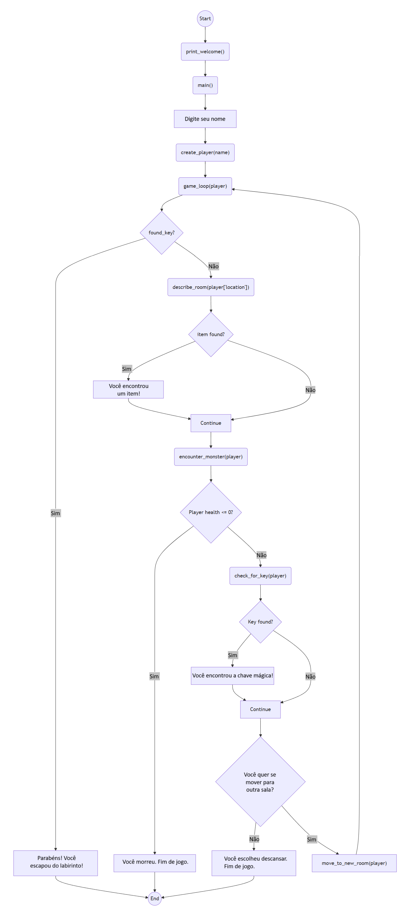

<script type="module">
  import mermaid from 'https://cdn.jsdelivr.net/npm/mermaid@10/dist/mermaid.esm.min.mjs';
  mermaid.initialize({ startOnLoad: true });
</script>

# Day 1. Understand your code. Python Adventure: 🧟‍♂️ Monster Maze 
{: .no_toc }
Feeling a bit lost when your **Vibe Coders** agents spit out lines of python code? You're not alone! Many aspiring developers find themselves staring at unfamiliar syntax, wondering how to interpret the logic behind their agents' creations. This crash lesson is designed to **banish that confusion**. We'll dive into the absolute essentials of Python – its fundamental data types, common operations, and basic control flow – equipping you with the knowledge to confidently read and understand the code your agents generate. Stop feeling sidelined and start truly collaborating with your AI; **unlock the power of understanding** the code, not just generating it!

---

<details open markdown="block">
<summary>
Table of contents
</summary>
{: .text-delta }
1. TOC
{:toc}
</details>


---
## 🧭 1.1. How is it explained? <a href="#top" class="back-to-top-link" aria-label="Back to Top">↑</a>

To cover all the basic Python concepts, let’s create a **mini text-based** game called **“Monster Maze”**. It’s fun, simple, and touches on all the listed topics.

You are stuck in a maze. Each turn, you decide to move through rooms, pick up items, and fight random monsters. The goal is to find the **magic key** to escape.

---

## 🧠 1.2. What you will learn? <a href="#top" class="back-to-top-link" aria-label="Back to Top">↑</a>

| Concept                 | Covered in                                                | Use/Purpose                                 |
| ----------------------- | --------------------------------------------------------- | ------------------------------------------- |
| Printing                | `print()` statements                                      | Display text output to the user             |
| Data Types              | `int`, `str`, `list`, `dict`, `bool`                      | Store different kinds of information        |
| Conditional Statements  | `if`, `elif`, `else`, and `random.random()` checks        | Make decisions based on conditions          |
| Randomisation           | `random.choice()`, `random.random()`                      | Generate unpredictable values               |
| For loops               | Inventory lookup or optional expansions                   | Repeat actions for each item in collection  |
| While loops             | User input loop                                           | Repeat actions until condition is met       |
| Functions               | All defined blocks (`main`, `game_loop`, etc.)            | Organize code into reusable blocks          |
| Functions with Inputs   | `create_player(name)`                                     | Pass data to functions for processing       |
| Functions with Outputs  | Returns in `create_player`, `describe_room`               | Get results back from functions             |
| Dictionaries            | `player` object                                           | Store key-value pairs for easy lookup       |
| Commenting              | All over the code                                         | Explain code for human readers              |
| Debugging               | Clear structure for tracing, game over paths              | Find and fix errors in your code            |
| String Manipulation     | `f"{player['health']}"`, `.lower()`, ASCII art            | Modify and format text                      |
| Type Conversion         | Not needed here directly, but can add e.g. `int(input())` | Change data from one type to another        |
| f-Strings               | `"f"You found {item}!"` etc.                              | Format strings with embedded variables       |
| Nested Lists            | Optional in expansions                                    | Create lists inside lists for complex data   |
| Index Errors            | Can be simulated via `inventory[5]` during teaching       | Handle out-of-range access attempts         |
| Recursion               | `game_loop()` calls itself                                | Function calls itself to repeat processing   |
| Range                   | Use `range()` if adding turns or steps                    | Generate sequences of numbers               |
| Scope / Global Variable | `found_key`, `global` keyword                             | Control where variables can be accessed     |
| Namespaces              | Explained by separating functions and main                | Organize names to avoid conflicts           |
| Docstrings              | `"""Docstrings"""` in all functions                       | Document function purpose and usage         |
| ASCII Art               | In `print_welcome()`                                      | Create text-based graphics                  |
| Improving UI            | Via emojis, layout, input messages                        | Enhance user experience                     |
| Breaking Down Problems  | Game is broken into tiny, testable functions              | Solve complex problems piece by piece       |

---

## 🧱 1.3. Step-by-Step Coding <a href="#top" class="back-to-top-link" aria-label="Back to Top">↑</a>

### 📦 1.3.1. Import module and Comments <a href="#top" class="back-to-top-link" aria-label="Back to Top">↑</a>
The import statement in Python allows you to include and use code from other modules in your current program. For example the in code below:
```python
# Simple import - access with module_name.item
import random
# Import with randint example
random_number = random.randint(1, 10)  # Generates a random integer between 1 and 10
```
Python searches for a module named "random" or file named random.py in several locations and executes its code once. A namespace named "random" is created in your program and then you can access the module's functions and variables. In the example the function randint is used to create a random integer number between 1 and 10. 
In python, anything written after "#" until the end of the line is interpreted as a comment and editors generally show them in green or grey. 

### 📋 1.3.2. Constants and Lists <a href="#top" class="back-to-top-link" aria-label="Back to Top">↑</a>

In Python, variables that are meant to remain unchanged throughout a program are often written in ALL_CAPS to indicate they are **constants**. While Python doesn't enforce this (variables can still be changed), it's a convention to signal to other programmers that these values shouldn't be modified.

**Lists** are ordered collections that can store multiple items of any type. They are created using square brackets `[]` with items separated by commas. Here's an example from our Monster Maze game:

```python
# Constants defined as lists
ROOMS = ["Hall", "Kitchen", "Library", "Dungeon", "Garden"]
ITEMS = ["sword", "potion", "shield"]
MONSTERS = ["Goblin", "Troll", "Skeleton"]
```

In this example:
- `ROOMS` is a list containing 5 string elements representing game locations
- `ITEMS` is a list of 3 collectible objects in the game
- `MONSTERS` is a list of 3 enemy types the player might encounter

Lists are incredibly versatile in Python:
- They can be accessed by index: `ROOMS[0]` would return "Hall"
- Their length can be found with `len(ROOMS)` (returns 5)
- Elements can be added with `append()` or `insert()`
- You can iterate through them using a for loop: `for room in ROOMS:`

Later in our game, we'll select random elements from these lists using `random.choice()` to create unpredictable gameplay.


### 🌐 1.3.3. Global variables, Functions and Print <a href="#top" class="back-to-top-link" aria-label="Back to Top">↑</a>
Global variables in Python are variables that are defined outside of any function and can be accessed throughout the program, including inside functions. The Global variable found_key gets the value False at the beginning of monster_maze.py
```python
# Global variable
found_key = False
```

Python **functions** are reusable blocks of code that perform a specific task. They are used to organize code, improve readability, and promote code reuse by breaking down complex problems into smaller, manageable pieces. In the code block below the global variable counter starts with a value of 0, then a function `increment()` is declared using def `<name of the function>` and ":". The code that is executed every time the function is called. Python identifies the code that belongs to the function because it is indented exactly 4 spaces. In the example the function `increment()` increases the variable counter by 1 every time that is called. 
```python
counter = 0

def increment(): # Creates the function increment() with zero variables
    global counter  # Declare we want to use the global variable
    counter += 1 # Increasings the variable counter by 1. It is the same as counter = counter + 1
    
increment() # Executes the function increment()
print(counter)  # Outputs: 1
increment() # Executes the function increment()
print(counter)  # Outputs: 2
```
To modify a global variable inside a function, you need to use the global keyword as per the example.
The command `<print(counter)>` writes the value of the variable counter to the terminal. **Print** is the main debugging command. It is also used to send text messages to the user like in the function `print_welcome()`.
```python
def print_welcome():
    """Prints the welcome message with ASCII art."""
    print("""
    🧟‍♂️ MONSTER MAZE 🧟‍♀️
    Escape the maze, defeat monsters, and find the key!
    """)  # String manipulation and printing
```
The string written below the function with triple """ contains a 
short documentation text named **"Docstrings"** which is used to convey the purpose and functionality of Python functions, modules, and classes.

### 🔑 1.3.4. Dictionaries, Lists of Dictionaries, Tuples and Slicing <a href="#top" class="back-to-top-link" aria-label="Back to Top">↑</a>

**Dictionaries** are one of Python's most powerful data structures. They store data as key-value pairs, allowing you to retrieve values quickly using their associated keys (similar to how you look up definitions in a real dictionary). Dictionaries are created using curly braces `{}` with each key-value pair separated by commas.

In our Monster Maze game, the `create_player()` function creates and returns a player dictionary:

```python
def create_player(name):
    """Returns a new player dictionary."""
    return {
        "name": name,
        "health": 100,
        "inventory": [],
        "location": random.choice(ROOMS)  # Random module
    }
```

In this dictionary:
- Keys are strings like `"name"`, `"health"`, `"inventory"`, and `"location"`
- Values can be of any type: a string for `"name"`, an integer for `"health"`, a list for `"inventory"`, etc.
- You access values using their keys: `player["health"]` would give you `100`
- Values can be modified: `player["health"] -= 20` would reduce health by 20

**Lists of Dictionaries** are powerful data structures that can store multiple records with named fields. They're ideal for collections of similar objects.

```python
# List of dictionaries for multiple players
players = [
    {"name": "Alex", "health": 100, "inventory": ["sword"]},
    {"name": "Taylor", "health": 80, "inventory": ["potion", "shield"]},
    {"name": "Jordan", "health": 120, "inventory": []}
]

# Accessing data
print(players[0]["name"])  # Output: Alex
print(players[1]["inventory"][0])  # Output: potion

# Adding new player to the list
players.append({"name": "Casey", "health": 90, "inventory": ["map"]})

# Looping through all players
for player in players:
    print(f"{player['name']} has {player['health']} health")
```

**Tuples** are immutable sequences similar to lists but enclosed in parentheses. Once created, their values cannot be changed.

```python
# Basic tuple creation
coordinates = (10, 20)
rgb_color = (255, 0, 128)

# Tuple unpacking - assigns each value to a variable
x, y = coordinates
print(f"X: {x}, Y: {y}")  # Output: X: 10, Y: 20

# Tuples can contain mixed data types
player_data = ("Alex", 100, ["sword", "potion"])
name, health, inventory = player_data

# Tuples are immutable - this would cause an error:
# coordinates[0] = 15

# But if a tuple contains a mutable object, that object can be modified:
player_data[2].append("shield")  # This works!
```

**Slicing** allows you to extract portions of sequences (lists, strings, tuples) using `[start:stop:step]` syntax.

```python
# Slicing a list
items = ["sword", "shield", "potion", "key", "map"]
first_two = items[0:2]  # ["sword", "shield"]
last_three = items[2:]  # ["potion", "key", "map"]
middle_items = items[1:4]  # ["shield", "potion", "key"]

# Negative indices count from the end
last_item = items[-1]  # "map"
second_last = items[-2]  # "key"
everything_but_last = items[:-1]  # ["sword", "shield", "potion", "key"]

# Step parameter skips elements
every_second = items[::2]  # ["sword", "potion", "map"]
reversed_list = items[::-1]  # ["map", "key", "potion", "shield", "sword"]

# Slicing strings works the same way
name = "Monster Maze"
first_word = name[:7]  # "Monster"
last_word = name[8:]  # "Maze"
reversed_name = name[::-1]  # "ezaM retsnoM"
```

Slicing is a concise and powerful way to manipulate sequences in Python, while lists of dictionaries and tuples provide flexible options for organizing complex data structures in your games.

### ⚙️ 1.3.5 Functions with Input and Output <a href="#top" class="back-to-top-link" aria-label="Back to Top">↑</a>
**Functions with Input** are functions where a variable is passed as value when they are called. This is done in our code when `game_loop(player)` is called in `main()`.
**Functions with Output** are functions that return values to be used elsewhere in your code. In Python, the `return` statement is used to specify what value a function should output. Without a return statement, functions return `None` by default.

Our `create_player()` function above is a perfect example:
1. It takes an input parameter `name`
2. It creates a dictionary with player attributes
3. It returns that dictionary, which can then be assigned to a variable
4. The calling code can then use that returned dictionary: `player = create_player("Alex")`

Return values are essential when a function needs to compute or create something that will be used by other parts of your program. In our game, the player dictionary is central to the entire program's state, which is why we have a dedicated function that returns it.

**Functions with unknown input** In Python, it is possible to create a function that accepts an unknown number of arguments using `*args` and `**kwargs`. Here's a breakdown of when and why we use each:

`*args` (Arbitrary Positional Arguments): Used when you need to create a function that can operate on an unspecified number of inputs of the same type.

How it works:
- The *args syntax in a function definition collects all the extra positional arguments passed to the function into a tuple.
- The name args is a convention; you could use *whatever if you wanted, but *args is widely understood and recommended.

Example:

```python
def sum_all_numbers(*args):
    total = 0
    for num in args:
        total += num
    return total

print(sum_all_numbers(1, 2, 3))         # Output: 6
print(sum_all_numbers(10, 20, 30, 40))  # Output: 100
print(sum_all_numbers())                # Output: 0
```

`**kwargs` (Arbitrary Keyword Arguments): used when you want a function to accept any number of keyword arguments (arguments passed with a `key=value` syntax).

How it works:
- The `**kwargs` syntax in a function definition collects all the extra keyword arguments passed to the function into a dictionary.
- The name kwargs is a convention; you could use `**whatever_else` but `**kwargs` is the standard.

Example:
```python
def configure_settings(**kwargs):
    settings = {
        "theme": "dark",
        "font_size": 12,
        "language": "en"
    }
    for key, value in kwargs.items():
        settings[key] = value
    return settings

print(configure_settings(theme="light", font_size=14))
# Output: {'theme': 'light', 'font_size': 14, 'language': 'en'}

print(configure_settings(language="fr", debug_mode=True))
# Output: {'theme': 'dark', 'font_size': 12, 'language': 'fr', 'debug_mode': True}

print(configure_settings())
# Output: {'theme': 'dark', 'font_size': 12, 'language': 'en'}
```
You can combine `*args` and `**kwargs`, for example `def generic_printer(arg1, *args, **kwargs):`


### 🔀 1.3.6. Conditional Statements and String Formatting <a href="#top" class="back-to-top-link" aria-label="Back to Top">↑</a>

**Conditional Statements** (if/elif/else) are fundamental building blocks in Python that allow your program to make decisions. They execute different code blocks based on whether certain conditions are true or false. Let's look at the `describe_room()` function as an example:

```python
def describe_room(room):
    """Describes the current room."""
    print(f"\nYou are now in the {room}.")
    if random.random() < 0.4:  # Conditional statement
        item = random.choice(ITEMS)
        print(f"You found a {item}!")
        return item
    return None
```

In this function:
- The `if` statement checks if `random.random() < 0.4` is true
- `random.random()` generates a random float between 0.0 and 1.0
- If the condition is true (40% chance), the indented block runs, selecting an item
- If the condition is false (60% chance), the function skips to `return None`

A complete if/elif/else structure works like this:
```python
if condition1:
    # Code that runs if condition1 is True
elif condition2:
    # Code that runs if condition1 is False but condition2 is True
else:
    # Code that runs if all conditions are False
```

**String Formatting** is demonstrated several ways in this function:

1. **f-strings** (formatted string literals) are a powerful feature introduced in Python 3.6. They start with `f` and allow you to embed expressions inside string literals using curly braces `{}`.
   ```python
   print(f"\nYou are now in the {room}.")
   ```
   Here, the value of the `room` variable is inserted directly into the string. This is much cleaner than older methods like `print("\nYou are now in the " + room + ".")`.

2. **Escape sequences** like `\n` are special character combinations that represent characters that would be difficult to type directly:
   - `\n` represents a newline character, starting text on a new line
   - Other common ones include `\t` (tab), `\"` (quotation mark), and `\\` (backslash)

3. **`random.choice()`** selects a random element from a sequence like a list. In our function:
   ```python
   item = random.choice(ITEMS)
   ```
   This randomly selects one item from our `ITEMS` list ("sword", "potion", or "shield").

The combination of these features makes our code both functional and readable. Notice how the function uses conditions to create dynamic gameplay (sometimes finding items, sometimes not) and formatted strings to clearly communicate what's happening to the player.


### 🔢 1.3.7. Range() and Logical Operators <a href="#top" class="back-to-top-link" aria-label="Back to Top">↑</a>

**The `range()` Function** is a built-in Python function that generates a sequence of numbers. It's commonly used in for loops to execute code a specific number of times. 

Basic usage: `range(stop)` or `range(start, stop, step)`:
- `range(5)` generates numbers 0, 1, 2, 3, 4
- `range(2, 8)` generates 2, 3, 4, 5, 6, 7
- `range(1, 10, 2)` generates 1, 3, 5, 7, 9

Although our `move_to_new_room()` function doesn't directly use `range()`, it uses a related concept called list comprehension, which can be implemented with range:

```python
def move_to_new_room(player):
    """Moves the player to a new random room."""
    previous = player["location"]
    player["location"] = random.choice([r for r in ROOMS if r != previous])
```

This function:
1. Stores the current room in `previous`
2. Creates a new list with all rooms *except* the current one using a list comprehension
3. Randomly selects one room from that list

The same list comprehension could be written with `range()` like this:
```python
[ROOMS[i] for i in range(len(ROOMS)) if ROOMS[i] != previous]
```

**Comparison Operators** are used to compare values and return boolean results (True or False):

| Operator | Description | Example |
|----------|-------------|---------|
| `==` | Equal to | `if name == "Alex":` |
| `!=` | Not equal to | `if r != previous:` (from our function) |
| `<` | Less than | `if random.random() < 0.4:` |
| `>` | Greater than | `if player["health"] > 50:` |
| `<=` | Less than or equal to | `if player["health"] <= 0:` |
| `>=` | Greater than or equal to | `if score >= 100:` |

**Logical Operators** allow you to combine multiple conditions:

| Operator | Description | Example |
|----------|-------------|---------|
| `and` | True if both conditions are true | `if health > 0 and found_key:` |
| `or` | True if either condition is true | `if choice in ["yes", "y"]:` |
| `not` | Inverts a boolean value | `if not found_key:` |

In our `move_to_new_room()` function, the list comprehension uses the `!=` operator to create a list of rooms that are not the current room. This ensures the player always moves to a different room.

Another example from our code showing logical operators is in the game loop:

```python
if choice in ["yes", "y"]:
    move_to_new_room(player)
    game_loop(player)  # Recursion
    break # Exits the loop
elif choice in ["no", "n"]:
    print("🛌 You chose to rest. Game Over.")
    break 
```
Here, the `in` operator checks if a value exists in a list, and acts as a logical condition. The condition `choice in ["yes", "y"]` is true if the user typed either "yes" or "y".

Combining operators lets you create complex decision logic:
```python
# Example of compound condition
if player["health"] < 30 and "potion" in player["inventory"]:
    print("You use a potion to restore health!")
    player["health"] += 50
    player["inventory"].remove("potion")
```

These operators are essential for creating dynamic, responsive programs that can make decisions based on changing conditions. In monster_maze.py this is used again to play Monster encounters. 

```python
def encounter_monster(player):
    """Random monster encounter with chance of fight."""
    if random.random() < 0.3:
        monster = random.choice(MONSTERS)
        print(f"\n⚔️ A wild {monster} appears!")
        if "sword" in player["inventory"]:
            print("You defeat it with your sword!")
        else:
            player["health"] -= 20
            print("You have no sword! You got hurt!")
            print(f"Health: {player['health']}")
            if player["health"] <= 0:
                print("💀 You have died. Game Over.")
                exit() # Exits the script
```

### 🔄 1.3.8. While and For Loops to Control Flow. Function Recursion <a href="#top" class="back-to-top-link" aria-label="Back to Top">↑</a>

Here is where we put the computer to properly work for us by using while and for loops to repeat actions. **While loops** execute a block of code repeatedly as long as a condition remains true. They're ideal when you don't know in advance how many iterations you'll need.

In our game, we use a while loop to keep asking the player for input until they provide a valid response:

```python
# While loop for input validation
while True:
    choice = input("\nDo you want to move to another room? (yes/no): ").lower()
    if choice in ["yes", "y"]:
        move_to_new_room(player)
        game_loop(player)  # Recursion
        break
    elif choice in ["no", "n"]:
        print("🛌 You chose to rest. Game Over.")
        break
    else:
        print("Please answer yes or no.")
```

The `while True:` creates an infinite loop that will only exit when it encounters a `break` statement. This happens when the player enters either "yes"/"y" or "no"/"n". If they enter anything else, the loop continues and prompts them again. This behaviour if not code properly may end with never reaching a false condition and having to halt the program using Ctrl+C or even worse Ctrl+Alt+Supr. To avoid this you may also want to add a counter to the condition to limit the maximun number of iterations. 

```python
# While loop with a counter to prevent infinite loops
max_attempts = 3
attempt_count = 0

while attempt_count < max_attempts:
    choice = input("\nDo you want to move to another room? (yes/no): ").lower()
    attempt_count += 1  # Increment counter with each iteration
    
    if choice in ["yes", "y"]:
        move_to_new_room(player)
        game_loop(player)
        break
    elif choice in ["no", "n"]:
        print("🛌 You chose to rest. Game Over.")
        break
    else:
        remaining = max_attempts - attempt_count
        if remaining > 0:
            print(f"Please answer yes or no. {remaining} attempts remaining.")
        else:
            print("Too many invalid inputs. Moving on...")
```

This version gives the player three chances to enter valid input before moving on, preventing an infinite loop. The counter tracks attempts and gives helpful feedback about remaining chances.

**For loops** iterate over a sequence (like a list or string) and execute code for each item:

```python
# Example of a for loop with player inventory
def show_inventory(player):
    print("Your inventory contains:")
    for item in player["inventory"]:
        print(f"- {item}")
```

This would print all the items in the inventory of the player.

**Recursion** is when a function calls itself. In our game, `game_loop()` calls itself when the player moves to a new room:

```python
if choice in ["yes", "y"]:
    move_to_new_room(player)
    game_loop(player)  # Recursion
    break
```

This creates a chain of function calls that continue until a terminating condition is met (finding the key or dying). Recursion is powerful but needs a clear exit condition to avoid infinite recursion.

### 🏃 1.3.9. Main Execution and Flow Diagram <a href="#top" class="back-to-top-link" aria-label="Back to Top">↑</a>

**Python Script Execution** follows a specific order:

1. Python reads the script from top to bottom
2. It defines functions and variables but doesn't execute function code until the function is called
3. When a function is called, Python temporarily jumps to that function, executes its code, then returns to where it left off

In our Monster Maze game, we use a common Python pattern:

```python
# Main program
def main():
    """Starts the game."""
    print_welcome()
    name = input("Enter your name, adventurer: ")
    player = create_player(name)
    game_loop(player)

if __name__ == "__main__":
    main()
```

The `if __name__ == "__main__":` check ensures the `main()` function only runs when the script is executed directly (not when imported as a module). This is a best practice for Python programs.

**Flow Diagram** is a visual representation of a program's logic. Flow diagrams help visualize complex logic and identify potential issues before coding. The great thing now is that you can now ask a Large Language Model like Gemini or ChatGPT to create one for you out of code. This is a great way to familiarise yourself with some code.  

In flow diagrams:
- Rectangles with square or rounded corners mean a step in the process. They represent a step in the process, an operation, or a task. This is where something is done.For example: "Perform Calculation," "Print Report," "Read Data".


- Diamonds are for decisions (or if, then else): They indicates a point where a decision must be made, typically a "Yes/No" or "True/False" question. The paths diverging from the diamond are labeled with the possible answers.


- Ovals/Capsules (Start/End - Terminal):Represent the beginning or end of a process.


- Cylinders: Represent data stored in a database or other storage medium.


- Arrows: Connect the symbols and indicates the direction of flow or the sequence of operations.<br/>
**→**


For Monster Maze, the flow chart looks like:



### 🐛 1.3.10. Debugging <a href="#top" class="back-to-top-link" aria-label="Back to Top">↑</a>

**Debugging** is the process of finding and fixing errors (bugs) in your code. Common debugging techniques in Python include:

1. **Print Debugging**: Adding `print()` statements to display variable values:
   ```python
   print(f"DEBUG: player health = {player['health']}")
   ```

2. **Using the Python Debugger** (`pdb`):
   ```python
   import pdb; pdb.set_trace()  # Code will pause here
   ```

3. **VS Code Debugging**:
   - Set breakpoints by clicking in the left margin next to line numbers
   - Press F5 to start debugging
   - Use the Debug toolbar to step through code (Step Over, Step Into, Continue)
   - Hover over variables to see their values
   - Use the Variables panel to inspect all current variables
   - Use the Debug Console to execute commands at the paused position

In our Monster Maze game, potential debugging points include:
- Checking room transitions
- Verifying health deduction after monster encounters
- Confirming items are added to inventory
- Testing win/lose conditions

Good debugging practices:
- Start with small, testable pieces of code
- Test one feature at a time
- Use descriptive print statements
- Check edge cases (empty lists, zero values, etc.)

### 🔧 1.3.11. Refactor and Test, Code Structure and UI Polish <a href="#top" class="back-to-top-link" aria-label="Back to Top">↑</a>

**Refactoring** is the process of restructuring code without changing its behavior. Benefits include:
- Improved readability
- Better organization
- Easier maintenance
- More efficient performance

When to refactor:
- After getting a basic version working
- When you find repeated code
- When functions are too long or do too many things
- When naming could be clearer

**Code Structure** best practices:
1. **Single Responsibility Principle**: Each function should do one thing well
2. **DRY (Don't Repeat Yourself)**: Extract repeated logic into functions
3. **Consistent Naming**: Use descriptive names and consistent conventions
4. **Modularity**: Organize related functions together
5. **Separation of Concerns**: Separate game logic, User Interface (UI), and data

Our Monster Maze example follows good structure:
- Functions are focused on specific tasks (create_player, encounter_monster, etc.)
- Main game flow is isolated in game_loop
- Variables have clear, descriptive names

**UI Polish** improves the user experience:
1. **Clear Instructions**: Help users understand what to do
2. **Visual Enhancements**: Use ASCII art, emojis, and formatting
3. **Input Validation**: Handle unexpected inputs gracefully
4. **Consistent Messaging**: Use a consistent tone and style
5. **Pacing**: Add pauses when appropriate for readability

In our game, we use several UI enhancements:
- Emoji icons for key moments (🧟‍♂️, 🔑, 💀, [more...](https://unicode.org/emoji/charts/full-emoji-list.html))
- Clear prompts for user input
- Newlines (`\n`) to organize text visually
- Consistent feedback for player actions

As a final step, thorough testing ensures your code works as expected across different scenarios and edge cases.

---

## 📝 1.4 Reflection Questions <a href="#top" class="back-to-top-link" aria-label="Back to Top">↑</a>

<details markdown="block">
  <summary>
1. What happens if a function doesn't `return` anything?
  </summary>
It will return `None`
</details>

<details markdown="block">
  <summary>
2. How do global and local variables differ in the game?
  </summary>
A global variable in the game is `found_key`, which is accessible and can be modified from any function within the program. In contrast, local variables are defined within a specific function, such as `player` in the `game_loop` function or `item` in `describe_room`, and their scope is limited to that function. This means they can only be used and modified within the function where they are defined.
</details>

<details markdown="block">
  <summary>
3. What type of loop would you use for repeating until a condition is met?
   </summary>
For repeating until a condition is met, a `while` loop would be suitable, as it continues to execute as long as a specified condition is true. 
</details> 

<details markdown="block">
  <summary> 
4. And for looping through a list of rooms?
  </summary>
For looping through a list of rooms, a `for` loop would be appropriate, as it iterates over each item in a sequence.
</details>

<details markdown="block">
  <summary>
5. What are some ways to avoid getting stuck in an infinite loop?
  </summary>
To avoid getting stuck in an infinite loop:

- Ensure the loop condition eventually becomes false: For `while` loops, make sure that the condition controlling the loop will at some point evaluate to `False`.
- Include a breaking condition: Use `break` statements to exit the loop when a certain condition is met.
- Limit iterations: For loops that might run indefinitely, consider adding a counter and breaking the loop after a maximum number of iterations.
</details>

<details markdown="block">
  <summary>
6. Can you break the game by entering unexpected input?
  </summary>
Yes, you can break the game by entering unexpected input. The `game_loop` function includes an `input` prompt that expects "yes" or "no" (or "y" or "n"). If any other input is entered, the program will repeatedly print "Please answer yes or no." due to the `while` True loop and the `else` condition, effectively getting stuck in a loop asking for valid input until "yes" or "no" is entered. This prevents the game from progressing to the next room or ending, and while not an infinite loop in the sense of crashing the program, it does halt the game's intended flow until valid input is provided.
</details>

---


## 🎯 1.5. Exercises <a href="#top" class="back-to-top-link" aria-label="Back to Top">↑</a>

#### 🧪 Practice 1: Custom Weapons
> Modify the `ITEMS` list to include new weapons like "laser", "bow", or "fireball". Have the monster encounter logic recognize them.

#### 🧪 Practice 2: Monster Stats
> Create a `monster_stats` dictionary that gives each monster a `strength`. Compare it to the player's health.

#### 🧪 Practice 3: Level Up System
> Add an experience system: each monster defeated gives points. At 100 points, print “Level Up!”

#### 🧪 Practice 4: Add a Map
> Track which rooms you've visited. Print a mini-map or list at the end showing where you’ve been.


---

Happy Hacking! 🧙‍♀️

