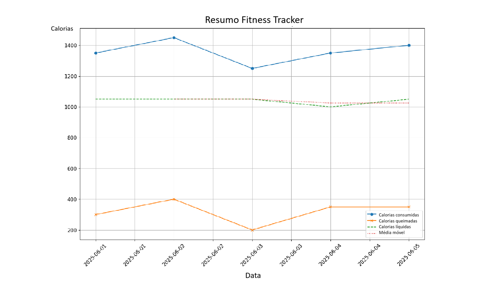

# Day 2. Python Intermediate. 🏋️ Fitness & Diet Tracker
{: .no_toc }
In Day 1 we learnt the basic python functions that let process repetitive tasks and choices. Today we will a bit more advance and powerfull modes of managing information learning how to manipulate other files, working with objects and clashes and plotting data. 


---

<details open markdown="block">
  <summary>
    Table of contents
  </summary>
  {: .text-delta }
1. TOC
{:toc}
</details>


---
## 🧭 How is it explained? <a href="#top" class="back-to-top-link" aria-label="Back to Top">↑</a>

This time we are going to build a fitness and diet tracker that will calculate the net calories everyday and plot the history in a chart. This command-line tool:
- Logs workouts and meals
- Reads and cleans CSV data
- Performs data analysis
- Visualizes trends using charts
- Uses OOP for structured code

## 📦 Prerequisites, module installation and environment.<a href="#top" class="back-to-top-link" aria-label="Back to Top">↑</a>
You will require:
- Python 3.x
- pandas and matplotlib
which you can install by running the command below in bash:
```bash
pip install pandas matplotlib
```

## 🗂 **Step 1**: Prepare Your Data. <a href="#top" class="back-to-top-link" aria-label="Back to Top">↑</a>

### 👉 Understanding File Structure 📁 and Paths in Python<a href="#top" class="back-to-top-link" aria-label="Back to Top">↑</a>

A **file structure** (also known as a **directory structure**) refers to how files and folders are organized on your computer. It's like a tree:
- At the top is the **root** (e.g., C:\ in Windows or / in Unix/Linux).
- Inside it are **folders/directories** (e.g., Documents, Desktop, etc.)
- Folders can contain **files** (like .txt, .csv, .py) or **other folders** (subdirectories).

### 👉 We need file structures to **organize data, locate files,** and **build scalable applications**.<a href="#top" class="back-to-top-link" aria-label="Back to Top">↑</a>

A file path is the address to a file or folder in the computer. There are two types:
1. Absolute Path that Points to the exact location from the root and always starts from the drive or root directory.
```python
"C:/Users/Alberto/Desktop/my_file.txt"  # Windows
"/home/alberto/documents/my_file.txt"   # Linux/macOS
```
1. Relative Path that points to a location relative to the current working directory.
```python
"data/my_file.txt"    # Means inside the folder 'data'
"./my_file.txt"       # Current directory
"../my_file.txt"      # One folder up
```

Forward slash is used in Unix/macOS/Linux, and also in Python on all platforms. `\` Backslash is used in Windows. 

{: .note }
>Best practice: Use forward slashes `/` in Python or use the `os.path` module for compatibility.

### 👉Python and the **OS Module**<a href="#top" class="back-to-top-link" aria-label="Back to Top">↑</a>

The os module helps interact with the file system reducing syntaxis errors are performing certain basic functions.

```python
import os

print(os.getcwd()) # Get current directory

print(os.listdir(".")) # List files and folders in a directory

file_path = os.path.join("data", "file.csv") # Join paths safely
print(file_path)

print(os.path.exists(file_path))# Check if path exists
```

In the fitness tracker os is used to create the path to the input files:
```python
DATA_DIR = os.path.join(os.path.dirname(__file__), 'data')
WORKOUTS_FILE = os.path.join(DATA_DIR, 'workouts.csv')
MEALS_FILE = os.path.join(DATA_DIR, 'meals.csv')
```


### 👉 **File structure** and **csv** files<a href="#top" class="back-to-top-link" aria-label="Back to Top">↑</a>

For this example we will store the records of our workouts and meals in the csv files in the subfolder data. 


```kotlin
fitness_tracker/
├── data/
│   ├── workouts.csv
│   └── meals.csv
└── fitness_tracker.py
```
CSV stands for Comma-Separated Values. It's a plain text file used to store tabular data (like a spreadsheet or database) in a simple format.

Each row is a line in the file, and each column value is separated by a comma (,).

🔹 Key Formatting Rules

| Element         | Description                                           |
| --------------- | ----------------------------------------------------- |
| **Comma (,)**   | Default separator between values                      |
| **New Line**    | Separates rows                                        |
| **First row**   | Often used as **header** (column names)               |
| **Quotes ("")** | Used around fields that contain commas or line breaks |
| **.csv**        | File extension for CSV files                          |

For this example the csv files are: 

<details markdown="block">
  <summary>
    `data/workouts.csv`
  </summary>
```csv
date,type,duration_minutes,calories_burned
2025-06-01,Running,30,300
2025-06-02,Cycling,45,400
2025-06-03,Yoga,60,200
2025-06-04,Swimming,30,350
2025-06-05,Running,40,350
```
</details>
<details markdown="block">
  <summary>
    `data/meals.csv`
  </summary>
```csv
date,meal_type,food,calories
2025-06-01,Breakfast,Oatmeal,250
2025-06-01,Lunch,Chicken Salad,500
2025-06-01,Dinner,Pasta,600
2025-06-02,Breakfast,Eggs,300
2025-06-02,Lunch,Sandwich,450
2025-06-02,Dinner,Steak,700
2025-06-03,Breakfast,Smoothie,200
2025-06-03,Lunch,Rice and Beans,550
2025-06-03,Dinner,Grilled Fish,500
2025-06-04,Breakfast,Yogurt with Granola,320
2025-06-04,Lunch,Vegetable Soup,380
2025-06-04,Dinner,Chicken Curry,650
2025-06-05,Breakfast,Avocado Toast,400
2025-06-05,Lunch,Caesar Salad,420
2025-06-05,Dinner,Salmon with Vegetables,580
```
</details>

## 🐍 **Step 2**: Create fitness_tracker.py. **Classes** and **Object-Oriented Programming**<a href="#top" class="back-to-top-link" aria-label="Back to Top">↑</a>


Let's dive into **Object-Oriented Programming (OOP)** with a simple analogy!

### 👉 What is **Object-Oriented Programming** (OOP)?<a href="#top" class="back-to-top-link" aria-label="Back to Top">↑</a>

Imagine you want to build a fleet of different types of vehicles: cars, motorcycles, and trucks. Instead of listing every single detail for every single vehicle you build (e.g., "This car has 4 wheels, a red color, can accelerate, can brake. This other car has 4 wheels, a blue color, can accelerate, can brake..."), OOP helps you organize your design.

**OOP is a way of organizing your code around "objects" rather than just functions and data**. Think of it like a blueprint system for creating things.

### 👉 What are **Classes**?<a href="#top" class="back-to-top-link" aria-label="Back to Top">↑</a>

Let's continue with the "Vehicle Factory" analogy:

**Classes** are like Blueprints: Before you build any vehicle, you need a design. You'd have a Car Blueprint, a Motorcycle Blueprint, and a Truck Blueprint. These blueprints define what characteristics (like number of wheels, color) and behaviors (like accelerating, braking) all cars, motorcycles, or trucks will have.
**Objects** are like the Actual Vehicles: Once you have a blueprint, you can build actual vehicles from it. So, a specific red car you just built, a blue motorcycle, or a green truck are all objects. Each one is a unique **instance** created from its respective blueprint.

### 👉 **Why** is OOP Useful and When?<a href="#top" class="back-to-top-link" aria-label="Back to Top">↑</a>

OOP is useful for:
- *Organization and Modularity*: It helps you break down complex problems into smaller, manageable pieces (objects). This makes your code easier to understand, maintain, and debug. Instead of one giant instruction manual for everything, you have separate blueprints for cars, motorcycles, etc.
- *Reusability*: You can reuse your blueprints (classes) to create many similar objects. You don't need to redraw the car blueprint every time you want to build a new car. You just use the existing one.
- *Flexibility and Maintainability*: If you need to change how all cars accelerate, you just modify the "Car Blueprint." All cars built from that blueprint will then have the updated acceleration behavior. If you decide all cars should now have self-driving capabilities, you update the Car Blueprint, and all new cars you build from it will have that feature.
- *Handling Complexity*: As your programs grow, OOP helps manage the complexity by encapsulating related data and behavior together.

### 👉 **When** is it useful?<a href="#top" class="back-to-top-link" aria-label="Back to Top">↑</a>

OOP shines when you're dealing with:
- *Complex systems*: Games, simulations, large business applications.
- *Programs with many similar "things"*: Think of a user management system (many "user" objects), an e-commerce site (many "product" objects), or a graphical user interface (many "button," "text field," "window" objects).
- *When you want to collaborate on code*: Different developers can work on different parts of the system (different classes) more easily.

### 👉 What are **Methods**, and **Attributes**?<a href="#top" class="back-to-top-link" aria-label="Back to Top">↑</a>

Let's go back to our vehicle analogy:
- *Objects*: As explained, these are the actual "things" created from a blueprint (class). For example, my_red_car, johns_motorcycle.
- *Attributes* (Properties/Data): These are the characteristics or data associated with an object. They are like the details on the blueprint that describe what the vehicle is.For a Car object, attributes might be color (e.g., "red"), number_of_wheels (e.g., 4), brand (e.g., "Toyota").
- *Methods* (Behaviors/Functions): These are the actions an object can perform. They are like the instructions on the blueprint that describe what the vehicle can do. For a Car object, methods might be accelerate(), brake(), turn_on_headlights().

How do you create an object out of a class in Python?

First, you define a class (our blueprint):
```python
class Car:
    # This is the blueprint for a Car

    def __init__(self, color, brand, num_wheels=4):
        # This is a special method called the "constructor".
        # It's like the initial assembly line for a new car.
        # 'self' refers to the specific car object being created.
        self.color = color         # Set the color attribute for this car
        self.brand = brand         # Set the brand attribute for this car
        self.num_wheels = num_wheels # Set the number of wheels (default to 4)

    def accelerate(self):
        # This is a method (behavior) for a Car object
        print(f"The {self.color} {self.brand} car is accelerating!")

    def brake(self):
        # Another method
        print(f"The {self.color} {self.brand} car is braking.")
```

Now, to create an object (a specific car) from this Car class:

```python
# Creating an object (a specific car) from the Car class
my_red_car = Car("red", "Toyota")
johns_blue_car = Car("blue", "Honda")
my_red_car.accelerate()
my_red_car.brake()
```
which will return
```bash
$ python car_factory.py
The red Toyota car is accelerating!
The red Toyota car is braking.
```

To access or set attributes, you use the dot notation (.) to access or set attributes:
```python
# Accessing attributes
print(f"My car's color: {my_red_car.color}")
print(f"John's car's brand: {johns_blue_car.brand}")

# Setting (modifying) an attribute
my_red_car.color = "yellow"
print(f"My car's new color: {my_red_car.color}")
```

### 👉 What is **Class Inheritance**?<a href="#top" class="back-to-top-link" aria-label="Back to Top">↑</a>

Inheritance is a powerful OOP concept that allows you to create new classes based on existing ones. Think of it as creating more specialized blueprints from general ones.

You have a general "Vehicle Blueprint." From this, you can create a "Car Blueprint," a "Motorcycle Blueprint," and a "Truck Blueprint." A Car is a Vehicle, a Motorcycle is a Vehicle. The Car blueprint automatically inherits all the general characteristics and behaviors of a Vehicle (like having wheels, being able to move) and then adds its own specific ones (like having doors, specific seating).

Inheritance promotes code reuse and helps model real-world relationships.

In Python:

```python
class Vehicle: # General blueprint
    def __init__(self, num_wheels, top_speed):
        self.num_wheels = num_wheels
        self.top_speed = top_speed

    def move(self):
        print("Vehicle is moving.")

class Car(Vehicle): # Car inherits from Vehicle
    def __init__(self, color, brand):
        super().__init__(4, 200) # Call the parent (Vehicle) constructor
        self.color = color
        self.brand = brand

    def accelerate(self): # Car has its own specific method
        print(f"The {self.color} {self.brand} car is accelerating!")

class Motorcycle(Vehicle): # Motorcycle also inherits from Vehicle
    def __init__(self, engine_size):
        super().__init__(2, 180) # Call the parent (Vehicle) constructor
        self.engine_size = engine_size

    def wheelie(self):
        print(f"The motorcycle is doing a wheelie!")

my_car = Car("green", "BMW")
my_car.move() # Car can use the Vehicle's move method
my_car.accelerate()

my_motorcycle = Motorcycle("1000cc")
my_motorcycle.move()
my_motorcycle.wheelie()
```

### 👉 **Creating** Meals, Workouts and Date **classes**<a href="#top" class="back-to-top-link" aria-label="Back to Top">↑</a>

In our fitness tracker, we will be using three classes, one for the dates, another for the workouts and another for the meals. Each of the columns in workouts and meals will be a different attribute. 

```python
class LogEntry:
    def __init__(self, date):
        self.date = date

class Workout(LogEntry): # Workout inherits from LogEntry
    def __init__(self, date, workout_type, duration, calories):
        super().__init__(date) # Call the parent (Logentry)
        self.workout_type = workout_type
        self.duration = duration
        self.calories = calories

class Meal(LogEntry): # Meal inherits from LogEntry
    def __init__(self, date, meal_type, food, calories):
        super().__init__(date) # Call the parent (Logentry)
        self.meal_type = meal_type
        self.food = food
        self.calories = calories
```

## 📄 **Step 3**: Read and Clean **CSV Files**<a href="#top" class="back-to-top-link" aria-label="Back to Top">↑</a>
### 👉 Manual Reading with CSV Module<a href="#top" class="back-to-top-link" aria-label="Back to Top">↑</a>

There are two main routes to load the csv file. The first one is using the module csv and load it onto a list. In doing so, we use the `strip()` and the `int()` methods. 
The `strip()` method is used to remove leading and trailing whitespace (spaces, tabs, newlines) from a string. This helps preventing Common Data Entry Issues caused by human or automated data entry, Accurate Comparisons/Lookups and Errors when applying to another type conversion for example with `int()`.
The `int()` function is used to convert a string or a float into an integer so that we can do numerical operations with it.

```python
import csv

def read_workouts_manual(file_path):
    workouts = []
    with open(file_path, newline='') as csvfile: # Opens and automatically closes when finished
        reader = csv.reader(csvfile) # Creates an object that can iterate over lines
        next(reader)  # Skip header
        for row in reader:
            # Create a Workout object for each row and add to workouts list
            date = row[0].strip()
            workout_type = row[1].strip()
            duration = int(row[2].strip())
            calories = int(row[3].strip())
            workouts.append(Workout(date, workout_type, duration, calories))
    return workouts

```

### 👉 Using Pandas<a href="#top" class="back-to-top-link" aria-label="Back to Top">↑</a>

The second module that is used to load csv files and work with their information is pandas. Pandas loads the csv file information into a pandas dataframe.  A **Dataframe** is two-dimensional labeled data structure with columns of potentially different types. This is the primary Pandas data structure and is essentially a table or spreadsheet. 

You can access a dataframe cell by doing `df.loc[row_label, column_label]` and a column by referring to its heading as below.
```python
import pandas as pd
data = {'Name': ['Alice', 'Bob', 'Charlie','Andres'],
        'Age': [25, 30, 35, 45],
        'City': ['New York', 'London', 'Paris','Madrid']}
df = pd.DataFrame(data)

cell_value_default = df.loc[0, 'Name'] # Accessing row 0, column 'Name'
print(f"Cell at index 0, column 'Name' (default index): {cell_value_default}")

names_column = df['Name'] # Access the 'Name' column
print("The 'Name' column:")
print(names_column)

```

Below an example on how to access the rows. 

```python
# Access the row at integer position 1 (the second row)
row_pos_1 = df.iloc[1]
print("Row at integer position 1:")
print(row_pos_1)
print("-" * 40)

# Access multiple rows using a list of integer positions
multiple_rows_pos = df.iloc[[0, 2]] # First and third rows
print("Rows at integer positions 0 and 2:")
print(multiple_rows_pos)
print("-" * 40)

# Access a slice of rows using integer positions (exclusive of end)
slice_of_rows_pos = df.iloc[1:4] # From position 1 up to (but not including) 4
print("Slice of rows from position 1 to 3:")
print(slice_of_rows_pos)
print("-" * 40)
```

In our fitness tracker, the pandas library is used in the function `load_and_clean_data()`. The method `.fillna` is used to replace the cells with Not a Number NaN data.

```python
import pandas as pd

def load_and_clean_data():
    df_workouts = pd.read_csv('data/workouts.csv')
    df_meals = pd.read_csv('data/meals.csv')

    df_workouts['date'] = pd.to_datetime(df_workouts['date'])
    df_meals['date'] = pd.to_datetime(df_meals['date'])

    # Fill any missing values in workout data with zeros (e.g., missing durations or calories)
    df_workouts.fillna(0, inplace=True)
    # Fill any missing values in meal data with "Unknown" (e.g., missing food descriptions)
    df_meals.fillna("Unknown", inplace=True)

    return df_workouts, df_meals
```

## 📊 **Step 4**: **Summarize** and **Merge Data**<a href="#top" class="back-to-top-link" aria-label="Back to Top">↑</a>

Now is time to combine the workouts and meals using the pandas library to optain the net calories. To do that, we follow this sequence:

### 👉 **Group rows** `df_meals.groupby('date')`:<a href="#top" class="back-to-top-link" aria-label="Back to Top">↑</a>

This is the first and most crucial part. The `groupby()` method is used to group rows together based on unique values in one or more columns.
In this case, `df_meals` will be grouped by the unique values in the 'date' column. Conceptually, pandas will create separate "groups" for each unique date. For our example, there would be a group for '2025-06-01', one for '2025-06-02', and one for '2025-06-03'.

### 👉 **Select a column** `['calories']`:<a href="#top" class="back-to-top-link" aria-label="Back to Top">↑</a>

After grouping, you typically want to perform an operation on a specific column within each group. `['calories']` selects the 'calories' column from each of these created groups. This means that for each date group, we are now only interested in the calorie values.

### 👉 Calculate **subtotals** `.sum()`:<a href="#top" class="back-to-top-link" aria-label="Back to Top">↑</a>

This is an aggregation function. After selecting the 'calories_burned' column for each group, `.sum()` calculates the total sum of 'calories' for each respective group (i.e., for each unique date).

At this point, the output would be a pandas Series with the 'date' as the index and the sum of 'calories' as the values. It would look something like this:

```bash
date
2025-06-01    1350  (250 + 500 + 600)
2025-06-02    1450  (300 + 450 + 700)
2025-06-03    1250  (200 + 550 + 500)
Name: calories_burned, dtype: int64
```

### 👉 **Re-Numbering** the rows of the selection `.reset_index()`:<a href="#top" class="back-to-top-link" aria-label="Back to Top">↑</a>

As you can see from the previous step, after `sum()`, 'date' is the index of the resulting Series.

`.reset_index()` converts the index back into a regular column. This is often desired for cleaner dataframes where you want the grouped column ('date' in this case) to be a proper column rather than the DataFrame's index.

After `reset_index()`, the output will be a new DataFrame:

| date       | calories |
|:-----------|:----------------|
| 2025-06-01 | 1350            |
| 2025-06-02 | 1450            |
| 2025-06-03 | 1250            |


After that the two pandas dataframes for workouts and meals are merged and a new column with the `'net_calories'` is created.

The actual function that summarises the data in our fitness tracker is:

```python
def summarize_data(df_workouts, df_meals):
    workout_summary = df_workouts.groupby('date')['calories_burned'].sum().reset_index()
    meal_summary = df_meals.groupby('date')['calories'].sum().reset_index()

    combined = pd.merge(workout_summary, meal_summary, on='date', how='outer').fillna(0)
    combined['net_calories'] = combined['calories'] - combined['calories_burned']
    return combined
```


## 📈 **Step 5**: Visualize with **matplotlib**<a href="#top" class="back-to-top-link" aria-label="Back to Top">↑</a>

The last function that we are going to write is the one that creates the plot of the workout, meal and net calories for every registered day. To do this, we simply load the matplotlib library and create a plot assembling each part as shown in the code below. 

```python
import matplotlib.pyplot as plt

def plot_fitness_trends(combined_df):
    # Create a new figure with specified size (width: 16 inches, height: 10 inches)
    # This creates a larger plot that is easier to read and analyze
    plt.figure(figsize=(16, 10)) 
    
    # Plot calories consumed with circular markers
    plt.plot(combined_df['date'], combined_df['calories'], label="Calories Consumed", marker='o')
    
    # Plot calories burned with x markers for visual distinction
    plt.plot(combined_df['date'], combined_df['calories_burned'], label="Calories Burned", marker='x')
    
    # Plot net calories (consumed - burned) with dashed line style
    # This shows the caloric balance for each day
    plt.plot(combined_df['date'], combined_df['net_calories'], label="Net Calories", linestyle='--')

    # Calculate and plot a 2-day rolling average of net calories
    # This smooths out daily fluctuations and shows the overall trend
    rolling = combined_df['net_calories'].rolling(window=2).mean()
    plt.plot(combined_df['date'], rolling, label="Rolling Mean (Net)", linestyle='dotted')

    # Add axis labels with increased font size for better readability
    plt.xlabel('Date', fontsize=14)
    plt.ylabel('Calories', fontsize=14)
    
    # Format the x-axis to display dates in YYYY-MM-DD format
    # This ensures consistent date representation on the chart
    date_format = DateFormatter('%Y-%m-%d')
    plt.gca().xaxis.set_major_formatter(date_format)
    
    # Rotate x-axis labels by 45 degrees to prevent overlap and increase font size
    plt.xticks(rotation=45, fontsize=12)
    plt.yticks(fontsize=12)
    
    plt.title('Fitness Tracker Summary', fontsize=16) # Add a descriptive title to the chart with larger font
    
    plt.legend() # Add a legend to identify each line in the plot
    
    plt.grid(True) # Add a grid to make it easier to read values from the chart
    
    plt.tight_layout() # Adjust layout to ensure all elements fit without overlapping
    
    plt.show() # Display the completed chart
```

The resulting chart with the Consumed and Burned calories as well as the Net ones looks like:



## ▶️ **Step 6**: Main Program<a href="#top" class="back-to-top-link" aria-label="Back to Top">↑</a>

Following best practices, we have left the main function to specify the flow of the program. This make it easier to review and to update the code. 

```python
def main():
    df_workouts, df_meals = load_and_clean_data()
    combined = summarize_data(df_workouts, df_meals)
    print(combined)
    plot_fitness_trends(combined)

if __name__ == "__main__":
    main()
```


## 🧪 Practice Challenges<a href="#top" class="back-to-top-link" aria-label="Back to Top">↑</a>
Try modifying or extending the project:
- Add weight tracking.
- Categorize meal types (e.g., “High Protein”).
- Export results to a new CSV file.
- Highlight days with a calorie surplus.
