# Day 3. Python Advance. 🌐 Hack your Stocks, Flights and Habits
{: .no_toc }
🚀 In this lesson, you’ll unlock the power of APIs, automation, and data tracking to master real-world Python skills. From monitoring markets to finding flight deals and optimizing your routines—prepare to code smarter and live better. 🌐💡

---

<details open markdown="block">
<summary>
Table of contents
</summary>
{: .text-delta }
1. TOC
{:toc}
</details>

---

## 📚 Concepts Covered<a href="#top" class="back-to-top-link" aria-label="Back to Top">↑</a>

What is an API?
- **API (Application Programming Interface)** is a set of rules that allows different software entities (like your Python script and a webapp) to communicate.
- **Client**: The application that sends requests (e.g., your Python script).
- **Server**: The application that responds to requests (e.g., the API endpoint).

How to use APIs?
The typical HTTP requests that clients send to servers are:
- **GET** – Retrieve data
- **POST** – Submit new data
- **PUT** – Update existing data
- **DELETE** – Remove data

When the client sends requests to the server they also go with headers and payload. Headers are key-value pairs sent between the client and the server to provide information about the request or the response. Headers can include things like Authentication tokens (Authorization), Content type (Content-Type) or API keys

For example: 

```python
import requests

# GitHub API endpoint to get user repositories
url = "https://api.github.com/users/octocat/repos"

# Custom headers
headers = {
    "User-Agent": "MyPythonApp/1.0",
    "Accept": "application/vnd.github.v3+json"
}

# Make the GET request
response = requests.get(url, headers=headers)

# Check if request was successful
if response.status_code == 200:
    data = response.json()
    # Print first 3 repositories with name and URL
    for repo in data[:3]:
        print(f"Name: {repo['name']} - URL: {repo['html_url']}")
else:
    print("Request failed with status code:", response.status_code)
```

### HTTP Responses - Status Codes<a href="#top" class="back-to-top-link" aria-label="Back to Top">↑</a>
HTTP responses are categorized by status codes, which are 3-digit numbers grouped into five classes:

<details markdown="block">
  <summary>
    100 Continue, 200 OK, 201 Created, 301 Redirection, 400 Bad Request, 401 Unauthorized, 403 Forbidden, 404 Not Found, 500 Server Error
  </summary>

{: .important-title }
> HTTP Responses
> 
> 1. **Informational** responses (1xx): These indicate that the request was received and understood, and the process is continuing. 
> - 100 Continue: The client should continue with its request.
> - 101 Switching Protocols: The server is changing protocols.
> 1. **Successful** responses (2xx): These indicate that the request was successfully received, understood, and accepted.
> - 200 OK: The standard successful response.
> - 201 Created: The request has been fulfilled and resulted in a new resource being created.
> - 204 No Content: The server successfully processed the request, but is not returning any content.
> 1. **Redirection** messages (3xx): These indicate that further action needs to be taken by the client to complete the request, usually by redirecting to a different URL.
> - 301 Moved Permanently: The requested resource has been permanently moved to a new URL.
> - 302 Found: The resource is temporarily located at a different URL.
> - 303 See Other: The response to the request can be found under another URI using a GET method.
> 1. **Client error** responses (4xx): These indicate that the client's request contained bad syntax or could not be fulfilled.
> - 400 Bad Request: The server cannot understand the request due to malformed syntax.
> - 401 Unauthorized: The client must authenticate itself to get the requested response.
> - 403 Forbidden: The client does not have access rights to the content.
> - 404 Not Found: The server cannot find the requested resource.
> - 405 Method Not Allowed: The request method is known by the server but has been disabled and cannot be used for the requested resource.
> 1. **Server error** responses (5xx): These indicate that the server failed to fulfill an apparently valid request.
> - 500 Internal Server Error: A generic error message, given when an unexpected condition was encountered and no more specific message is suitable.
> - 502 Bad Gateway: The server, while acting as a gateway or proxy, received an invalid response from an upstream server.
> - 503 Service Unavailable: The server is not ready to handle the request, often due to maintenance or being overloaded.
</details>


In addition to the status code, an HTTP response also includes:
1. **Status-line**: Contains the HTTP version, the numeric status code, and a textual reason phrase (e.g., HTTP/1.1 200 OK).
1. **Headers**: Provide additional information about the response, such as content type, caching instructions, server information, etc.
1. **Message-body** (optional): Contains the actual data being returned, such as an **HTML** page, **JSON** data, an **image**, etc.


<details markdown="block">
  <summary>
    The `Content-Type` header uses a MIME type (Multipurpose Internet Mail Extensions) to tell the client what kind of data is being sent.
  </summary>


Here's a breakdown of other possible message bodies, often categorized by their Content-Type:

{: .important-title }
> Content-type
> 
> 1. Text-based Formats:
> - text/plain: Simple, unformatted text. Good for plain messages, logs, or when no specific formatting is needed.
> - text/css: Cascading Style Sheets, used to style HTML documents.
> - text/javascript: JavaScript code, often used for client-side scripting in web applications.
> - text/csv: Comma-Separated Values, a common format for tabular data.
> - text/xml: XML (Extensible Markup Language), a structured data format. While less common than JSON for new APIs, it's still widely used in older systems and for specific applications (e.g., RSS feeds).
> 1. Application-specific Formats:
> - application/xml: Similar to text/xml, but indicates that the content is a generic XML document, not specifically for display as text.
> - application/json: JavaScript Object Notation, a lightweight data-interchange format. This is extremely common for APIs and data exchange between web services.
> - application/pdf: Portable Document Format, for documents intended to be viewed or printed in a consistent way.
> - application/octet-stream: This is a generic binary data type. It's often used when the server doesn't know the specific type of binary data, or when the client is expected to handle the download as a raw file (e.g., a file download where the browser prompts the user to save).
> - application/zip: Compressed archive files.
> - application/vnd.*: Vendor-specific MIME types. These are used when a company or organization defines its own unique data format. For example, > - application/vnd.openxmlformats-officedocument.spreadsheetml.sheet for an Excel XLSX file.
> - application/graphql: For GraphQL queries and responses.
> - application/wasm: WebAssembly binary format.
> 3. Image Formats:
> - image/jpeg: JPEG images.
> - image/png: PNG images.
> - image/gif: GIF images.
> - image/svg+xml: Scalable Vector Graphics, XML-based vector images.
> - image/webp: WebP images.
> 4. Audio and Video Formats:
> - audio/mpeg: MP3 audio.
> - audio/ogg: Ogg Vorbis audio.
> - video/mp4: MP4 video.
> - video/webm: WebM video.
> - video/ogg: Ogg Theora video.
> 5. Multipart Messages:
> - multipart/form-data: While often seen in request bodies for file uploads, it can also appear in response bodies if the server is sending back multiple distinct parts as a single response (less common for standard web Browse, more for specialized APIs).
> - multipart/mixed: A generic multipart type for sending multiple independent body parts.
> 
> Important Considerations:
> - Content-Length header: If a message body is present and its size is known, the Content-Length header specifies the exact size in bytes.
> - Transfer-Encoding: chunked: If the server doesn't know the total size of the response body in advance (e.g., for streaming data), it will use chunked transfer encoding, where the body is sent in a series of chunks, each with its own size indicator.
> - No body for certain status codes: As mentioned, status codes like 204 No Content or 304 Not Modified explicitly indicate that there will be no message body.
> - Error messages: Even for error responses (4xx or 5xx), the body can contain human-readable error messages, often in HTML or JSON format, to help the client or user understand what went wrong.
> 
> The flexibility of HTTP, combined with the vast array of MIME types, allows servers to send virtually any kind of data as a response, making it a highly versatile protocol for the internet.

</details>


### JSON Handling<a href="#top" class="back-to-top-link" aria-label="Back to Top">↑</a>
A JSON file (JavaScript Object Notation) is a text file that stores data in a structured, readable format using key-value pairs.
It is used for:
- Exchanging data between servers and web apps
- Config files
- Storing structured data in APIs or applications

Python incorporates an standard library for json manipulation

```python
import json

# Convert dict to JSON 1
with open('data1.json', 'w') as f:
    json.dump({"name": "Alice"}, f)

# Convert dict to JSON 2
# Serialize to JSON
json_string = json.dumps({"name": "Alice"})

# Deserialize from JSON
data = json.loads(json_string)

# Save to file
with open("data2.json", "w") as f:
    json.dump(data, f, indent=4)

# Read JSON file
with open('data2.json') as f:
    data = json.load(f)
    print(data['name'])
```

 There are other libraries for json manipulation such as [simplejson](https://pypi.org/project/simplejson/), [pandas](https://pandas.pydata.org/), [requests](https://pypi.org/project/requests/), [ujson](https://github.com/ultrajson/ultrajson), [orjson](https://github.com/ijl/orjson) and [demjson](https://github.com/dmeranda/demjson)

<details markdown="block">
  <summary>
    See pandas and request examples
  </summary>
```python
import pandas as pd
df = pd.read_json("data.json")
```
```python
import requests
response = requests.get("https://api.example.com/data")
data = response.json()
```

</details>

For easier visualization [https://jsonformatter.org/json-viewer](https://jsonformatter.org/json-viewer) is quite handy.


### Exception Handling<a href="#top" class="back-to-top-link" aria-label="Back to Top">↑</a>
When programming it is best practice to introduce messages for and error handling strutures like the one below. This reduces the time in locating and fixing errors that may arise from the code itself or from the server responses.
```python
try:
    response = requests.get("https://someapi.com/data")
    response.raise_for_status()
except requests.exceptions.HTTPError as e:
    print(f"HTTP error occurred: {e}")
except KeyError:
    print("Missing a key in the response.")
except IndexError:
    print("List index out of range.")
except Exception as e:
    print(f"Something went wrong: {e}")
```


### Authentication Types<a href="#top" class="back-to-top-link" aria-label="Back to Top">↑</a>
The most common authentication methods are:
- 🔑**API Key**: A unique key (like a password) is passed in the request, usually in the header or URL. This is used for basic access control for public APIs. It isn't very secure and it should always use HTTPS. See the example below with openweather. You will have to sign up and get your api key in https://home.openweathermap.org/api_keys. 

```python
import requests
base_url = "http://api.openweathermap.org/data/2.5/weather"
params = {
    "q": "London",
    "appid": "YOUR_API_KEY",
    "units": "metric"  # You can change to "imperial" for Fahrenheit
}
response = requests.get(base_url, params=params)
if response.status_code == 200:
    data = response.json()
    print(f"Weather in {params['q']}: {data['weather'][0]['description']}")
else:
    print("Error:", response.status_code, response.text)
```

- 🍪**Basic Authentication and Session-Based Authentication (Cookie)**: which is now rare and considered insecure and never used.

<details markdown="block">
  <summary>
    click for Basic Authentication example
  </summary>

```python
import requests

url = "https://api.example.com/user"
response = requests.get(url, auth=('your_username', 'your_password'))

print(response.status_code, response.json())
```

</details>

<details markdown="block">
  <summary>
    click for Session-Based Authentication example
  </summary>

```python
import requests

# Step 1: Log in and get a session cookie
session = requests.Session()
login_url = "https://example.com/login"
payload = {
    "username": "your_username",
    "password": "your_password"
}

response = session.post(login_url, data=payload)

# Step 2: Access protected page using the same session
protected_url = "https://example.com/profile"
profile_response = session.get(protected_url)

print(profile_response.status_code, profile_response.text)
```

</details>


- 🛡️**CSRF Tokens**: are a unique, unpredictable value that the server generates and includes in each form or API request. where the server delivers a token to the client after login in and that is then used with subsequent http requests. These tokens/cookies usually expire after some time. 

<details markdown="block">
  <summary>
    click for CSRF example using flask
  </summary>
To run this example you need to install Flask:
```bash
pip install Flask Flask-WTF
```


The flask application that will act as a server is:


```python
from flask import Flask, render_template_string, request, redirect, flash
from flask_wtf import FlaskForm
from wtforms import StringField, SubmitField
from wtforms.validators import DataRequired
import secrets

# Basic Flask app
app = Flask(__name__)
app.config['SECRET_KEY'] = secrets.token_hex(16)  # Needed for CSRF protection

# Define form with CSRF protection
class NameForm(FlaskForm):
    name = StringField('Your Name', validators=[DataRequired()])
    submit = SubmitField('Submit')

```
```python

# Route to display and handle form
@app.route('/', methods=['GET', 'POST'])
def index():
    form = NameForm()
    if form.validate_on_submit():
        flash(f"Hello, {form.name.data}!", "success")
        return redirect('/')
    return render_template_string('''
        <!doctype html>
        <title>CSRF Example</title>
        
          
            <div style="color:green">{{ message }}</div>
          
        
        <form method="POST">
            {{ form.hidden_tag() }}
            {{ form.name.label }} {{ form.name(size=20) }}
            {{ form.submit() }}
        </form>
    ''', form=form)

if __name__ == '__main__':
    app.run(debug=True)
```


Run it with 
```bash
 python csrf_flask_example.py
 ```

 and then open it in the browser doing in the address http://127.0.0.1:5000/
If you inspect in the browser the website code by doing right click in the box and cliking inspect, or by doing Ctrl+Shift+I. Then selecting the Elements tab you will find a line like

```html
<input id="csrf_token" name="csrf_token" type="hidden" value="something_like_4jh56yFj3...">
```

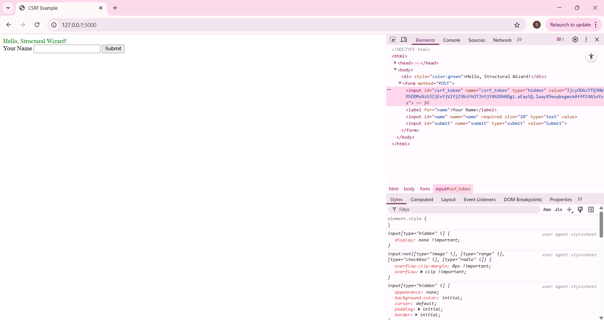


</details>


- **OAuth**: is a multi-step process often done in a web app.It is typically used with services like Google, Facebook, iOS apps. We will see more practical example of this later.

<details markdown="block">
  <summary>
    click for OAuth 2.0
  </summary>
The python code below is just for explanation of the process. It won't run. Please see and try actual examples in the next point.

```python
import requests
import webbrowser

# Step 1: Redirect user to authorization URL
client_id = "YOUR_CLIENT_ID"
redirect_uri = "http://localhost:8080/callback"
auth_url = (
    f"https://auth.example.com/oauth/authorize?response_type=code"
    f"&client_id={client_id}&redirect_uri={redirect_uri}&scope=read"
)
webbrowser.open(auth_url)

# Step 2: User logs in and gets redirected to a URL like:
# http://localhost:8080/callback?code=AUTH_CODE
# You must manually extract this `code` for the next step.

# Step 3: Exchange auth code for access token
auth_code = input("Paste the authorization code here: ")
token_url = "https://auth.example.com/oauth/token"
data = {
    "grant_type": "authorization_code",
    "code": auth_code,
    "redirect_uri": redirect_uri,
    "client_id": client_id,
    "client_secret": "YOUR_CLIENT_SECRET"
}

response = requests.post(token_url, data=data)
token_data = response.json()
access_token = token_data['access_token']

# Step 4: Use the token
headers = {"Authorization": f"Bearer {access_token}"}
protected_url = "https://api.example.com/userinfo"
user_data = requests.get(protected_url, headers=headers)
print(user_data.json())
```

</details>


### Environment Variables<a href="#top" class="back-to-top-link" aria-label="Back to Top">↑</a>
Environment variables allow you to store sensitive data (like API keys, passwords, secrets) outside of your source code.
Instead of doing this ❌:

```python
API_KEY = "my-super-secret-api-key-123"
```

You do this ✅:

```python
import os
API_KEY = os.getenv("API_KEY")
```

Then set the key in your environment:

```bash
export API_KEY=my-super-secret-api-key-123
```

| Benefit                     | Why It Matters                                                        |
| --------------------------- | --------------------------------------------------------------------- |
| **Security**             | Keeps secrets out of source code (e.g. GitHub repo)                   |
| **Configurability**      | You can change keys or settings **without changing code**             |
| **Environment-Specific** | Different values for dev, staging, production                         |
| **Reusability**          | Same codebase, different configs based on environment                 |
| **Cloud-Friendly**       | All major cloud platforms support secret management via env variables |

For local dev, you can store secrets in a .env file:
`.env`
```ini
API_KEY=abcdef123456
DB_PASSWORD=my_db_pass
```

Load it in Python
```bash
pip install python-dotenv
```

```python
from dotenv import load_dotenv
import os

load_dotenv()  # loads from .env file
api_key = os.getenv("API_KEY")
```

{: .warning}
> NEVER Hardcode Secrets. If you commit a secret to GitHub: 
> 🔓 Anyone can see it, 
> 🤖 Bots constantly scan public repos for secrets, 
> 💣 API providers may revoke or abuse keys and 
> ☠️ You could be billed or attacked (e.g., if AWS keys are leaked)

{: .warning}
> AI Coding agents 🕵️ have the tendency to Hardcode API keys. ALWAYS revise your code!!

{: .warning}
> Ensure .gitignore excludes .env from being uploaded to GitHub


---
### 🍏 1. Habit & Nutrition Dashboard using Google Sheets and Nutritionix<a href="#top" class="back-to-top-link" aria-label="Back to Top">↑</a>

The goal of this exercise is to create a text app to track your daily food intake and exercise. We will be using the following APIs

- **Nutritionix**: To parse food and exercise items
- **Google Sheets (via Sheety)**: Store data


#### Nutritionix<a href="#top" class="back-to-top-link" aria-label="Back to Top">↑</a>

We will have to create a free acount in [Nutritionix](https://www.nutritionix.com/business/api), and then create some [API key](https://developer.nutritionix.com/admin/access_details) and save them to the .env file

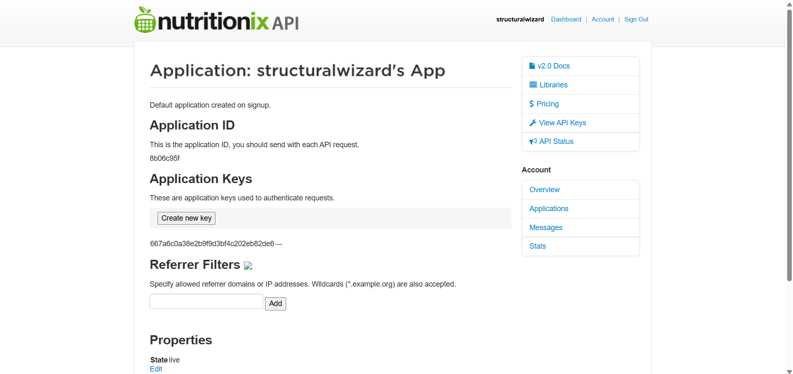

`.env` file
```python
NUTRITIONIX_KEY="ec3***"
NUTRITIONIX_ID="8b***"
```

Then we can do some END POINT tests as explained in ther [Getting started documentation](https://docx.syndigo.com/developers/docs/get-started) for which we can use postman to try some [Endpoints](https://docx.syndigo.com/developers/docs/natural-language-for-nutrients). 

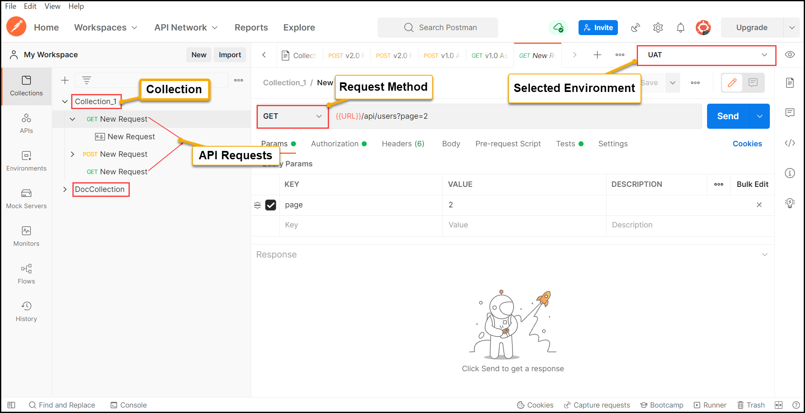

Once we understand the headers and authentication syntax, we pass it to python code as follows:

```python
import requests, os
import datetime
from dotenv import load_dotenv
import json

# Load environment variables from .env file
load_dotenv()

# Nutritionix
NUTRITIONIX_NLP_NUTRIENTS_URL_ENDPOINT = " https://trackapi.nutritionix.com/v2/natural/nutrients"
headers = {
    "Content-Type": 'application/json',
    "x-app-id": os.environ.get("NUTRITIONIX_ID"),
    "x-app-key": os.environ.get("NUTRITIONIX_KEY"),
}
print(headers)
query = input("What did you eat? ")
data = {"query": query}
nutrition_response = requests.post(NUTRITIONIX_NLP_NUTRIENTS_URL_ENDPOINT, headers=headers,json=data )
calories = nutrition_response.json()["foods"][0]["nf_calories"]
print(f"Calories consumed in {query}: {calories}")


NUTRITIONIX_NLP_EXERCISE_URL_ENDPOINT = " https://trackapi.nutritionix.com/v2/natural/exercise"
exercise_config = {"query": input("What exercises did you do (you can include duration and/or distance)?: "),}

exercise_response = requests.post(NUTRITIONIX_NLP_EXERCISE_URL_ENDPOINT, headers=headers, json=exercise_config)

user_input = exercise_response.json()["exercises"][0]["user_input"]
duration = exercise_response.json()["exercises"][0]["duration_min"]
calories = exercise_response.json()["exercises"][0]["nf_calories"]
print(f"Exercise: {user_input}, Duration: {duration}, Calories: {calories}")

# Save response to a JSON file
with open('nlp_food.json', 'w') as f:
    json.dump(nutrition_response.json(), f, indent=4)
with open('nlp_exercise.json', 'w') as f:
    json.dump(exercise_response.json(), f, indent=4)

```

#### Google Sheets with SHEETY<a href="#top" class="back-to-top-link" aria-label="Back to Top">↑</a>

To store the data we will use Google Sheets and Sheety API. We will have to signup for free in [Sheety](https://sheety.co/) and create an project. 

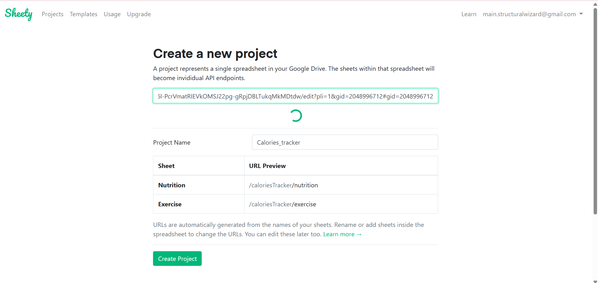

Which needs to be linked to a Google Sheet. We will also create the tables that we want to fill in. 

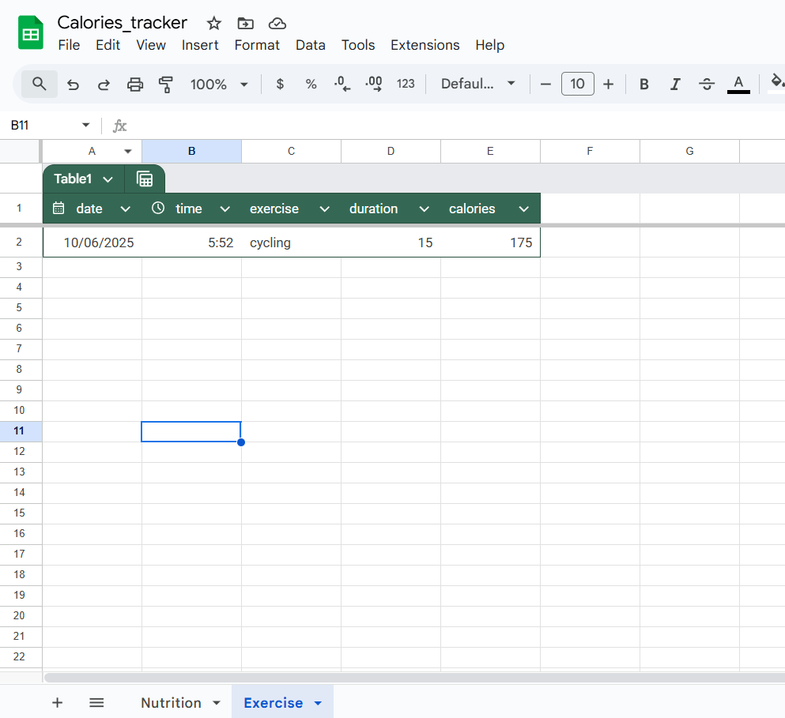

Next we will have to create an Authentication code in Sheety. 

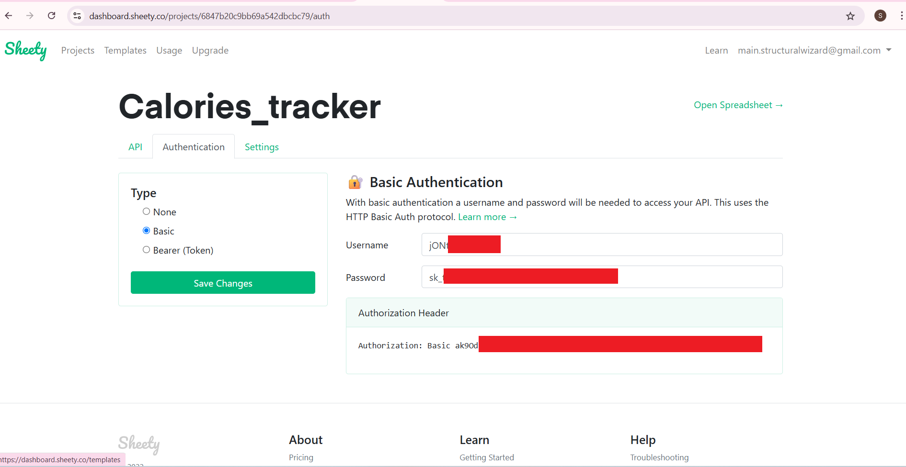

And allow Post requests on it. 

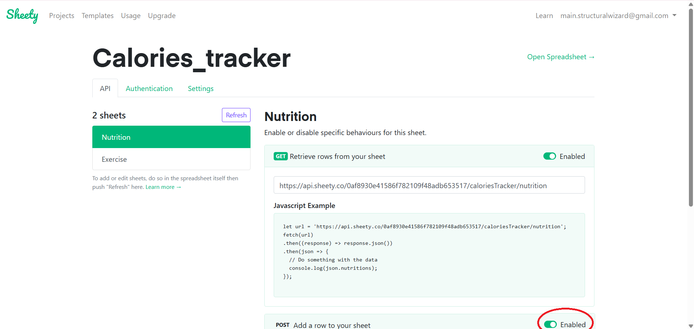

Then we assemble the headers and payload and write down the post requests to fill the google sheet. 

```python
# Google Sheets
SHEETY_AUTH_TOKEN = os.environ.get("SHEETY_AUTH_TOKEN")
SHEETY_NUTRITION_ENDPOINT_API = os.environ.get("SHEETY_NUTRITION_URL")
SHEETY_EXERCISE_ENDPOINT_API = os.environ.get("SHEETY_EXERCISE_URL")

headers = {
    "Authorization": SHEETY_AUTH_TOKEN,
}


#Record current date and time
date = datetime.datetime.now()
formatted_date = date.strftime("%d/%m/%Y")
time = date.strftime("%H:%M:%S")

nutrition_data = {
    "nutrition": {
      "date": formatted_date,
      "time": time,
      "food": query,
      "calories": calories,
    }
  }

workout_data = {
    "exercise": {
      "date": formatted_date,
      "time": time,
      "exercise": user_input,
      "duration": duration,
      "calories": calories,
    }
  }


# Add new row to the spreadsheet with inputted data
#print(headers)
new_response = requests.post(url=SHEETY_NUTRITION_ENDPOINT_API, json=nutrition_data, headers=headers)
new_response = requests.post(url=SHEETY_EXERCISE_ENDPOINT_API, json=workout_data, headers=headers)
#print(new_response.text)

```


---


### 📈 2. Stock and News with Whatsapp Alerts<a href="#top" class="back-to-top-link" aria-label="Back to Top">↑</a>

#### APIs Used<a href="#top" class="back-to-top-link" aria-label="Back to Top">↑</a>
- **Alpha Vantage**: Real-time stock data
- **FINNHUB News API**: Financial news
- **Twilio Bot API**: Message sending

#### Stock prices with Alpha Vantage<a href="#top" class="back-to-top-link" aria-label="Back to Top">↑</a>

The settup of alphavantage API is relatively straight forward. You simply fill in the [Form](https://www.alphavantage.co/support/) to get the key that needs to go in your .env file 

<details markdown="block">
  <summary>
    Alpha Vantage API key form
  </summary>

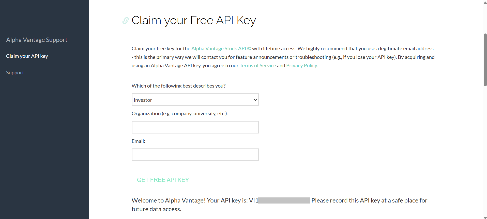

</details>


```python
from dotenv import load_dotenv
import requests, os

# Load environment variables from .env file
load_dotenv()

# Stock price
stock_params = {"symbol": "APPL", "apikey": os.getenv("ALPHA_API_KEY")}
stock_response = requests.get("https://www.alphavantage.co/query?function=TIME_SERIES_DAILY", params=stock_params)
data = stock_response.json()
yesterday = list(data["Time Series (Daily)"].keys())[0]
price = float(data["Time Series (Daily)"][yesterday]["4. close"])
print(f"APPL closing price yesterday {yesterday}: ${price}")
```
`.env` file
```python
ALPHA_API_KEY="***"
TWILIO_ACCOUNT_SID="***"
TWILIO_AUTH_TOKEN="***"
FINNHUB_API_KEY="***"
```

#### Get Financial news<a href="#top" class="back-to-top-link" aria-label="Back to Top">↑</a>
In the second part of this example, we are going to learn how to connect to [Finhub](https://finnhub.io/dashboard), which provides financial news with free tier. You will then need to create an API key. 

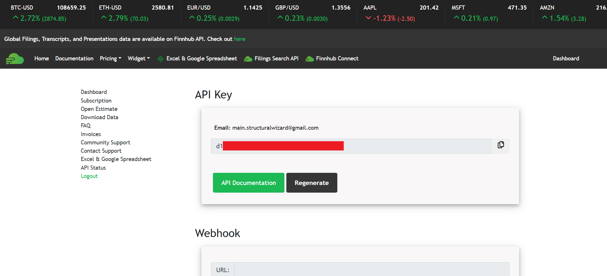

This time we are going to use their very well documented [python repository](https://github.com/Finnhub-Stock-API/finnhub-python) by first installing it. 

```bash
pip install finnhub-python
```
And then following one of their code examples is used. 

```python
# News API
import finnhub
import datetime

# Get dates
today = datetime.datetime.now().strftime('%Y-%m-%d')
yesterday = (datetime.datetime.now() - datetime.timedelta(days=1)).strftime('%Y-%m-%d')

# Setup client
finnhub_client = finnhub.Client(api_key=os.environ.get("FINNHUB_API_KEY"))
# Company News
# Need to use _from instead of from to avoid conflict
latest_news = finnhub_client.company_news('AAPL', _from=yesterday, to=today)
print(f"Latest news for AAPL from {yesterday} to {today}:")

for news in latest_news[:5]:
    print(f"Title: {news['headline']}")
    print(f"Source: {news['source']}")
    print(f"Date: {news['datetime']}")
    print(f"Summary: {news['summary']}")
    print("-" * 50)
```
Which results in 


```
Latest news for AAPL from 2025-06-08 to 2025-06-09:
Title: Apple's New Design Language
Source: Finnhub
Date: 1749486328
Summary: Apple is expected to showcase a new redesign of its software across all its products at this year's WWDC. Bloomberg's Mark Gurman explains....
--------------------------------------------------
Title: Building A $75,000 Dividend Portfolio: Enhancing SCHD With June's Top High-Yield Picks
Source: SeekingAlpha
Date: 1749481200
Summary: SCHD remains a particularly attractive investment option for long-term investors. Check out how to build a $75,000 dividend portfolio with SCHD as a core.
```

#### Send emails, Whatsapps, SMS, Video, Audio with Twilio<a href="#top" class="back-to-top-link" aria-label="Back to Top">↑</a>

Now we are going to try to use [Twilio](https://www.twilio.com/en-us) which has a very powerful API to send emails, Whatsapp messages, SMS, and more. 

[First time](https://console.twilio.com/us1/develop/sms/try-it-out/whatsapp-learn?frameUrl=%2Fconsole%2Fsms%2Fwhatsapp%2Flearn%3Fx-target-region%3Dus1) that you use it, after setting up the Keys you will have to log in with a Whatsapp account. It will ask you to open a QR code and guide throught e process. You can also text join finally-gold to +14155238886<br>


Then you can [test requests](https://console.twilio.com/us1/develop/sms/content-template-builder/template/HX38f4a38e390bfec8bfe8760c5d013619) on the web that you can directly apply to your code. 

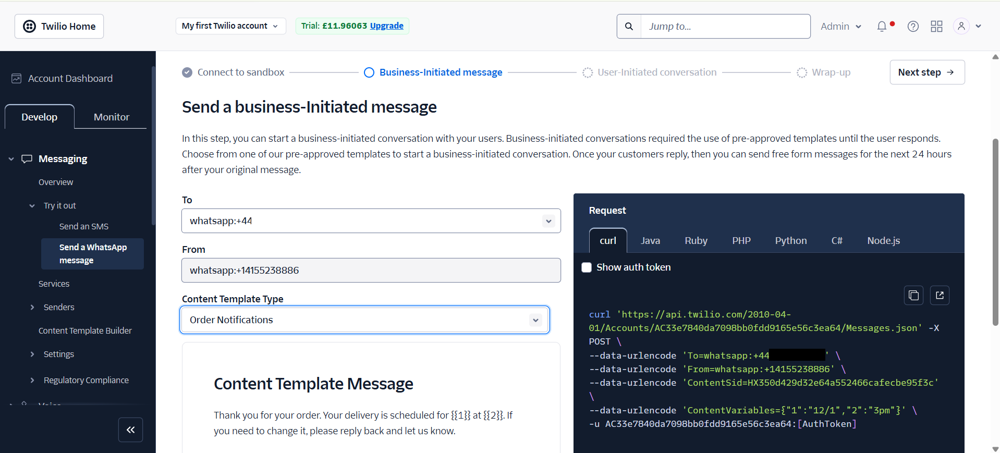


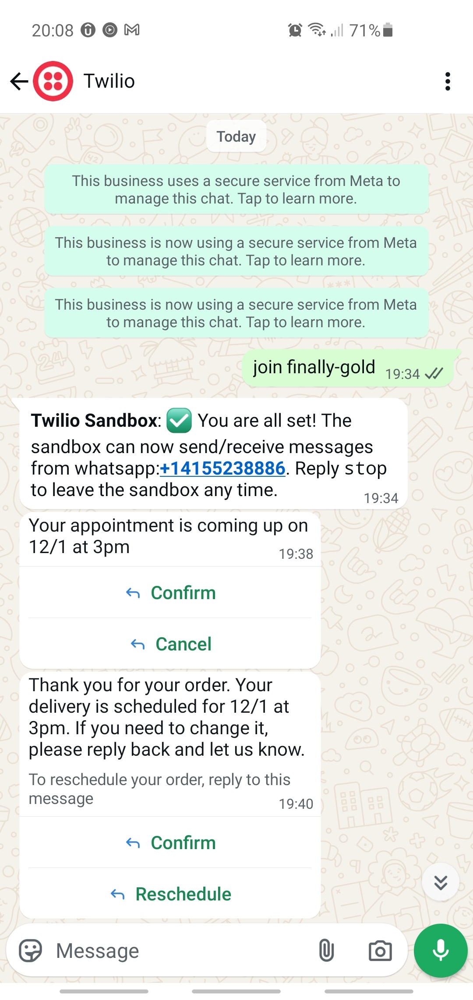

Twilio has a number of templates for the messages and also allow you to create your own ones. 

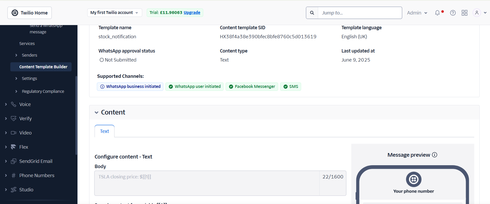

If we implement this code in our script rather than using directly in the testing area of the portal it looks like the extract below:


```python
# Send message via Twilio WhatsApp
from twilio.rest import Client

account_sid = os.environ.get('TWILIO_ACCOUNT_SID')
auth_token =  os.environ.get('TWILIO_AUTH_TOKEN')
print("Twilio account SID:", account_sid)
print("Twilio auth token:", auth_token)
client = Client(account_sid, auth_token)

message = client.messages.create(
    from_='whatsapp:+14155238886',
    #content_sid='HXb5b62575e6e4ff6129ad7c8efe1f983e', # Your appointment is coming up on {1} at {2}
    #content_variables='{"1":"12/1","2":"3pm"}',
    #content_sid='HX350d429d32e64a552466cafecbe95f3c', # Thank you for your order. Your delivery is scheduled for {1} at {2}
    #content_variables='{"1":"12/1","2":"3pm"}',
    #content_sid='HX229f5a04fd0510ce1b071852155d3e75', # {1} is your verification code. For your security, do not share this code.
    #content_variables='{"1":"409173"}',    
    content_sid='HX38f4a38e390bfec8bfe8760c5d013619', # APPL closing price: ${{1}}
    content_variables=f'{{"1":"{price}"}}',
    to='whatsapp:+44YOUR TELEPHONE NUMBER GOES HERE'
)

print(message.sid)
```



---


### ✈️ 3. Cheap Flight Finder and Email Alerts<a href="#top" class="back-to-top-link" aria-label="Back to Top">↑</a>

#### APIs Used and Development process<a href="#top" class="back-to-top-link" aria-label="Back to Top">↑</a>
In this example we will create a text app that uses Amadeus API for flight search and send email alerts using the gmail API. To get to that point we will learn how to navigate GitHub documentation and get support from LLMs and Agents for each of the steps involved:
- Authenticate in Amadeus
- To search for flights doing a Request and using **datetime** for date management.
- Process the response into a **json file**, a **csv file**
- To send an email notification with **smtp**. 

The first thing would be to pront an LLM (either Claude, Gemini or Chat GPT) in the web or in GitHub Copilot within VSCode. We would ask it to create a python script to search for flights on an specific date with the API service that we decided. The ones that I looked at were [Tequila](https://tequila.kiwi.com/) which needs manual registering via email, [Skyscanner](https://www.partners.skyscanner.net/product/travel-api) which needs an enterprise account and [Amadeus](https://developers.amadeus.com/register) which is currently (09/06/2025) free and easy to [register](https://developers.amadeus.com/register). We follow the steps in [Get Started](https://developers.amadeus.com/get-started/get-started-with-self-service-apis-335) to get the keys. 

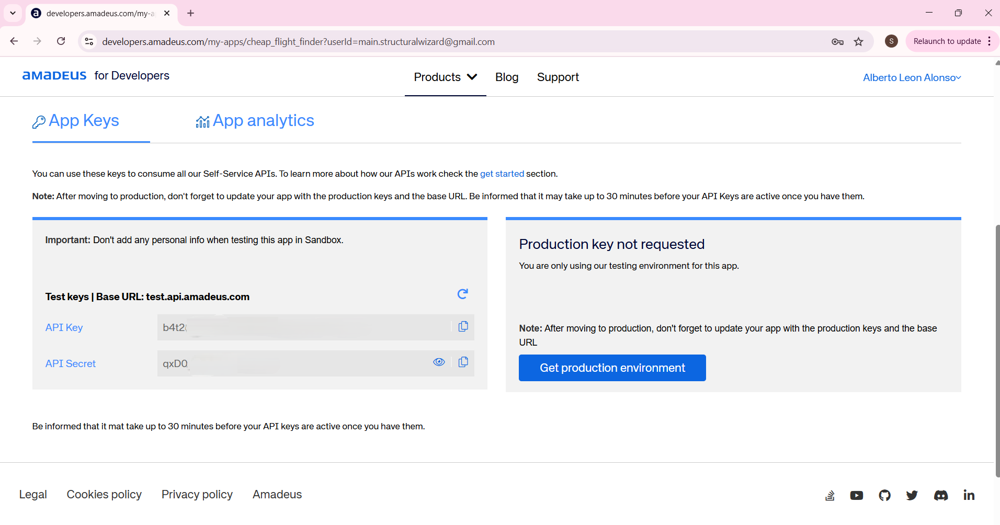

We then add them to the `.env` file in the same directory than the python script or in the `PATH`. 

```python
AMADEUS_API_KEY="b4t2..."
AMADEUS_API_SECRET="qxD..."
EMAIL_ADDRESS="m...@gmail.com"
GMAIL_PASSWORD="cyjb ..."
OPENWEATHER_API_KEY="24a..."
```

The code that was generated in all attempts with the LLMs and agents did not work but provided some structure and mentioned the GitHub library [amadeus4dev](https://github.com/amadeus4dev/amadeus-python/tree/master) which contains [manual](https://github.com/amadeus4dev/amadeus-python/tree/master) and simple [examples](https://github.com/amadeus4dev/amadeus-code-examples). 

We install it by running the following line in bash:
```python
pip install amadeus
```
#### Request and json file<a href="#top" class="back-to-top-link" aria-label="Back to Top">↑</a>
So we then get the following code that connects to Amadeus and exports the response to a json file. 

 
```python
from amadeus import Client, ResponseError
import os, smtplib
from dotenv import load_dotenv
from datetime import datetime, timedelta
import json
import csv

# Load environment variables from .env file
load_dotenv()

amadeus = Client(
    client_id= os.getenv("AMADEUS_API_KEY"),
    client_secret= os.getenv("AMADEUS_API_SECRET")    
)


try:
    # -------------------------------------------------------------
    # Search for flights
    response = amadeus.shopping.flight_offers_search.get(
        originLocationCode='LON',
        destinationLocationCode='SCQ',
        departureDate=(datetime.now() + timedelta(days=10)).strftime("%Y-%m-%d"),
        adults=1,
        currencyCode='GBP')
    
    # -------------------------------------------------------------
    # Save response to a JSON file
    with open('flight_offers.json', 'w') as f:
        json.dump(response.data, f, indent=4)
```

<details markdown="block">
  <summary>
    Json response file
  </summary>

```json
[
    {
        "type": "flight-offer",
        "id": "1",
        "source": "GDS",
        "instantTicketingRequired": false,
        "nonHomogeneous": false,
        "oneWay": false,
        "isUpsellOffer": false,
        "lastTicketingDate": "2025-06-10",
        "lastTicketingDateTime": "2025-06-10",
        "numberOfBookableSeats": 9,
        "itineraries": [
            {
                "duration": "PT2H10M",
                "segments": [
                    {
                        "departure": {
                            "iataCode": "LGW",
                            "terminal": "S",
                            "at": "2025-06-19T15:25:00"
                        },
                        "arrival": {
                            "iataCode": "SCQ",
                            "at": "2025-06-19T18:35:00"
                        },
                        "carrierCode": "VY",
                        "number": "7107",
                        "aircraft": {
                            "code": "320"
                        },
                        "operating": {
                            "carrierCode": "VY"
                        },
                        "duration": "PT2H10M",
                        "id": "9",
                        "numberOfStops": 0,
                        "blacklistedInEU": false
                    }
                ]
            }
        ],
        "price": {
            "currency": "GBP",
            "total": "106.38",
            "base": "73.00",
            "fees": [
                {
                    "amount": "0.00",
                    "type": "SUPPLIER"
                },
                {
                    "amount": "0.00",
                    "type": "TICKETING"
                }
            ],
            "grandTotal": "106.38"
        },
        "pricingOptions": {
            "fareType": [
                "PUBLISHED"
            ],
            "includedCheckedBagsOnly": true
        },
        "validatingAirlineCodes": [
            "VY"
        ],
        "travelerPricings": [
            {
                "travelerId": "1",
                "fareOption": "STANDARD",
                "travelerType": "ADULT",
                "price": {
                    "currency": "GBP",
                    "total": "106.38",
                    "base": "73.00"
                },
                "fareDetailsBySegment": [
                    {
                        "segmentId": "9",
                        "cabin": "ECONOMY",
                        "fareBasis": "OWFLX",
                        "class": "O",
                        "includedCheckedBags": {
                            "weight": 25,
                            "weightUnit": "KG"
                        },
                        "includedCabinBags": {
                            "quantity": 1
                        }
                    }
                ]
            }
        ]
    }
]
```
</details>

#### Export to a csv file<a href="#top" class="back-to-top-link" aria-label="Back to Top">↑</a>


Now we ask the LLM AI agent to create a table in a csv file with the desired fields and we give both the .py file and the .json for context. And we got the result below. 

```python
    # -------------------------------------------------------------
    # Extract flight data for CSV
    csv_data = []
    for offer in response.data:
        price_grand_total = offer['price']['grandTotal']
        
        # Process each itinerary
        for itinerary in offer['itineraries']:
            # For each segment in the itinerary
            for segment in itinerary['segments']:
                # Get basic segment info
                dep_iata = segment['departure']['iataCode']
                dep_time = segment['departure']['at']
                arr_iata = segment['arrival']['iataCode']
                arr_time = segment['arrival']['at']
                carrier_code = segment['carrierCode']
                
                # Get baggage info from the first traveler pricing
                baggage_info = {}
                cabin_bags_qty = None
                checked_bags_weight = None
                checked_bags_weight_unit = None
                
                if 'travelerPricings' in offer:
                    for pricing in offer['travelerPricings']:
                        for fare_detail in pricing['fareDetailsBySegment']:
                            if fare_detail['segmentId'] == segment['id']:
                                if 'includedCheckedBags' in fare_detail:
                                    if 'weight' in fare_detail['includedCheckedBags']:
                                        checked_bags_weight = fare_detail['includedCheckedBags']['weight']
                                        checked_bags_weight_unit = fare_detail['includedCheckedBags'].get('weightUnit', 'N/A')
                                    elif 'quantity' in fare_detail['includedCheckedBags']:
                                        checked_bags_weight = fare_detail['includedCheckedBags']['quantity']
                                        checked_bags_weight_unit = 'PIECES'
                                
                                if 'includedCabinBags' in fare_detail and 'quantity' in fare_detail['includedCabinBags']:
                                    cabin_bags_qty = fare_detail['includedCabinBags']['quantity']
                
                # Add to CSV data
                csv_data.append({
                    'departure_iatacode': dep_iata,
                    'departure_at': dep_time,
                    'arrival_iatacode': arr_iata,
                    'arrival_at': arr_time,
                    'carriercode': carrier_code,
                    'price_grandtotal': price_grand_total,
                    'included_checkedbags_weight': checked_bags_weight,
                    'included_checkedbags_weightunit': checked_bags_weight_unit,
                    'included_cabinbags_quantity': cabin_bags_qty
                })
    
    # Write to CSV
    csv_fields = ['departure_iatacode', 'departure_at', 'arrival_iatacode', 'arrival_at', 
                 'carriercode', 'price_grandtotal', 'included_checkedbags_weight', 
                 'included_checkedbags_weightunit', 'included_cabinbags_quantity']
    with open('flight_data.csv', 'w', newline='') as csvfile:
        writer = csv.DictWriter(csvfile, fieldnames=csv_fields)
        writer.writeheader()
        writer.writerows(csv_data)
    
    print(f"Flight data extracted and saved to flight_data.csv")
```

#### Send email alerts<a href="#top" class="back-to-top-link" aria-label="Back to Top">↑</a>

Similarly, we ask gemini to add an email alert if the flight price is below 150gbp using smtp and gmail. It came with the code below and we only have to ensure the passwords in the .env file are the correct ones. 


```python
    # -------------------------------------------------------------
    # Check if any flights are below price threshold and send email notification
    for offer in response.data:
        price_grand_total = float(offer['price']['grandTotal'])
        if price_grand_total < 150:
            try:
                with smtplib.SMTP("smtp.gmail.com", 587) as connection:
                    connection.starttls()
                    connection.login(user=os.getenv("EMAIL_ADDRESS"), password=os.getenv("GMAIL_PASSWORD"))
                    connection.sendmail(
                        from_addr=os.getenv("EMAIL_ADDRESS"),
                        to_addrs="toemail@gmail.com",
                        msg=f"Subject:Cheap Flight Alert!\n\nOnly {price_grand_total}GBP to fly to Santiago de Compostela!\n On the {dep_time} with {offer['itineraries'][0]['segments'][0]['carrierCode']}.\n\n"
                    )
                print(f"Email alert sent for flight priced at £{price_grand_total}")
            except Exception as e:
                print(f"Failed to send email alert: {e}")
    
except ResponseError as error:
    print(error)
```

When we tried for the first one with our normal password, we received an error from the server 

```bash
Failed to send email alert: (534, b'5.7.9 Application-specific password required. For more information, go to\n5.7.9  https://support.google.com/mail/?p=InvalidSecondFactor 5b1f17b1804b1-4526e0563cesm112983275e9.1 - gsmtp')
```

which led us to a website where we have to set up a password for a developement app. 
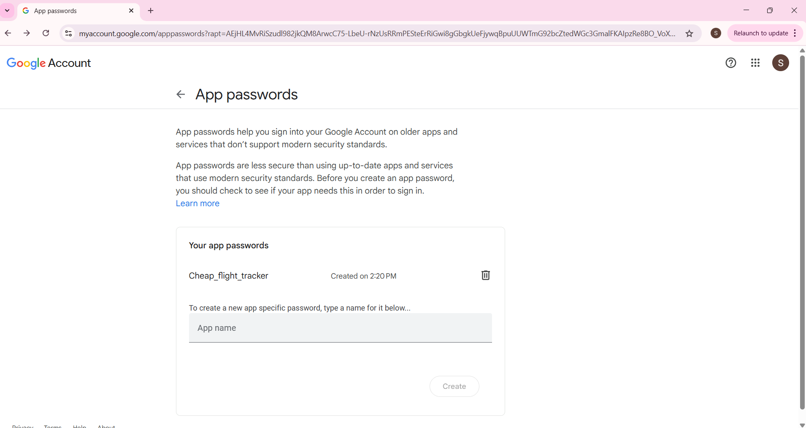


---

## ✅ Summary<a href="#top" class="back-to-top-link" aria-label="Back to Top">↑</a>

| Concept | Tools Used |
|--------|-------------|
| API Fundamentals | `requests`, `json`, error handling |
| Authentication | API Key, Basic Auth |
| JSON | `json.load`, `json.dump` |
| Data Storage | `.env`, Google Sheets via Sheety, csv file |
| Communication | Email (SMTP), Twilio |


> 🚀 This tutorial bridges theory with practice using exciting, purposeful applications. You now have the tools to build your own API-powered projects!