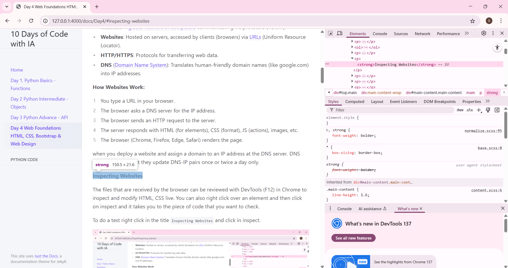
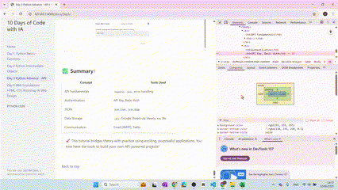
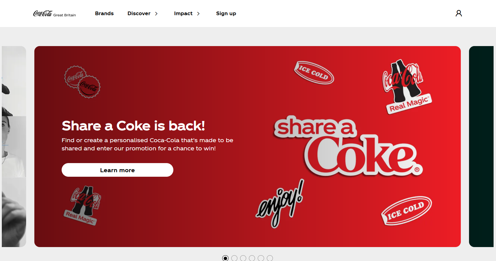
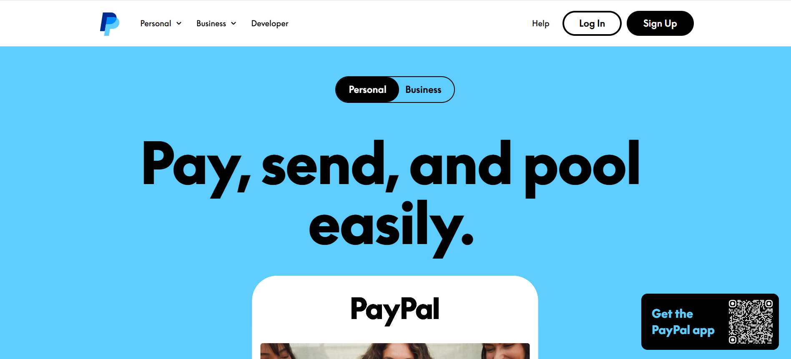
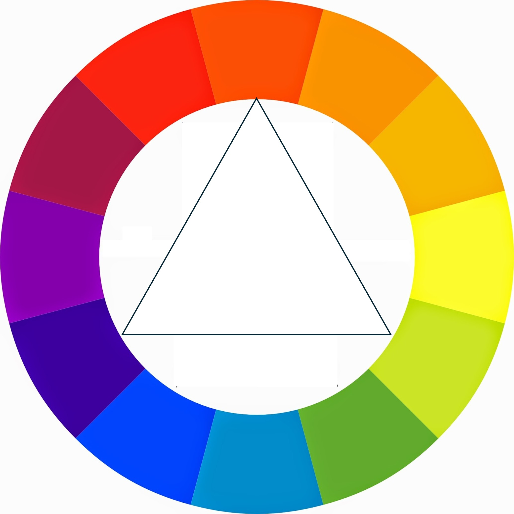

# Dia 4. Fundamentos da Web. 🕸️ HTML, CSS, Bootstrap e Web Design
{: .no_toc }

Bem-vindo ao Dia 4! Hoje, você construirá uma base sólida em desenvolvimento web, aprendendo como a internet funciona, os fundamentos de HTML e CSS, e como usar o Bootstrap para um design web rápido e bonito. Também abordaremos os conceitos básicos da teoria do web design para ajudá-lo a criar sites que as pessoas vão adorar.

---

<details open markdown="block">
  <summary>
    Índice
  </summary>
  {: .text-delta }
1. TOC
{:toc}
</details>

---

## 🌐 Como a Internet Realmente Funciona?<a href="#top" class="back-to-top-link" aria-label="Back to Top">↑</a>

Antes de construir sites, é importante entender como a internet conecta usuários e servidores.

- **Internet**: Uma [rede global de computadores](https://developer.mozilla.org/en-US/docs/Learn_web_development/Howto/Web_mechanics/How_does_the_Internet_work) que se comunicam por meio de protocolos (TCP/IP).
- **Sites**: Hospedados em servidores, acessados por clientes (navegadores) via [URLs](https://developer.mozilla.org/en-US/docs/Learn_web_development/Howto/Web_mechanics/What_is_a_URL) (Localizador Uniforme de Recursos).
- **HTTP/HTTPS**: Protocolos para transferir dados da web.
- **DNS** ([Sistema de Nomes de Domínio](https://developer.mozilla.org/en-US/docs/Learn_web_development/Howto/Web_mechanics/What_is_a_domain_name)): Traduz nomes de domínio amigáveis para humanos (como google.com) em endereços IP.

**Como os Sites Funcionam:**
1. Você digita uma URL em seu navegador.
2. O navegador pede a um servidor DNS o endereço IP.
3. O navegador envia uma requisição HTTP para o servidor.
4. O servidor responde com HTML (para elementos), CSS (formato), JS (ações), imagens, etc.
5. O navegador (Chrome, Firefox, Edge, Safari) renderiza a página.

quando você implanta um site e atribui um domínio a um endereço IP no servidor DNS. Os servidores DNS funcionam 24/7, mas atualizam os pares DNS-IP apenas uma ou duas vezes por dia.

**Inspecionando Sites**

Os arquivos recebidos pelo navegador podem ser revisados com as Ferramentas de Desenvolvedor (F12) no Chrome para inspecionar e modificar HTML e CSS ao vivo. Você também pode clicar com o botão direito sobre um elemento e depois clicar em inspecionar, e isso o levará ao trecho de código que você deseja verificar.

Para fazer um teste, clique com o botão direito no título `Inspecionando Sites` e clique em inspecionar.



O navegador possui um conjunto de ferramentas para inspecionar elementos (o código html), estilos (o código CSS), um terminal para executar código diretamente ou ver em que ordem e quanto tempo leva para baixar e executar o código do servidor. Você também pode gravar ações ou carregar extensões. O navegador tem muito mais possibilidades do que parece à primeira vista.


---


## 📝 HTML: A Estrutura da Web<a href="#top" class="back-to-top-link" aria-label="Back to Top">↑</a>

### O que é HTML?<a href="#top" class="back-to-top-link" aria-label="Back to Top">↑</a>

- **HTML (HyperText Markup Language)** é a linguagem padrão para criar páginas da web que podem ser renderizadas pela maioria dos navegadores. Ele estrutura o conteúdo usando **elementos** (tags) como `<title>Minha Primeira Página Web</title>` de forma estática e não formatada.
Geralmente, as tags têm uma tag de abertura e uma de fechamento, como `<details></details>`, mas algumas tags não precisam de uma tag de fechamento, por exemplo, `` para imagens, `<br>` para nova linha, `<hr>` para uma linha horizontal.

### Estrutura Básica do HTML<a href="#top" class="back-to-top-link" aria-label="Back to Top">↑</a>

Toda página HTML começa com uma estrutura básica:

```html
<!DOCTYPE html>
<html lang="pt-br">
<head>
  <meta charset="UTF-8">
  <title>Minha Primeira Página Web</title>
</head>
<body>
  <!-- O conteúdo vai aqui -->
   Olá, Mundo!
</body>
</html>
```

### Títulos, Parágrafos e Listas<a href="#top" class="back-to-top-link" aria-label="Back to Top">↑</a>
Os [elementos mais básicos](https://developer.mozilla.org/en-US/docs/Learn_web_development/Howto/Solve_HTML_problems) são títulos (existem 7 deles), parágrafos e listas. Você pode encontrar a lista completa de elementos em [W3Schools](https://www.w3schools.com/html/default.asp)

Tente brincar com o código abaixo no [teste da web de HTML da W3Schools](https://www.w3schools.com/html/tryit.asp?filename=tryhtml_basic)

```html
<!DOCTYPE html>
<html lang="pt-br">
<head>
  <meta charset="UTF-8">
  <title>Minha Primeira Página Web</title>
</head>
<body>
  <h1>Título Principal</h1>
  <h2>Subtítulo</h2>
  <p>Este é um parágrafo de texto.</p>

  <ul>
    <li>Item de lista não ordenada</li>
  </ul>
  <ol>
    <li>Item de lista ordenada</li>
  </ol>
</body>
</html>
```

### Elementos de Âncora e Imagem<a href="#top" class="back-to-top-link" aria-label="Back to Top">↑</a>
Elementos de âncora são usados para criar links. Imagens são incluídas com a tag ``. É recomendado incluir uma descrição para acessibilidade.

```html
<a href="https://www.example.com">Visite o Exemplo</a>

```

### Aninhamento e Indentação<a href="#top" class="back-to-top-link" aria-label="Back to Top">↑</a>

Elementos HTML podem ser aninhados. É recomendado escrevê-los com indentação adequada para melhorar a legibilidade.

```html
<ul>
  <li>
    <a href="#">Link Aninhado</a>
  </li>
</ul>
```

### Formulários<a href="#top" class="back-to-top-link" aria-label="Back to Top">↑</a>

Formulários são usados para coletar a entrada do usuário em uma página da web. Cada formulário pode ter rótulos, campos de entrada e placeholders para guiar o usuário, bem como botões para enviar as informações.

Exemplo:
```html
<form>
  <label for="nome">Nome:</label>
  <input type="text" id="nome" name="nome" placeholder="Digite seu nome">
  <button type="submit">Enviar</button>
</form>
```

### Estilos<a href="#top" class="back-to-top-link" aria-label="Back to Top">↑</a>

Você pode estilizar elementos HTML inline usando o atributo `style` diretamente na tag. Isso é chamado de estilização inline. Por exemplo, você pode alterar o tamanho da fonte, alinhamento do texto, cor e muito mais.

Exemplo:
```html
<p style="font-size:18px; text-align:center; color:blue; font-family:Arial;">Este é um parágrafo estilizado.</p>
```

Em vez de atribuir os estilos tag por tag, o que seria confuso e demorado, as tags são atribuídas a classes e/ou IDs e, em seguida, os estilos para as classes ou IDs são especificados em um arquivo CSS, como explicado mais adiante.


### Elementos HTML com IDs e Classes<a href="#top" class="back-to-top-link" aria-label="Back to Top">↑</a>

Tanto IDs quanto classes são atributos que podem ser adicionados a elementos HTML para torná-los selecionáveis para estilização com CSS ou manipulação com JavaScript. As principais diferenças:

- **ID**: Deve ser único na página (apenas um elemento deve ter um ID específico)
- **Classe**: Pode ser reutilizada em múltiplos elementos

```html
<h2 id="titulo-boas-vindas" class="titulo-secao">Bem-vindo ao Meu Site</h2>
<p id="texto-intro" class="paragrafo-conteudo">Este parágrafo tem um ID e uma classe.
O ID "texto-intro" só pode ser usado uma vez nesta página, enquanto a classe "paragrafo-conteudo"
pode ser aplicada a múltiplos elementos de parágrafo.</p>
```

Em CSS, você selecionaria esses elementos usando:
```css
/* Selecionar por ID (usa o símbolo #) */
#titulo-boas-vindas {
  color: navy;
  font-size: 28px;
}

#texto-intro {
  font-style: italic;
}

/* Selecionar por classe (usa o símbolo .) */
.titulo-secao {
  border-bottom: 2px solid #ccc;
  padding-bottom: 10px;
}

.paragrafo-conteudo {
  line-height: 1.6;
  margin-bottom: 20px;
}
```


### Divs<a href="#top" class="back-to-top-link" aria-label="Back to Top">↑</a>
O elemento HTML `<div>` é um contêiner genérico para conteúdo de fluxo. É uma "divisão" ou "seção" de uma página da web. Eles são usados para agrupar outros elementos HTML.

### Template HTML completo<a href="#top" class="back-to-top-link" aria-label="Back to Top">↑</a>

<details markdown="block">
  <summary>
    Para uma visão completa de todos os tipos de elementos HTML, veja o código abaixo.
  </summary>

Isso pode ser visualizado no [teste da web de HTML da W3Schools](https://www.w3schools.com/html/tryit.asp?filename=tryhtml_basic)


```html
<!DOCTYPE html>
<html lang="pt-br">
<head>
    <meta charset="UTF-8">
    <meta name="viewport" content="width=device-width, initial-scale=1.0">
    <title>Mostruário de Elementos HTML</title>
    <!-- Tailwind CSS CDN para estilização -->
    <script src="https://cdn.tailwindcss.com"></script>
    <!-- Google Fonts - Inter -->
    <link href="https://fonts.googleapis.com/css2?family=Inter:wght@400;600;700&display=swap" rel="stylesheet">
    <style>
        body {
            font-family: 'Inter', sans-serif;
            background-color: #f3f4f6; /* Fundo cinza claro */
            color: #374151; /* Texto cinza escuro */
        }
    </style>
</head>
<body class="p-4 sm:p-8 md:p-12 lg:p-16">
    <div class="max-w-4xl mx-auto bg-white shadow-xl rounded-xl p-6 sm:p-8 md:p-10 lg:p-12">

        <!-- Seção de Cabeçalho -->
        <header class="mb-12 text-center">
            <h1 class="text-4xl sm:text-5xl font-extrabold text-blue-600 mb-4 rounded-lg p-2">Mostruário de Elementos HTML</h1>
            <p class="text-lg sm:text-xl text-gray-700">Um template abrangente demonstrando elementos HTML comuns com Tailwind CSS.</p>
        </header>

        <!-- Seção de Navegação -->
        <nav class="mb-12">
            <h2 class="text-3xl font-semibold text-gray-800 mb-4 pb-2 border-b-2 border-blue-300 rounded-lg">Navegação</h2>
            <ul class="flex flex-wrap gap-4 justify-center">
                <li><a href="#typography" class="text-blue-600 hover:text-blue-800 text-lg font-medium p-2 rounded-md hover:bg-blue-50 transition-colors duration-200">Tipografia</a></li>
                <li><a href="#links-images" class="text-blue-600 hover:text-blue-800 text-lg font-medium p-2 rounded-md hover:bg-blue-50 transition-colors duration-200">Links e Imagens</a></li>
                <li><a href="#lists" class="text-blue-600 hover:text-blue-800 text-lg font-medium p-2 rounded-md hover:bg-blue-50 transition-colors duration-200">Listas</a></li>
                <li><a href="#tables" class="text-blue-600 hover:text-blue-800 text-lg font-medium p-2 rounded-md hover:bg-blue-50 transition-colors duration-200">Tabelas</a></li>
                <li><a href="#forms" class="text-blue-600 hover:text-blue-800 text-lg font-medium p-2 rounded-md hover:bg-blue-50 transition-colors duration-200">Formulários</a></li>
                <li><a href="#media" class="text-blue-600 hover:text-blue-800 text-lg font-medium p-2 rounded-md hover:bg-blue-50 transition-colors duration-200">Mídia</a></li>
                <li><a href="#interactive" class="text-blue-600 hover:text-blue-800 text-lg font-medium p-2 rounded-md hover:bg-blue-50 transition-colors duration-200">Interativo</a></li>
            </ul>
        </nav>

        <!-- Área de Conteúdo Principal -->
        <main>
            <!-- Seção de Tipografia -->
            <section id="typography" class="mb-12 p-6 bg-gray-50 rounded-lg shadow-md">
                <h2 class="text-3xl font-semibold text-gray-800 mb-4 pb-2 border-b-2 border-blue-300 rounded-lg">Tipografia</h2>

                <!-- Títulos -->
                <h3 class="text-2xl font-bold text-gray-700 mb-3">Títulos</h3>
                <p class="mb-4">O HTML fornece seis níveis de títulos, de `h1` (mais importante) a `h6` (menos importante).</p>
                <h1 class="text-4xl font-extrabold text-blue-700 mb-2">Título 1 (h1) - Título Principal</h1>
                <h2 class="text-3xl font-bold text-blue-600 mb-2">Título 2 (h2) - Título da Seção</h2>
                <h3 class="text-2xl font-semibold text-blue-500 mb-2">Título 3 (h3) - Título da Subseção</h3>
                <h4 class="text-xl font-medium text-blue-400 mb-2">Título 4 (h4) - Título Menor</h4>
                <h5 class="text-lg font-normal text-blue-300 mb-2">Título 5 (h5) - Título Menor Ainda</h5>
                <h6 class="text-base font-light text-blue-200 mb-6">Título 6 (h6) - Título Menos Importante</h6>

                <!-- Parágrafos -->
                <h3 class="text-2xl font-bold text-gray-700 mb-3">Parágrafos</h3>
                <p class="mb-4 text-gray-600 leading-relaxed">
                    Este é um parágrafo padrão (`&lt;p&gt;`) de texto. É usado para blocos de conteúdo.
                    Podemos adicionar algum <strong class="font-bold text-gray-800">texto em negrito</strong> e
                    <em>texto enfatizado (itálico)</em> usando as tags `&lt;strong&gt;` e `&lt;em&gt;`.
                </p>
                <p class="mb-6 text-gray-600 leading-relaxed">
                    Aqui está outro parágrafo demonstrando várias opções de formatação de texto inline.
                    Você pode <mark class="bg-yellow-200 px-1 rounded">destacar texto</mark> usando `&lt;mark&gt;`.
                    <del class="line-through text-red-500">Texto deletado</del> (`&lt;del&gt;`) e
                    <ins class="underline text-green-600">texto inserido</ins> (`&lt;ins&gt;`) também são possíveis.
                    Para notação científica, você pode usar H<sub class="align-sub">2</sub>O (`&lt;sub&gt;`) ou
                    E=mc<sup class="align-super">2</sup> (`&lt;sup&gt;`).
                </p>
            </section>

            <!-- Seção de Links e Imagens -->
            <section id="links-images" class="mb-12 p-6 bg-gray-50 rounded-lg shadow-md">
                <h2 class="text-3xl font-semibold text-gray-800 mb-4 pb-2 border-b-2 border-blue-300 rounded-lg">Links e Imagens</h2>

                <!-- Links -->
                <h3 class="text-2xl font-bold text-gray-700 mb-3">Links</h3>
                <p class="mb-4">
                    Este é um link externo:
                    <a href="https://www.google.com" target="_blank" rel="noopener noreferrer"
                       class="text-blue-600 hover:text-blue-800 underline font-medium transition-colors duration-200">
                        Visite o Google
                    </a>.
                    Links (`&lt;a&gt;`) são cruciais para a navegação. O atributo `target="_blank"` abre o link em uma nova aba, e `rel="noopener noreferrer"` é uma boa prática de segurança para links externos.
                </p>

                <!-- Imagens -->
                <h3 class="text-2xl font-bold text-gray-700 mb-3">Imagens</h3>
                <p class="mb-4">
                    Uma imagem (`&lt;img&gt;`) exibida abaixo. O atributo `alt` é importante para a acessibilidade.
                    O atributo `onerror` fornece um fallback caso a imagem não carregue.
                </p>
                <div class="flex justify-center mb-6">
                    
                </div>
            </section>

            <!-- Seção de Listas -->
            <section id="lists" class="mb-12 p-6 bg-gray-50 rounded-lg shadow-md">
                <h2 class="text-3xl font-semibold text-gray-800 mb-4 pb-2 border-b-2 border-blue-300 rounded-lg">Listas</h2>

                <!-- Lista Não Ordenada -->
                <h3 class="text-2xl font-bold text-gray-700 mb-3">Lista Não Ordenada (`&lt;ul&gt;`)</h3>
                <p class="mb-2">Itens em uma lista não ordenada são tipicamente marcados com pontos.</p>
                <ul class="list-disc list-inside mb-6 pl-4 text-gray-700">
                    <li class="mb-1">Item Um</li>
                    <li class="mb-1">Item Dois
                        <ul class="list-circle list-inside mt-1 pl-4">
                            <li class="mb-1">Item Aninhado A</li>
                            <li class="mb-1">Item Aninhado B</li>
                        </ul>
                    </li>
                    <li class="mb-1">Item Três</li>
                </ul>

                <!-- Lista Ordenada -->
                <h3 class="text-2xl font-bold text-gray-700 mb-3">Lista Ordenada (`&lt;ol&gt;`)</h3>
                <p class="mb-2">Itens em uma lista ordenada são tipicamente numerados.</p>
                <ol class="list-decimal list-inside mb-6 pl-4 text-gray-700">
                    <li class="mb-1">Primeiro passo</li>
                    <li class="mb-1">Segundo passo</li>
                    <li class="mb-1">Terceiro passo</li>
                </ol>

                <!-- Lista de Descrição -->
                <h3 class="text-2xl font-bold text-gray-700 mb-3">Lista de Descrição (`&lt;dl&gt;`)</h3>
                <p class="mb-2">Uma lista de termos e suas descrições.</p>
                <dl class="mb-6 text-gray-700">
                    <dt class="font-semibold text-gray-800 mt-2">HTML</dt>
                    <dd class="ml-6 mb-1">HyperText Markup Language: A linguagem de marcação padrão para criar páginas da web.</dd>
                    <dt class="font-semibold text-gray-800 mt-2">CSS</dt>
                    <dd class="ml-6 mb-1">Cascading Style Sheets: Uma linguagem de folha de estilo usada para descrever a apresentação de um documento escrito em HTML.</dd>
                    <dt class="font-semibold text-gray-800 mt-2">JavaScript</dt>
                    <dd class="ml-6 mb-1">Uma linguagem de programação que permite páginas da web interativas.</dd>
                </dl>
            </section>

            <!-- Seção de Tabelas -->
            <section id="tables" class="mb-12 p-6 bg-gray-50 rounded-lg shadow-md overflow-x-auto">
                <h2 class="text-3xl font-semibold text-gray-800 mb-4 pb-2 border-b-2 border-blue-300 rounded-lg">Tabelas</h2>
                <p class="mb-4">Tabelas (`&lt;table&gt;`) são usadas para exibir dados tabulares.</p>
                <table class="w-full border-collapse text-left rounded-lg overflow-hidden shadow-md">
                    <thead class="bg-blue-600">
                        <tr>
                            <th class="py-3 px-4 border-b border-blue-700">Nome</th>
                            <th class="py-3 px-4 border-b border-blue-700">Idade</th>
                            <th class="py-3 px-4 border-b border-blue-700">Cidade</th>
                        </tr>
                    </thead>
                    <tbody class="bg-white">
                        <tr>
                            <td class="py-2 px-4 border-b border-gray-200">João da Silva</td>
                            <td class="py-2 px-4 border-b border-gray-200">30</td>
                            <td class="py-2 px-4 border-b border-gray-200">Nova York</td>
                        </tr>
                        <tr>
                            <td class="py-2 px-4 border-b border-gray-200">Maria Souza</td>
                            <td class="py-2 px-4 border-b border-gray-200">24</td>
                            <td class="py-2 px-4 border-b border-gray-200">Los Angeles</td>
                        </tr>
                        <tr>
                            <td class="py-2 px-4 border-b border-gray-200">Pedro Oliveira</td>
                            <td class="py-2 px-4 border-b border-gray-200">45</td>
                            <td class="py-2 px-4 border-b border-gray-200">Chicago</td>
                        </tr>
                    </tbody>
                </table>
            </section>

            <!-- Seção de Formulários -->
            <section id="forms" class="mb-12 p-6 bg-gray-50 rounded-lg shadow-md">
                <h2 class="text-3xl font-semibold text-gray-800 mb-4 pb-2 border-b-2 border-blue-300 rounded-lg">Formulários</h2>
                <p class="mb-4">Formulários (`&lt;form&gt;`) são usados para coletar a entrada do usuário.</p>

                <form class="space-y-6">
                    <!-- Entrada de Texto -->
                    <div>
                        <label for="username" class="block text-sm font-medium text-gray-700 mb-1">Nome de usuário:</label>
                        <input type="text" id="username" name="username" placeholder="Digite seu nome de usuário"
                               class="mt-1 block w-full px-3 py-2 border border-gray-300 rounded-md shadow-sm focus:ring-blue-500 focus:border-blue-500 sm:text-sm"
                               required>
                    </div>

                    <!-- Entrada de Email -->
                    <div>
                        <label for="email" class="block text-sm font-medium text-gray-700 mb-1">Email:</label>
                        <input type="email" id="email" name="email" placeholder="voce@exemplo.com"
                               class="mt-1 block w-full px-3 py-2 border border-gray-300 rounded-md shadow-sm focus:ring-blue-500 focus:border-blue-500 sm:text-sm">
                    </div>

                    <!-- Entrada de Senha -->
                    <div>
                        <label for="password" class="block text-sm font-medium text-gray-700 mb-1">Senha:</label>
                        <input type="password" id="password" name="password" placeholder="••••••••"
                               class="mt-1 block w-full px-3 py-2 border border-gray-300 rounded-md shadow-sm focus:ring-blue-500 focus:border-blue-500 sm:text-sm"
                               minlength="8">
                    </div>

                    <!-- Entrada de Número -->
                    <div>
                        <label for="quantity" class="block text-sm font-medium text-gray-700 mb-1">Quantidade:</label>
                        <input type="number" id="quantity" name="quantity" value="1" min="1" max="10"
                               class="mt-1 block w-full px-3 py-2 border border-gray-300 rounded-md shadow-sm focus:ring-blue-500 focus:border-blue-500 sm:text-sm">
                    </div>

                    <!-- Textarea -->
                    <div>
                        <label for="message" class="block text-sm font-medium text-gray-700 mb-1">Mensagem:</label>
                        <textarea id="message" name="message" rows="4" placeholder="Sua mensagem aqui..."
                                  class="mt-1 block w-full px-3 py-2 border border-gray-300 rounded-md shadow-sm focus:ring-blue-500 focus:border-blue-500 sm:text-sm"></textarea>
                    </div>

                    <!-- Select (Dropdown) -->
                    <div>
                        <label for="country" class="block text-sm font-medium text-gray-700 mb-1">País:</label>
                        <select id="country" name="country"
                                class="mt-1 block w-full px-3 py-2 border border-gray-300 rounded-md shadow-sm focus:ring-blue-500 focus:border-blue-500 sm:text-sm bg-white">
                            <option value="">--Por favor, escolha uma opção--</option>
                            <option value="usa">Estados Unidos</option>
                            <option value="can">Canadá</option>
                            <option value="mex">México</option>
                        </select>
                    </div>

                    <!-- Checkbox -->
                    <div class="flex items-center">
                        <input type="checkbox" id="newsletter" name="newsletter"
                               class="h-4 w-4 text-blue-600 border-gray-300 rounded focus:ring-blue-500">
                        <label for="newsletter" class="ml-2 block text-sm text-gray-900">Inscrever-se na newsletter</label>
                    </div>

                    <!-- Botões de Rádio (Fieldset para agrupar) -->
                    <fieldset class="border border-gray-300 p-4 rounded-md">
                        <legend class="text-base font-medium text-gray-900">Cor Favorita:</legend>
                        <div class="mt-2 space-y-2">
                            <div class="flex items-center">
                                <input type="radio" id="color_red" name="fav_color" value="red"
                                       class="focus:ring-blue-500 h-4 w-4 text-blue-600 border-gray-300">
                                <label for="color_red" class="ml-2 block text-sm text-gray-900">Vermelho</label>
                            </div>
                            <div class="flex items-center">
                                <input type="radio" id="color_blue" name="fav_color" value="blue" checked
                                       class="focus:ring-blue-500 h-4 w-4 text-blue-600 border-gray-300">
                                <label for="color_blue" class="ml-2 block text-sm text-gray-900">Azul</label>
                            </div>
                            <div class="flex items-center">
                                <input type="radio" id="color_green" name="fav_color" value="green"
                                       class="focus:ring-blue-500 h-4 w-4 text-blue-600 border-gray-300">
                                <label for="color_green" class="ml-2 block text-sm text-gray-900">Verde</label>
                            </div>
                        </div>
                    </fieldset>

                    <!-- Entrada de Arquivo -->
                    <div>
                        <label for="profile_pic" class="block text-sm font-medium text-gray-700 mb-1">Carregar Foto de Perfil:</label>
                        <input type="file" id="profile_pic" name="profile_pic" accept="image/*"
                               class="mt-1 block w-full text-sm text-gray-500 file:mr-4 file:py-2 file:px-4 file:rounded-full file:border-0 file:text-sm file:font-semibold file:bg-blue-50 file:text-blue-700 hover:file:bg-blue-100">
                    </div>

                    <!-- Entrada de Faixa -->
                    <div>
                        <label for="volume" class="block text-sm font-medium text-gray-700 mb-1">Volume:</label>
                        <input type="range" id="volume" name="volume" min="0" max="100" value="50"
                               class="mt-1 block w-full h-2 bg-gray-200 rounded-lg appearance-none cursor-pointer range-lg">
                    </div>

                    <!-- Entrada de Data -->
                    <div>
                        <label for="event_date" class="block text-sm font-medium text-gray-700 mb-1">Data do Evento:</label>
                        <input type="date" id="event_date" name="event_date"
                               class="mt-1 block w-full px-3 py-2 border border-gray-300 rounded-md shadow-sm focus:ring-blue-500 focus:border-blue-500 sm:text-sm">
                    </div>

                    <!-- Entrada de Cor -->
                    <div>
                        <label for="fav_color_picker" class="block text-sm font-medium text-gray-700 mb-1">Escolha sua cor favorita:</label>
                        <input type="color" id="fav_color_picker" name="fav_color_picker" value="#4A90E2"
                               class="mt-1 block w-24 h-10 border border-gray-300 rounded-md cursor-pointer">
                    </div>

                    <!-- Botão de Envio -->
                    <div>
                        <button type="submit"
                                class="w-full flex justify-center py-2 px-4 border border-transparent rounded-md shadow-sm text-sm font-medium text-white bg-blue-600 hover:bg-blue-700 focus:outline-none focus:ring-2 focus:ring-offset-2 focus:ring-blue-500 transition-colors duration-200">
                            Enviar Formulário
                        </button>
                    </div>
                </form>
            </section>

            <!-- Seção de Mídia -->
            <section id="media" class="mb-12 p-6 bg-gray-50 rounded-lg shadow-md">
                <h2 class="text-3xl font-semibold text-gray-800 mb-4 pb-2 border-b-2 border-blue-300 rounded-lg">Mídia</h2>

                <!-- Áudio -->
                <h3 class="text-2xl font-bold text-gray-700 mb-3">Áudio (`&lt;audio&gt;`)</h3>
                <p class="mb-4">Incorpore conteúdo de áudio. Nota: Uma URL de arquivo de áudio real seria necessária aqui.</p>
                <div class="flex justify-center mb-6">
                    <audio controls class="w-full max-w-lg rounded-lg shadow-md bg-gray-200 p-2">
                        <!-- Substitua por uma fonte de áudio válida -->
                        <source src="https://www.soundhelix.com/examples/mp3/SoundHelix-Song-1.mp3" type="audio/mpeg">
                        Seu navegador não suporta o elemento de áudio.
                    </audio>
                </div>

                <!-- Vídeo -->
                <h3 class="text-2xl font-bold text-gray-700 mb-3">Vídeo (`&lt;video&gt;`)</h3>
                <p class="mb-4">Incorpore conteúdo de vídeo. Nota: Uma URL de arquivo de vídeo real seria necessária aqui.</p>
                <div class="flex justify-center mb-6">
                    <video controls width="640" height="360" poster="https://placehold.co/640x360/A0A0A0/FFFFFF?text=Placeholder+de+Vídeo"
                           class="max-w-full h-auto rounded-lg shadow-md border-2 border-gray-200">
                        <!-- Substitua por uma fonte de vídeo válida -->
                        <source src="http://commondatastorage.googleapis.com/gtv-videos-bucket/sample/BigBuckBunny.mp4" type="video/mp4">
                        Seu navegador não suporta a tag de vídeo.
                    </video>
                </div>
            </section>

            <!-- Seção de Elementos Interativos -->
            <section id="interactive" class="mb-12 p-6 bg-gray-50 rounded-lg shadow-md">
                <h2 class="text-3xl font-semibold text-gray-800 mb-4 pb-2 border-b-2 border-blue-300 rounded-lg">Elementos Interativos</h2>

                <!-- Detalhes/Resumo -->
                <h3 class="text-2xl font-bold text-gray-700 mb-3">Detalhes e Resumo (`&lt;details&gt;`, `&lt;summary&gt;`)</h3>
                <p class="mb-4">Fornece um widget de divulgação sob demanda que o usuário pode abrir e fechar.</p>
                <details class="bg-white border border-gray-300 rounded-md p-4 shadow-sm cursor-pointer hover:bg-gray-100 transition-colors duration-200">
                    <summary class="font-semibold text-lg text-blue-700">Clique para revelar mais informações</summary>
                    <div class="mt-3 text-gray-700 leading-relaxed">
                        <p>Este conteúdo está oculto por padrão e é revelado quando o resumo é clicado.</p>
                        <p>É útil para FAQs, acordeões ou para ocultar detalhes menos importantes.</p>
                    </div>
                </details>
            </section>
        </main>

        <!-- Seção Aside (para conteúdo tangencial) -->
        <aside class="mb-12 p-6 bg-blue-50 rounded-lg shadow-md border-l-4 border-blue-300">
            <h2 class="text-3xl font-semibold text-gray-800 mb-4 pb-2 border-b-2 border-blue-300 rounded-lg">Sobre Este Template</h2>
            <p class="text-gray-700 leading-relaxed">
                Este template serve como uma referência rápida para elementos HTML comuns. Cada seção demonstra uma categoria diferente de tags e como elas podem ser estilizadas usando classes de utilidade do <a href="https://tailwindcss.com/" target="_blank" rel="noopener noreferrer" class="text-blue-600 hover:text-blue-800 underline font-medium">Tailwind CSS</a>.
            </p>
            <p class="mt-3 text-gray-700 leading-relaxed">
                Lembre-se de aplicar HTML semântico para melhor acessibilidade e SEO.
            </p>
        </aside>

        <!-- Seção de Rodapé -->
        <footer class="text-center text-gray-600 mt-12 pt-6 border-t-2 border-gray-200">
            <p>&copy; 2025 Mostruário de Elementos HTML. Todos os direitos reservados.</p>
            <p class="text-sm mt-2">
                Criado com amor usando HTML e Tailwind CSS.
            </p>
        </footer>

    </div>

    <!-- Exemplo de JavaScript (Opcional) -->
    <script>
        // Um exemplo simples de JavaScript demonstrando um log no console
        // Este script é executado após o carregamento do documento HTML.
        console.log("Mostruário de Elementos HTML Carregado!");

        // Exemplo de adição de um ouvinte de evento a um botão (se você tivesse um)
        document.addEventListener('DOMContentLoaded', () => {
            const submitButton = document.querySelector('button[type="submit"]');
            if (submitButton) {
                submitButton.addEventListener('click', (event) => {
                    // Previne o envio padrão do formulário para demonstração
                    event.preventDefault();
                    console.log('Tentativa de envio do formulário!');
                    // Em uma aplicação real, você manipularia os dados do formulário aqui,
                    // por exemplo, enviando-os para um servidor usando a API fetch.
                    // Por enquanto, apenas mostraremos uma mensagem simples no console.
                });
            }
        });
    </script>
</body>
</html>
```


</details>

<details>
  <summary>
    Template HTML completo renderizado abaixo.
  </summary>
Você pode usar F12 ou clicar com o botão direito e inspecionar para ver o código html de cada elemento.


```
<html lang="pt-br">
<head>
    <meta charset="UTF-8">
    <meta name="viewport" content="width=device-width, initial-scale=1.0">
    <title>Mostruário de Elementos HTML</title>
    <!-- Tailwind CSS CDN para estilização -->
    <script src="https://cdn.tailwindcss.com"></script>
    <!-- Google Fonts - Inter -->
    <link href="https://fonts.googleapis.com/css2?family=Inter:wght@400;600;700&display=swap" rel="stylesheet">
    <style>
        body {
            font-family: 'Inter', sans-serif;
            background-color: #f3f4f6; /* Fundo cinza claro */
            color: #374151; /* Texto cinza escuro */
        }
    </style>
</head>
<body class="p-4 sm:p-8 md:p-12 lg:p-16">
    <div class="max-w-4xl mx-auto bg-white shadow-xl rounded-xl p-6 sm:p-8 md:p-10 lg:p-12">

        <!-- Seção de Cabeçalho -->
        <header class="mb-12 text-center">
            <h1 class="text-4xl sm:text-5xl font-extrabold text-blue-600 mb-4 rounded-lg p-2">Mostruário de Elementos HTML</h1>
            <p class="text-lg sm:text-xl text-gray-700">Um template abrangente demonstrando elementos HTML comuns com Tailwind CSS.</p>
        </header>

        <!-- Seção de Navegação -->
        <nav class="mb-12">
            <h2 class="text-3xl font-semibold text-gray-800 mb-4 pb-2 border-b-2 border-blue-300 rounded-lg">Navegação</h2>
            <ul class="flex flex-wrap gap-4 justify-center">
                <li><a href="#typography" class="text-blue-600 hover:text-blue-800 text-lg font-medium p-2 rounded-md hover:bg-blue-50 transition-colors duration-200">Tipografia</a></li>
                <li><a href="#links-images" class="text-blue-600 hover:text-blue-800 text-lg font-medium p-2 rounded-md hover:bg-blue-50 transition-colors duration-200">Links e Imagens</a></li>
                <li><a href="#lists" class="text-blue-600 hover:text-blue-800 text-lg font-medium p-2 rounded-md hover:bg-blue-50 transition-colors duration-200">Listas</a></li>
                <li><a href="#tables" class="text-blue-600 hover:text-blue-800 text-lg font-medium p-2 rounded-md hover:bg-blue-50 transition-colors duration-200">Tabelas</a></li>
                <li><a href="#forms" class="text-blue-600 hover:text-blue-800 text-lg font-medium p-2 rounded-md hover:bg-blue-50 transition-colors duration-200">Formulários</a></li>
                <li><a href="#media" class="text-blue-600 hover:text-blue-800 text-lg font-medium p-2 rounded-md hover:bg-blue-50 transition-colors duration-200">Mídia</a></li>
                <li><a href="#interactive" class="text-blue-600 hover:text-blue-800 text-lg font-medium p-2 rounded-md hover:bg-blue-50 transition-colors duration-200">Interativo</a></li>
            </ul>
        </nav>

        <!-- Área de Conteúdo Principal -->
        <main>
            <!-- Seção de Tipografia -->
            <section id="typography" class="mb-12 p-6 bg-gray-50 rounded-lg shadow-md">
                <h2 class="text-3xl font-semibold text-gray-800 mb-4 pb-2 border-b-2 border-blue-300 rounded-lg">Tipografia</h2>

                <!-- Títulos -->
                <h3 class="text-2xl font-bold text-gray-700 mb-3">Títulos</h3>
                <p class="mb-4">O HTML fornece seis níveis de títulos, de `h1` (mais importante) a `h6` (menos importante).</p>
                <h1 class="text-4xl font-extrabold text-blue-700 mb-2">Título 1 (h1) - Título Principal</h1>
                <h2 class="text-3xl font-bold text-blue-600 mb-2">Título 2 (h2) - Título da Seção</h2>
                <h3 class="text-2xl font-semibold text-blue-500 mb-2">Título 3 (h3) - Título da Subseção</h3>
                <h4 class="text-xl font-medium text-blue-400 mb-2">Título 4 (h4) - Título Menor</h4>
                <h5 class="text-lg font-normal text-blue-300 mb-2">Título 5 (h5) - Título Menor Ainda</h5>
                <h6 class="text-base font-light text-blue-200 mb-6">Título 6 (h6) - Título Menos Importante</h6>

                <!-- Parágrafos -->
                <h3 class="text-2xl font-bold text-gray-700 mb-3">Parágrafos</h3>
                <p class="mb-4 text-gray-600 leading-relaxed">
                    Este é um parágrafo padrão (`&lt;p&gt;`) de texto. É usado para blocos de conteúdo.
                    Podemos adicionar algum <strong class="font-bold text-gray-800">texto em negrito</strong> e
                    <em>texto enfatizado (itálico)</em> usando as tags `&lt;strong&gt;` e `&lt;em&gt;`.
                </p>
                <p class="mb-6 text-gray-600 leading-relaxed">
                    Aqui está outro parágrafo demonstrando várias opções de formatação de texto inline.
                    Você pode <mark class="bg-yellow-200 px-1 rounded">destacar texto</mark> usando `&lt;mark&gt;`.
                    <del class="line-through text-red-500">Texto deletado</del> (`&lt;del&gt;`) e
                    <ins class="underline text-green-600">texto inserido</ins> (`&lt;ins&gt;`) também são possíveis.
                    Para notação científica, você pode usar H<sub class="align-sub">2</sub>O (`&lt;sub&gt;`) ou
                    E=mc<sup class="align-super">2</sup> (`&lt;sup&gt;`).
                </p>
            </section>

            <!-- Seção de Links e Imagens -->
            <section id="links-images" class="mb-12 p-6 bg-gray-50 rounded-lg shadow-md">
                <h2 class="text-3xl font-semibold text-gray-800 mb-4 pb-2 border-b-2 border-blue-300 rounded-lg">Links e Imagens</h2>

                <!-- Links -->
                <h3 class="text-2xl font-bold text-gray-700 mb-3">Links</h3>
                <p class="mb-4">
                    Este é um link externo:
                    <a href="https://www.google.com" target="_blank" rel="noopener noreferrer"
                       class="text-blue-600 hover:text-blue-800 underline font-medium transition-colors duration-200">
                        Visite o Google
                    </a>.
                    Links (`&lt;a&gt;`) são cruciais para a navegação. O atributo `target="_blank"` abre o link em uma nova aba, e `rel="noopener noreferrer"` é uma boa prática de segurança para links externos.
                </p>

                <!-- Imagens -->
                <h3 class="text-2xl font-bold text-gray-700 mb-3">Imagens</h3>
                <p class="mb-4">
                    Uma imagem (`&lt;img&gt;`) exibida abaixo. O atributo `alt` é importante para a acessibilidade.
                    O atributo `onerror` fornece um fallback caso a imagem não carregue.
                </p>
                <div class="flex justify-center mb-6">
                    
                </div>
            </section>

            <!-- Seção de Listas -->
            <section id="lists" class="mb-12 p-6 bg-gray-50 rounded-lg shadow-md">
                <h2 class="text-3xl font-semibold text-gray-800 mb-4 pb-2 border-b-2 border-blue-300 rounded-lg">Listas</h2>

                <!-- Lista Não Ordenada -->
                <h3 class="text-2xl font-bold text-gray-700 mb-3">Lista Não Ordenada (`&lt;ul&gt;`)</h3>
                <p class="mb-2">Itens em uma lista não ordenada são tipicamente marcados com pontos.</p>
                <ul class="list-disc list-inside mb-6 pl-4 text-gray-700">
                    <li class="mb-1">Item Um</li>
                    <li class="mb-1">Item Dois
                        <ul class="list-circle list-inside mt-1 pl-4">
                            <li class="mb-1">Item Aninhado A</li>
                            <li class="mb-1">Item Aninhado B</li>
                        </ul>
                    </li>
                    <li class="mb-1">Item Três</li>
                </ul>

                <!-- Lista Ordenada -->
                <h3 class="text-2xl font-bold text-gray-700 mb-3">Lista Ordenada (`&lt;ol&gt;`)</h3>
                <p class="mb-2">Itens em uma lista ordenada são tipicamente numerados.</p>
                <ol class="list-decimal list-inside mb-6 pl-4 text-gray-700">
                    <li class="mb-1">Primeiro passo</li>
                    <li class="mb-1">Segundo passo</li>
                    <li class="mb-1">Terceiro passo</li>
                </ol>

                <!-- Lista de Descrição -->
                <h3 class="text-2xl font-bold text-gray-700 mb-3">Lista de Descrição (`&lt;dl&gt;`)</h3>
                <p class="mb-2">Uma lista de termos e suas descrições.</p>
                <dl class="mb-6 text-gray-700">
                    <dt class="font-semibold text-gray-800 mt-2">HTML</dt>
                    <dd class="ml-6 mb-1">HyperText Markup Language: A linguagem de marcação padrão para criar páginas da web.</dd>
                    <dt class="font-semibold text-gray-800 mt-2">CSS</dt>
                    <dd class="ml-6 mb-1">Cascading Style Sheets: Uma linguagem de folha de estilo usada para descrever a apresentação de um documento escrito em HTML.</dd>
                    <dt class="font-semibold text-gray-800 mt-2">JavaScript</dt>
                    <dd class="ml-6 mb-1">Uma linguagem de programação que permite páginas da web interativas.</dd>
                </dl>
            </section>

            <!-- Seção de Tabelas -->
            <section id="tables" class="mb-12 p-6 bg-gray-50 rounded-lg shadow-md overflow-x-auto">
                <h2 class="text-3xl font-semibold text-gray-800 mb-4 pb-2 border-b-2 border-blue-300 rounded-lg">Tabelas</h2>
                <p class="mb-4">Tabelas (`&lt;table&gt;`) são usadas para exibir dados tabulares.</p>
                <table class="w-full border-collapse text-left rounded-lg overflow-hidden shadow-md">
                    <thead class="bg-blue-600">
                        <tr>
                            <th class="py-3 px-4 border-b border-blue-700">Nome</th>
                            <th class="py-3 px-4 border-b border-blue-700">Idade</th>
                            <th class="py-3 px-4 border-b border-blue-700">Cidade</th>
                        </tr>
                    </thead>
                    <tbody class="bg-white">
                        <tr>
                            <td class="py-2 px-4 border-b border-gray-200">João da Silva</td>
                            <td class="py-2 px-4 border-b border-gray-200">30</td>
                            <td class="py-2 px-4 border-b border-gray-200">Nova York</td>
                        </tr>
                        <tr>
                            <td class="py-2 px-4 border-b border-gray-200">Maria Souza</td>
                            <td class="py-2 px-4 border-b border-gray-200">24</td>
                            <td class="py-2 px-4 border-b border-gray-200">Los Angeles</td>
                        </tr>
                        <tr>
                            <td class="py-2 px-4 border-b border-gray-200">Pedro Oliveira</td>
                            <td class="py-2 px-4 border-b border-gray-200">45</td>
                            <td class="py-2 px-4 border-b border-gray-200">Chicago</td>
                        </tr>
                    </tbody>
                </table>
            </section>

            <!-- Seção de Formulários -->
            <section id="forms" class="mb-12 p-6 bg-gray-50 rounded-lg shadow-md">
                <h2 class="text-3xl font-semibold text-gray-800 mb-4 pb-2 border-b-2 border-blue-300 rounded-lg">Formulários</h2>
                <p class="mb-4">Formulários (`&lt;form&gt;`) são usados para coletar a entrada do usuário.</p>

                <form class="space-y-6">
                    <!-- Entrada de Texto -->
                    <div>
                        <label for="username" class="block text-sm font-medium text-gray-700 mb-1">Nome de usuário:</label>
                        <input type="text" id="username" name="username" placeholder="Digite seu nome de usuário"
                               class="mt-1 block w-full px-3 py-2 border border-gray-300 rounded-md shadow-sm focus:ring-blue-500 focus:border-blue-500 sm:text-sm"
                               required>
                    </div>

                    <!-- Entrada de Email -->
                    <div>
                        <label for="email" class="block text-sm font-medium text-gray-700 mb-1">Email:</label>
                        <input type="email" id="email" name="email" placeholder="voce@exemplo.com"
                               class="mt-1 block w-full px-3 py-2 border border-gray-300 rounded-md shadow-sm focus:ring-blue-500 focus:border-blue-500 sm:text-sm">
                    </div>

                    <!-- Entrada de Senha -->
                    <div>
                        <label for="password" class="block text-sm font-medium text-gray-700 mb-1">Senha:</label>
                        <input type="password" id="password" name="password" placeholder="••••••••"
                               class="mt-1 block w-full px-3 py-2 border border-gray-300 rounded-md shadow-sm focus:ring-blue-500 focus:border-blue-500 sm:text-sm"
                               minlength="8">
                    </div>

                    <!-- Entrada de Número -->
                    <div>
                        <label for="quantity" class="block text-sm font-medium text-gray-700 mb-1">Quantidade:</label>
                        <input type="number" id="quantity" name="quantity" value="1" min="1" max="10"
                               class="mt-1 block w-full px-3 py-2 border border-gray-300 rounded-md shadow-sm focus:ring-blue-500 focus:border-blue-500 sm:text-sm">
                    </div>

                    <!-- Textarea -->
                    <div>
                        <label for="message" class="block text-sm font-medium text-gray-700 mb-1">Mensagem:</label>
                        <textarea id="message" name="message" rows="4" placeholder="Sua mensagem aqui..."
                                  class="mt-1 block w-full px-3 py-2 border border-gray-300 rounded-md shadow-sm focus:ring-blue-500 focus:border-blue-500 sm:text-sm"></textarea>
                    </div>

                    <!-- Select (Dropdown) -->
                    <div>
                        <label for="country" class="block text-sm font-medium text-gray-700 mb-1">País:</label>
                        <select id="country" name="country"
                                class="mt-1 block w-full px-3 py-2 border border-gray-300 rounded-md shadow-sm focus:ring-blue-500 focus:border-blue-500 sm:text-sm bg-white">
                            <option value="">--Por favor, escolha uma opção--</option>
                            <option value="usa">Estados Unidos</option>
                            <option value="can">Canadá</option>
                            <option value="mex">México</option>
                        </select>
                    </div>

                    <!-- Checkbox -->
                    <div class="flex items-center">
                        <input type="checkbox" id="newsletter" name="newsletter"
                               class="h-4 w-4 text-blue-600 border-gray-300 rounded focus:ring-blue-500">
                        <label for="newsletter" class="ml-2 block text-sm text-gray-900">Inscrever-se na newsletter</label>
                    </div>

                    <!-- Botões de Rádio (Fieldset para agrupar) -->
                    <fieldset class="border border-gray-300 p-4 rounded-md">
                        <legend class="text-base font-medium text-gray-900">Cor Favorita:</legend>
                        <div class="mt-2 space-y-2">
                            <div class="flex items-center">
                                <input type="radio" id="color_red" name="fav_color" value="red"
                                       class="focus:ring-blue-500 h-4 w-4 text-blue-600 border-gray-300">
                                <label for="color_red" class="ml-2 block text-sm text-gray-900">Vermelho</label>
                            </div>
                            <div class="flex items-center">
                                <input type="radio" id="color_blue" name="fav_color" value="blue" checked
                                       class="focus:ring-blue-500 h-4 w-4 text-blue-600 border-gray-300">
                                <label for="color_blue" class="ml-2 block text-sm text-gray-900">Azul</label>
                            </div>
                            <div class="flex items-center">
                                <input type="radio" id="color_green" name="fav_color" value="green"
                                       class="focus:ring-blue-500 h-4 w-4 text-blue-600 border-gray-300">
                                <label for="color_green" class="ml-2 block text-sm text-gray-900">Verde</label>
                            </div>
                        </div>
                    </fieldset>

                    <!-- Entrada de Arquivo -->
                    <div>
                        <label for="profile_pic" class="block text-sm font-medium text-gray-700 mb-1">Carregar Foto de Perfil:</label>
                        <input type="file" id="profile_pic" name="profile_pic" accept="image/*"
                               class="mt-1 block w-full text-sm text-gray-500 file:mr-4 file:py-2 file:px-4 file:rounded-full file:border-0 file:text-sm file:font-semibold file:bg-blue-50 file:text-blue-700 hover:file:bg-blue-100">
                    </div>

                    <!-- Entrada de Faixa -->
                    <div>
                        <label for="volume" class="block text-sm font-medium text-gray-700 mb-1">Volume:</label>
                        <input type="range" id="volume" name="volume" min="0" max="100" value="50"
                               class="mt-1 block w-full h-2 bg-gray-200 rounded-lg appearance-none cursor-pointer range-lg">
                    </div>

                    <!-- Entrada de Data -->
                    <div>
                        <label for="event_date" class="block text-sm font-medium text-gray-700 mb-1">Data do Evento:</label>
                        <input type="date" id="event_date" name="event_date"
                               class="mt-1 block w-full px-3 py-2 border border-gray-300 rounded-md shadow-sm focus:ring-blue-500 focus:border-blue-500 sm:text-sm">
                    </div>

                    <!-- Entrada de Cor -->
                    <div>
                        <label for="fav_color_picker" class="block text-sm font-medium text-gray-700 mb-1">Escolha sua cor favorita:</label>
                        <input type="color" id="fav_color_picker" name="fav_color_picker" value="#4A90E2"
                               class="mt-1 block w-24 h-10 border border-gray-300 rounded-md cursor-pointer">
                    </div>

                    <!-- Botão de Envio -->
                    <div>
                        <button type="submit"
                                class="w-full flex justify-center py-2 px-4 border border-transparent rounded-md shadow-sm text-sm font-medium text-white bg-blue-600 hover:bg-blue-700 focus:outline-none focus:ring-2 focus:ring-offset-2 focus:ring-blue-500 transition-colors duration-200">
                            Enviar Formulário
                        </button>
                    </div>
                </form>
            </section>

            <!-- Seção de Mídia -->
            <section id="media" class="mb-12 p-6 bg-gray-50 rounded-lg shadow-md">
                <h2 class="text-3xl font-semibold text-gray-800 mb-4 pb-2 border-b-2 border-blue-300 rounded-lg">Mídia</h2>

                <!-- Áudio -->
                <h3 class="text-2xl font-bold text-gray-700 mb-3">Áudio (`&lt;audio&gt;`)</h3>
                <p class="mb-4">Incorpore conteúdo de áudio. Nota: Uma URL de arquivo de áudio real seria necessária aqui.</p>
                <div class="flex justify-center mb-6">
                    <audio controls class="w-full max-w-lg rounded-lg shadow-md bg-gray-200 p-2">
                        <!-- Substitua por uma fonte de áudio válida -->
                        <source src="https://www.soundhelix.com/examples/mp3/SoundHelix-Song-1.mp3" type="audio/mpeg">
                        Seu navegador não suporta o elemento de áudio.
                    </audio>
                </div>

                <!-- Vídeo -->
                <h3 class="text-2xl font-bold text-gray-700 mb-3">Vídeo (`&lt;video&gt;`)</h3>
                <p class="mb-4">Incorpore conteúdo de vídeo. Nota: Uma URL de arquivo de vídeo real seria necessária aqui.</p>
                <div class="flex justify-center mb-6">
                    <video controls width="640" height="360" poster="https://placehold.co/640x360/A0A0A0/FFFFFF?text=Placeholder+de+Vídeo"
                           class="max-w-full h-auto rounded-lg shadow-md border-2 border-gray-200">
                        <!-- Substitua por uma fonte de vídeo válida -->
                        <source src="http://commondatastorage.googleapis.com/gtv-videos-bucket/sample/BigBuckBunny.mp4" type="video/mp4">
                        Seu navegador não suporta a tag de vídeo.
                    </video>
                </div>
            </section>

            <!-- Seção de Elementos Interativos -->
            <section id="interactive" class="mb-12 p-6 bg-gray-50 rounded-lg shadow-md">
                <h2 class="text-3xl font-semibold text-gray-800 mb-4 pb-2 border-b-2 border-blue-300 rounded-lg">Elementos Interativos</h2>

                <!-- Detalhes/Resumo -->
                <h3 class="text-2xl font-bold text-gray-700 mb-3">Detalhes e Resumo (`&lt;details&gt;`, `&lt;summary&gt;`)</h3>
                <p class="mb-4">Fornece um widget de divulgação sob demanda que o usuário pode abrir e fechar.</p>
                <details class="bg-white border border-gray-300 rounded-md p-4 shadow-sm cursor-pointer hover:bg-gray-100 transition-colors duration-200">
                    <summary class="font-semibold text-lg text-blue-700">Clique para revelar mais informações</summary>
                    <div class="mt-3 text-gray-700 leading-relaxed">
                        <p>Este conteúdo está oculto por padrão e é revelado quando o resumo é clicado.</p>
                        <p>É útil para FAQs, acordeões ou para ocultar detalhes menos importantes.</p>
                    </div>
                </details>
            </section>
        </main>

        <!-- Seção Aside (para conteúdo tangencial) -->
        <aside class="mb-12 p-6 bg-blue-50 rounded-lg shadow-md border-l-4 border-blue-300">
            <h2 class="text-3xl font-semibold text-gray-800 mb-4 pb-2 border-b-2 border-blue-300 rounded-lg">Sobre Este Template</h2>
            <p class="text-gray-700 leading-relaxed">
                Este template serve como uma referência rápida para elementos HTML comuns. Cada seção demonstra uma categoria diferente de tags e como elas podem ser estilizadas usando classes de utilidade do <a href="https://tailwindcss.com/" target="_blank" rel="noopener noreferrer" class="text-blue-600 hover:text-blue-800 underline font-medium">Tailwind CSS</a>.
            </p>
            <p class="mt-3 text-gray-700 leading-relaxed">
                Lembre-se de aplicar HTML semântico para melhor acessibilidade e SEO.
            </p>
        </aside>

        <!-- Seção de Rodapé -->
        <footer class="text-center text-gray-600 mt-12 pt-6 border-t-2 border-gray-200">
            <p>&copy; 2025 Mostruário de Elementos HTML. Todos os direitos reservados.</p>
            <p class="text-sm mt-2">
                Criado com amor usando HTML e Tailwind CSS.
            </p>
        </footer>

    </div>

    <!-- Exemplo de JavaScript (Opcional) -->
    <script>
        // Um exemplo simples de JavaScript demonstrando um log no console
        // Este script é executado após o carregamento do documento HTML.
        console.log("Mostruário de Elementos HTML Carregado!");

        // Exemplo de adição de um ouvinte de evento a um botão (se você tivesse um)
        document.addEventListener('DOMContentLoaded', () => {
            const submitButton = document.querySelector('button[type="submit"]');
            if (submitButton) {
                submitButton.addEventListener('click', (event) => {
                    // Previne o envio padrão do formulário para demonstração
                    event.preventDefault();
                    console.log('Tentativa de envio do formulário!');
                    // Em uma aplicação real, você manipularia os dados do formulário aqui,
                    // por exemplo, enviando-os para um servidor usando a API fetch.
                    // Por enquanto, apenas mostraremos uma mensagem simples no console.
                });
            }
        });
    </script>
</body>
</html>
```
</details>

---

## 🎨 CSS: Estilizando a Web<a href="#top" class="back-to-top-link" aria-label="Back to Top">↑</a>

### Por que precisamos de CSS?<a href="#top" class="back-to-top-link" aria-label="Back to Top">↑</a>

- **CSS (Folhas de Estilo em Cascata)** controla a aparência dos elementos HTML. Ele separa o conteúdo (HTML) da apresentação (CSS).

### Adicionando CSS<a href="#top" class="back-to-top-link" aria-label="Back to Top">↑</a>

**Inline:**
```html
<p style="color: red;">Texto vermelho</p>
```
**Interno:**
Quando você define uma lista de estilos no arquivo html para aplicar a todos os elementos.

```html
<head>
  <style>
    p { color: blue; } // Aplica a todos os parágrafos
  </style>
</head>
```

**Externo:**
Em um arquivo css que é referenciado no arquivo html como mostrado abaixo.
```html
<link rel="stylesheet" href="styles.css">
```

### Seletores e Propriedades CSS<a href="#top" class="back-to-top-link" aria-label="Back to Top">↑</a>

Seletores permitem que você selecione elementos específicos, grupos de elementos ou elementos com base em seus atributos, estados ou relações com outros elementos.

#### Seletores Simples<a href="#top" class="back-to-top-link" aria-label="Back to Top">↑</a>

<details markdown="block">
  <summary>
    Seletor Universal (*)
  </summary>
Seleciona todos os elementos da página.

```css
* {
  box-sizing: border-box;
}
```

</details>

<details markdown="block">
  <summary>
    Seletor de Elemento
  </summary>
Seleciona todos os elementos HTML de um tipo especificado (nome da tag).

```css
p {
  font-size: 16px;
}
```

</details>

<details markdown="block">
  <summary>
    Seletor de Classe (.nome_classe)
  </summary>
Seleciona todos os elementos com um atributo de classe específico.

```css
.minha-classe {
  color: blue;
}
```

</details>

<details markdown="block">
  <summary>
    Seletor de ID (#nome_id)
  </summary>
Seleciona um único elemento com um atributo id específico. IDs devem ser únicos em uma página.

```css
#cabecalho {
  background-color: gray;
}
```
</details>

#### Seletores Combinadores<a href="#top" class="back-to-top-link" aria-label="Back to Top">↑</a>
Combinadores permitem selecionar elementos com base em sua relação com outros elementos na árvore do documento.

<details markdown="block">
  <summary>
    Seletor Descendente
  </summary>

```css
div p {
  margin-bottom: 10px;
} /* Seleciona todos os parágrafos dentro de qualquer div */
```

</details>

<details markdown="block">
  <summary>
    Seletor de Filho Direto
  </summary>

```css
ul > li {
  list-style-type: none;
} /* Seleciona todos os elementos li que são filhos diretos de um ul */
```
</details>

#### Seletores de Atributo<a href="#top" class="back-to-top-link" aria-label="Back to Top">↑</a>
Selecionam elementos com base em seus atributos.

<details markdown="block">
  <summary>
    Seletor de Presença ([atributo])
  </summary>

Seleciona elementos que possuem o atributo especificado.

```css
[data-tooltip] {
  position: relative;
}
```
</details>

<details markdown="block">
  <summary>
    Seletor de Valor de Atributo ([atributo="valor"])
  </summary>

Seleciona elementos cujo valor do atributo é exatamente igual a "valor".

```css
input[type="text"] {
  border: 1px solid #ccc;
}
```

</details>

#### Pseudo-classes<a href="#top" class="back-to-top-link" aria-label="Back to Top">↑</a>
Selecionam elementos com base em um estado, condição ou posição específica.

<details markdown="block">
  <summary>
    Pseudo-classes de Ação do Usuário
  </summary>

`:hover:` Quando o ponteiro do mouse está sobre um elemento.

`:active:` Quando um elemento está sendo ativado pelo usuário (ex: clicado).

`:focus:` Quando um elemento tem foco de entrada.

`:visited:` Para links que já foram visitados pelo usuário.

`:link:` Para links não visitados.

</details>

<details markdown="block">
  <summary>
    Pseudo-classes Estruturais
  </summary>

`:first-child:` Seleciona o primeiro filho de seu pai.

`:last-child:` Seleciona o último filho de seu pai.

`:nth-child(n):` Seleciona o enésimo filho de seu pai (pode usar palavras-chave como even, odd, ou fórmulas como 2n+1).

`:first-of-type:` Seleciona o primeiro irmão de seu tipo.

`:last-of-type:` Seleciona o último irmão de seu tipo.

`:nth-of-type(n):` Seleciona o enésimo irmão de seu tipo.

`:only-child:` Seleciona um elemento que é o único filho de seu pai.

`:only-of-type:` Seleciona um elemento que é o único irmão de seu tipo.

`:empty:` Seleciona elementos que não têm filhos (incluindo nós de texto).

`:root:` Seleciona o elemento raiz do documento (geralmente <html>).

</details>

<details markdown="block">
  <summary>
    Pseudo-classes de Formulário
  </summary>

`:checked:` Para botões de opção ou caixas de seleção marcados.

`:disabled:` Para elementos de entrada desabilitados.

`:enabled:` Para elementos de entrada habilitados.

`:required:` Para elementos de entrada com o atributo required.

`:optional:` Para elementos de entrada sem o atributo required.

`:valid:` Para elementos de entrada com valores válidos.

`:invalid:` Para elementos de entrada com valores inválidos.

</details>

<details markdown="block">
  <summary>
    Outras Pseudo-classes
  </summary>

`:not(seletor):` Seleciona elementos que NÃO correspondem ao seletor fornecido.

`:has(seletor):` Seleciona elementos que contêm pelo menos um elemento correspondente ao seletor (ainda experimental/não totalmente suportado em todos os navegadores).

`:is(lista-de-seletores):` Corresponde a qualquer elemento em uma lista de seletores separada por vírgulas.

`:where(lista-de-seletores):` Semelhante ao :is(), mas não adiciona especificidade.

</details>

#### Pseudo-elementos <a href="#top" class="back-to-top-link" aria-label="Back to Top">↑</a>
Para partes específicas de um elemento. Prefixados com dois pontos duplos (::).

<details markdown="block">
  <summary>
    Outros Pseudo-elementos
  </summary>

`::before:` Insere conteúdo antes do conteúdo de um elemento.

`::after:` Insere conteúdo após o conteúdo de um elemento.

`::first-letter:` Seleciona a primeira letra da primeira linha de um elemento de bloco.

`::first-line:` Seleciona a primeira linha de um elemento de bloco.

`::selection:` Seleciona a parte de um elemento que está destacada pelo usuário.

`::marker:` Seleciona o marcador de um item de lista (ex: bolinhas ou números).

`::placeholder:` Seleciona o texto de placeholder em um campo de entrada.

</details>


### Cores em CSS<a href="#top" class="back-to-top-link" aria-label="Back to Top">↑</a>
As cores em CSS podem ser expressas de diferentes formas:

- Nomes de cores: `red`, `blue`
- Hexadecimal: `#ff5733`
- RGB: `rgb(255, 87, 51)`

### Propriedades de Fonte<a href="#top" class="back-to-top-link" aria-label="Back to Top">↑</a>
No CSS existem dois tipos principais de fontes:
- Fontes do Sistema (ou Fontes Seguras para Web): São fontes geralmente pré-instaladas na maioria dos sistemas operacionais (como Arial, Times New Roman, Verdana, Georgia, etc.). Ao especificar uma fonte do sistema no seu CSS, o navegador do usuário tentará usar essa fonte se estiver disponível. Caso contrário, usará uma família genérica que você especificar (ex: sans-serif).

- Fontes Web (ou Fontes Personalizadas): São arquivos de fonte que você hospeda ou vincula de um serviço de fontes web (como Google Fonts, Adobe Fonts). Ao usar uma fonte web, o arquivo da fonte é baixado pelo navegador do usuário junto com os outros arquivos do seu site. Isso garante que o usuário veja exatamente a fonte que você escolheu, independentemente das fontes instaladas no sistema dele.

As formas comuns de obter fontes web:

- Self-hosting: Você baixa os arquivos de fonte (ex: .woff2, .woff, .ttf, .otf) e coloca no seu servidor.
- Google Fonts: Muito popular e fácil. Você seleciona fontes da biblioteca deles, e o Google fornece uma tag <link> para colocar no <head> do seu HTML ou uma regra @import para seu CSS, que cuida do fornecimento da fonte.
- Outros serviços de fontes: Existem muitos outros serviços oferecendo fontes web, geralmente com diferentes modelos de licença.

Abaixo um exemplo de fonte atribuída ao body.
```css
body {
  font-family: 'Roboto', sans-serif;
  font-size: 16px;
  font-weight: 400;
}
```

### O Modelo de Caixa do CSS<a href="#top" class="back-to-top-link" aria-label="Back to Top">↑</a>

Todo elemento em uma página web é tratado como uma caixa retangular pelo navegador. O modelo de caixa do CSS descreve como essas caixas são estruturadas e como o espaçamento funciona ao redor e dentro dos elementos:

- **Conteúdo**: O texto, imagem ou outro conteúdo dentro do elemento.
- **Padding (Preenchimento)**: Espaço entre o conteúdo e a borda. O padding adiciona espaço *dentro* do elemento, ao redor do conteúdo.
- **Borda**: A linha que envolve o padding e o conteúdo. As bordas podem ter diferentes larguras, estilos e cores.
- **Margem**: Espaço *fora* da borda, separando o elemento de outros elementos na página. As margens criam espaço entre as caixas.

Visualmente, a estrutura é:

```
|  Margem  |  ← espaço fora da borda
| [Borda   |  ← borda envolve o padding e o conteúdo
| |Padding |  ← espaço dentro da borda, ao redor do conteúdo
| | Conteúdo|  ← o conteúdo real do elemento
```
Você pode explorar o resultado no inspetor do Chrome.



Você pode controlar cada parte com propriedades CSS como `margin`, `padding` e `border`. Por exemplo:

```css
div {
  margin: 20px;      /* espaço fora da borda */
  padding: 10px;     /* espaço dentro da borda */
  border: 2px solid #333; /* borda ao redor do elemento */
}
```

---

## 🚀 Introdução ao JavaScript<a href="#top" class="back-to-top-link" aria-label="Back to Top">↑</a>

JavaScript é a linguagem de programação que dá vida às páginas web. Enquanto o HTML fornece a estrutura e o CSS cuida da aparência, o JavaScript permite interatividade, conteúdo dinâmico e lógica no lado do cliente (no navegador). O JavaScript possui uma lista extensa e complexa de comandos, módulos e frameworks que não são explicados aqui. O JavaScript pode ser usado tanto no Frontend quanto no Backend. Aqui cobriremos apenas alguns conceitos básicos para que você possa identificá-lo ao inspecionar sites.

### O que o JavaScript pode fazer?<a href="#top" class="back-to-top-link" aria-label="Back to Top">↑</a>
- Responder a ações do usuário (cliques, digitação, movimento do mouse)
- Alterar o conteúdo ou o estilo de uma página web sem recarregar
- Validar formulários antes de serem enviados
- Criar elementos interativos como sliders, modais e abas
- Buscar dados de servidores e atualizar a página (AJAX, APIs)
- Construir jogos, animações e muito mais

### Como usar JavaScript<a href="#top" class="back-to-top-link" aria-label="Back to Top">↑</a>
Você pode adicionar JavaScript à sua página web de várias formas:
- **Inline**: Diretamente no atributo de um elemento HTML (não recomendado para códigos complexos)
- **Interno**: Dentro de uma tag `<script>` no seu arquivo HTML
- **Externo**: Em um arquivo `.js` separado, vinculado ao seu HTML

Exemplo (inline):
```html
<button onclick="alert('Olá!')">Clique em mim</button>
```

Exemplo (interno):
```html
<script>
  function greet() {
    alert('Olá do JavaScript!');
  }
</script>
<button onclick="greet()">Saudar</button>
```

Exemplo (externo):
```html
<script src="script.js"></script>
```

### Teste você mesmo<a href="#top" class="back-to-top-link" aria-label="Back to Top">↑</a>
Abra as DevTools do seu navegador (F12), vá até a aba Console e digite:
```js
console.log('Olá, mundo!');
```
Você verá a mensagem aparecer no console. Esta é uma ótima maneira de experimentar e aprender o básico do JavaScript!

---

## 💡 Bootstrap: Rapid Web Design<a href="#top" class="back-to-top-link" aria-label="Back to Top">↑</a>

### What is Bootstrap?<a href="#top" class="back-to-top-link" aria-label="Back to Top">↑</a>

It is a popular CSS framework for building responsive, mobile-first websites quickly. It includes ready-made components (buttons, navbars, cards) and a grid system.

### Bootstrap Layout<a href="#top" class="back-to-top-link" aria-label="Back to Top">↑</a>
Bootstrap styles are included as a reference in your html file. You can directly link the cloud repository or download a copy and store it with the rest of your files. 
```html
<link rel="stylesheet" href="https://cdn.jsdelivr.net/npm/bootstrap/dist/css/bootstrap.min.css">
<div class="container">
  <div class="row">
    <div class="col-md-6">Column 1</div>
    <div class="col-md-6">Column 2</div>
  </div>
</div>
```

### Bootstrap Components<a href="#top" class="back-to-top-link" aria-label="Back to Top">↑</a>
Bootstrap includes:
- Buttons: `<button class="btn btn-primary">Click</button>`
- Alerts: `<div class="alert alert-success">Success!</div>`
- Navbars, cards, forms, and more.

<details markdown="block">
  <summary>
    Bootstrap template code
  </summary>

This template was generated with Gemini with the prompt: `can you write an html code with all types of HTML/css elements in a template fashion to showcase what can be done in Bootstrap?`

You can visualise this code in [W3Schools html web testing](https://www.w3schools.com/html/tryit.asp?filename=tryhtml_basic)<br>


```html
<!DOCTYPE html>
<html lang="pt-br">
<head>
    <meta charset="UTF-8">
    <meta name="viewport" content="width=device-width, initial-scale=1.0">
    <title>Mostruário de Bootstrap e Tailwind CSS</title>
    <!-- Fonte Inter do Google Fonts -->
    <link href="https://fonts.googleapis.com/css2?family=Inter:wght@300;400;500;600;700&display=swap" rel="stylesheet">
    <!-- Bootstrap CSS -->
    <link href="https://cdn.jsdelivr.net/npm/bootstrap@5.3.3/dist/css/bootstrap.min.css" rel="stylesheet" integrity="sha384-QWTKZyjpPEjISv5WaRU9OFeRpok6YctnYmDr5pNlyT2bRjXh0JMhjY6hW+ALEwIH" crossorigin="anonymous">
    <!-- Tailwind CSS CDN -->
    <script src="https://cdn.tailwindcss.com"></script>
    <style>
        body {
            font-family: 'Inter', sans-serif;
            background-color: #f8f9fa; /* Fundo cinza claro */
        }
        .section-header {
            border-bottom: 2px solid #e0e0e0;
            padding-bottom: 1rem;
            margin-bottom: 2rem;
            font-weight: 600;
            color: #343a40;
        }
        .card {
            box-shadow: 0 4px 8px rgba(0,0,0,0.1);
            border-radius: 0.75rem; /* Cantos mais arredondados */
            overflow: hidden;
            transition: transform 0.2s ease-in-out;
        }
        .card:hover {
            transform: translateY(-5px);
        }
        .btn-custom {
            background-image: linear-gradient(to right, #6a11cb 0%, #2575fc 100%);
            border: none;
            color: white;
            padding: 0.75rem 1.5rem;
            border-radius: 0.5rem;
            transition: all 0.3s ease;
        }
        .btn-custom:hover {
            transform: translateY(-2px);
            box-shadow: 0 5px 15px rgba(0, 0, 0, 0.2);
            color: white; /* Garante que o texto permaneça branco ao passar o mouse */
        }
        /* Estilos personalizados para melhor espaçamento e estética */
        .container-fluid {
            padding-left: 1rem;
            padding-right: 1rem;
        }
        .container {
            padding-top: 3rem;
            padding-bottom: 3rem;
        }
    </style>
</head>
<body>

    <!-- Seção da Barra de Navegação -->
    <nav class="navbar navbar-expand-lg bg-white shadow-sm py-3 px-4">
        <div class="container-fluid">
            <a class="navbar-brand text-lg font-bold text-gray-800" href="#">Mostruário Bootstrap</a>
            <button class="navbar-toggler" type="button" data-bs-toggle="collapse" data-bs-target="#navbarNav" aria-controls="navbarNav" aria-expanded="false" aria-label="Toggle navigation">
                <span class="navbar-toggler-icon"></span>
            </button>
            <div class="collapse navbar-collapse" id="navbarNav">
                <ul class="navbar-nav ms-auto space-x-4">
                    <li class="nav-item">
                        <a class="nav-link text-gray-700 hover:text-blue-600 font-medium" aria-current="page" href="#layout">Layout</a>
                    </li>
                    <li class="nav-item">
                        <a class="nav-link text-gray-700 hover:text-blue-600 font-medium" href="#components">Componentes</a>
                    </li>
                    <li class="nav-item">
                        <a class="nav-link text-gray-700 hover:text-blue-600 font-medium" href="#forms">Formulários</a>
                    </li>
                    <li class="nav-item">
                        <a class="nav-link text-gray-700 hover:text-blue-600 font-medium" href="#utilities">Utilitários</a>
                    </li>
                </ul>
            </div>
        </div>
    </nav>

    <!-- Seção de Herói -->
    <div class="bg-gradient-to-r from-blue-600 to-purple-700 text-white py-20 px-4 text-center rounded-b-lg shadow-lg">
        <div class="container mx-auto">
            <h1 class="text-5xl font-extrabold mb-4">Explore o Poder do Bootstrap</h1>
            <p class="text-xl mb-8 opacity-90">Um template abrangente mostrando recursos essenciais do Bootstrap e design responsivo.</p>
            <button class="btn btn-lg btn-custom shadow-md hover:shadow-xl">Começar</button>
        </div>
    </div>

    <main class="container mx-auto mt-12 px-4 md:px-0">

        <!-- Seção de Layout -->
        <section id="layout" class="mb-12 bg-white p-6 rounded-lg shadow-md">
            <h2 class="text-3xl section-header mb-8">1. Layout e Sistema de Grade</h2>
            <div class="row g-4">
                <div class="col-md-6 col-lg-4">
                    <div class="p-4 bg-blue-100 border border-blue-300 rounded-md text-blue-800 h-full flex items-center justify-center">
                        <p class="text-lg font-medium">Coluna 1 (col-md-6 col-lg-4)</p>
                    </div>
                </div>
                <div class="col-md-6 col-lg-4">
                    <div class="p-4 bg-green-100 border border-green-300 rounded-md text-green-800 h-full flex items-center justify-center">
                        <p class="text-lg font-medium">Coluna 2 (col-md-6 col-lg-4)</p>
                    </div>
                </div>
                <div class="col-md-6 col-lg-4">
                    <div class="p-4 bg-yellow-100 border border-yellow-300 rounded-md text-yellow-800 h-full flex items-center justify-center">
                        <p class="text-lg font-medium">Coluna 3 (col-md-6 col-lg-4)</p>
                    </div>
                </div>
                <div class="col-md-12">
                    <div class="p-4 bg-purple-100 border border-purple-300 rounded-md text-purple-800 h-full flex items-center justify-center">
                        <p class="text-lg font-medium">Coluna de Largura Total (col-md-12)</p>
                    </div>
                </div>
            </div>
            <p class="mt-6 text-gray-700">Demonstra o sistema de grade responsivo do Bootstrap, adaptando colunas para diferentes tamanhos de tela.</p>
        </section>

        <!-- Seção de Componentes -->
        <section id="components" class="mb-12 bg-white p-6 rounded-lg shadow-md">
            <h2 class="text-3xl section-header mb-8">2. Componentes Principais</h2>

            <!-- Cards -->
            <h3 class="text-2xl font-semibold mb-4 text-gray-800">2.1 Cards</h3>
            <div class="row g-4 mb-8">
                <div class="col-md-6 col-lg-4">
                    <div class="card h-full">
                        
                        <div class="card-body">
                            <h5 class="card-title text-xl font-semibold mb-2">Título do Card Um</h5>
                            <p class="card-text text-gray-700">Texto de exemplo rápido para construir sobre o título do card e compor a maior parte do conteúdo do card.</p>
                            <a href="#" class="btn btn-primary bg-blue-500 hover:bg-blue-600 border-none rounded-md px-4 py-2">Ir para algum lugar</a>
                        </div>
                    </div>
                </div>
                <div class="col-md-6 col-lg-4">
                    <div class="card h-full">
                        
                        <div class="card-body">
                            <h5 class="card-title text-xl font-semibold mb-2">Título do Card Dois</h5>
                            <p class="card-text text-gray-700">Outro exemplo de card com um conteúdo um pouco mais longo para mostrar a consistência da altura do card.</p>
                            <a href="#" class="btn btn-success bg-green-500 hover:bg-green-600 border-none rounded-md px-4 py-2">Saiba mais</a>
                        </div>
                    </div>
                </div>
                <div class="col-md-6 col-lg-4">
                    <div class="card h-full">
                        
                        <div class="card-body">
                            <h5 class="card-title text-xl font-semibold mb-2">Título do Card Três</h5>
                            <p class="card-text text-gray-700">Este card demonstra uma imagem no topo e conteúdo de corpo padrão.</p>
                            <a href="#" class="btn btn-warning bg-yellow-500 hover:bg-yellow-600 border-none rounded-md px-4 py-2">Ver detalhes</a>
                        </div>
                    </div>
                </div>
            </div>

            <!-- Botões -->
            <h3 class="text-2xl font-semibold mb-4 text-gray-800">2.2 Botões</h3>
            <div class="flex flex-wrap gap-3 mb-8 items-center">
                <button type="button" class="btn btn-primary rounded-lg px-4 py-2 shadow-md">Primário</button>
                <button type="button" class="btn btn-secondary rounded-lg px-4 py-2 shadow-md">Secundário</button>
                <button type="button" class="btn btn-success rounded-lg px-4 py-2 shadow-md">Sucesso</button>
                <button type="button" class="btn btn-danger rounded-lg px-4 py-2 shadow-md">Perigo</button>
                <button type="button" class="btn btn-warning rounded-lg px-4 py-2 shadow-md">Aviso</button>
                <button type="button" class="btn btn-info rounded-lg px-4 py-2 shadow-md">Info</button>
                <button type="button" class="btn btn-light rounded-lg px-4 py-2 shadow-md">Claro</button>
                <button type="button" class="btn btn-dark rounded-lg px-4 py-2 shadow-md">Escuro</button>
                <button type="button" class="btn btn-link rounded-lg px-4 py-2">Link</button>
                <button type="button" class="btn btn-outline-primary rounded-lg px-4 py-2">Contorno Primário</button>
                <button type="button" class="btn btn-custom rounded-lg px-4 py-2">Gradiente Personalizado</button>
            </div>

            <!-- Alertas -->
            <h3 class="text-2xl font-semibold mb-4 text-gray-800">2.3 Alertas</h3>
            <div class="mb-8 space-y-3">
                <div class="alert alert-primary rounded-lg p-3" role="alert">
                    Um alerta primário simples—confira!
                </div>
                <div class="alert alert-secondary rounded-lg p-3" role="alert">
                    Um alerta secundário simples—confira!
                </div>
                <div class="alert alert-success rounded-lg p-3" role="alert">
                    Um alerta de sucesso simples—confira!
                </div>
                <div class="alert alert-danger rounded-lg p-3" role="alert">
                    Um alerta de perigo simples—confira!
                </div>
                <div class="alert alert-warning rounded-lg p-3" role="alert">
                    Um alerta de aviso simples—confira!
                </div>
                <div class="alert alert-info rounded-lg p-3" role="alert">
                    Um alerta de informação simples—confira!
                </div>
            </div>

            <!-- Modais -->
            <h3 class="text-2xl font-semibold mb-4 text-gray-800">2.4 Modais</h3>
            <button type="button" class="btn btn-primary rounded-lg px-4 py-2 shadow-md" data-bs-toggle="modal" data-bs-target="#exampleModal">
                Lançar modal de demonstração
            </button>

            <!-- Estrutura do Modal -->
            <div class="modal fade" id="exampleModal" tabindex="-1" aria-labelledby="exampleModalLabel" aria-hidden="true">
                <div class="modal-dialog rounded-lg">
                    <div class="modal-content rounded-lg shadow-lg">
                        <div class="modal-header border-b border-gray-200">
                            <h5 class="modal-title text-xl font-semibold" id="exampleModalLabel">Título do modal</h5>
                            <button type="button" class="btn-close" data-bs-dismiss="modal" aria-label="Close"></button>
                        </div>
                        <div class="modal-body text-gray-700">
                            Este é um exemplo de conteúdo de modal. Você pode colocar qualquer conteúdo HTML aqui, como formulários, imagens ou texto.
                        </div>
                        <div class="modal-footer border-t border-gray-200">
                            <button type="button" class="btn btn-secondary rounded-lg px-4 py-2" data-bs-dismiss="modal">Fechar</button>
                            <button type="button" class="btn btn-primary rounded-lg px-4 py-2">Salvar alterações</button>
                        </div>
                    </div>
                </div>
            </div>
        </section>

        <!-- Seção de Formulários -->
        <section id="forms" class="mb-12 bg-white p-6 rounded-lg shadow-md">
            <h2 class="text-3xl section-header mb-8">3. Formulários</h2>
            <form>
                <div class="mb-4">
                    <label for="exampleInputEmail1" class="form-label text-gray-700 font-medium">Endereço de email</label>
                    <input type="email" class="form-control rounded-md p-2 border border-gray-300 focus:ring focus:ring-blue-200" id="exampleInputEmail1" aria-describedby="emailHelp">
                    <div id="emailHelp" class="form-text text-sm text-gray-500 mt-1">Nós nunca compartilharemos seu email com ninguém.</div>
                </div>
                <div class="mb-4">
                    <label for="exampleInputPassword1" class="form-label text-gray-700 font-medium">Senha</label>
                    <input type="password" class="form-control rounded-md p-2 border border-gray-300 focus:ring focus:ring-blue-200" id="exampleInputPassword1">
                </div>
                <div class="mb-4 form-check">
                    <input type="checkbox" class="form-check-input rounded-sm" id="exampleCheck1">
                    <label class="form-check-label text-gray-700" for="exampleCheck1">Me marque</label>
                </div>
                <div class="mb-4">
                    <label for="formControlTextarea1" class="form-label text-gray-700 font-medium">Exemplo de área de texto</label>
                    <textarea class="form-control rounded-md p-2 border border-gray-300 focus:ring focus:ring-blue-200" id="formControlTextarea1" rows="3"></textarea>
                </div>
                <div class="mb-4">
                    <label for="formFile" class="form-label text-gray-700 font-medium">Exemplo de entrada de arquivo padrão</label>
                    <input class="form-control rounded-md p-2 border border-gray-300 focus:ring focus:ring-blue-200" type="file" id="formFile">
                </div>
                <div class="mb-4">
                    <label for="formSelect" class="form-label text-gray-700 font-medium">Opção de seleção</label>
                    <select class="form-select rounded-md p-2 border border-gray-300 focus:ring focus:ring-blue-200" aria-label="Default select example" id="formSelect">
                        <option selected>Abra este menu de seleção</option>
                        <option value="1">Um</option>
                        <option value="2">Dois</option>
                        <option value="3">Três</option>
                    </select>
                </div>
                <button type="submit" class="btn btn-primary rounded-lg px-4 py-2 shadow-md">Enviar</button>
            </form>
        </section>

        <!-- Seção de Utilitários -->
        <section id="utilities" class="mb-12 bg-white p-6 rounded-lg shadow-md">
            <h2 class="text-3xl section-header mb-8">4. Classes Utilitárias</h2>

            <!-- Tipografia -->
            <h3 class="text-2xl font-semibold mb-4 text-gray-800">4.1 Tipografia</h3>
            <p class="h1 text-blue-700 mb-2">h1. Título Bootstrap</p>
            <p class="h2 text-green-700 mb-2">h2. Título Bootstrap</p>
            <p class="h3 text-purple-700 mb-2">h3. Título Bootstrap</p>
            <p class="lead text-lg text-gray-700 mb-2">Este é um parágrafo de destaque, indicando um elemento de texto mais proeminente.</p>
            <p class="text-muted text-gray-500 mb-2">Este texto está silenciado.</p>
            <p class="font-bold mb-2">Este texto está em negrito usando o font-bold do Tailwind.</p>
            <p class="text-decoration-underline mb-8">Este texto está sublinhado.</p>

            <!-- Espaçamento (Margem e Preenchimento) -->
            <h3 class="text-2xl font-semibold mb-4 text-gray-800">4.2 Espaçamento</h3>
            <div class="bg-blue-100 p-4 mb-4 rounded-md">
                <div class="bg-blue-300 p-2 m-4 rounded-md">
                    <p class="text-blue-900">Esta div tem margem `m-4` do Tailwind.</p>
                </div>
            </div>
            <div class="bg-green-100 p-4 mb-8 rounded-md">
                <div class="bg-green-300 py-3 px-5 rounded-md">
                    <p class="text-green-900">Esta div tem preenchimento `py-3 px-5` do Tailwind.</p>
                </div>
            </div>

            <!-- Cores -->
            <h3 class="text-2xl font-semibold mb-4 text-gray-800">4.3 Cores</h3>
            <div class="flex flex-wrap gap-4 mb-8">
                <div class="p-4 rounded-md text-white bg-primary shadow-md">Cor Primária</div>
                <div class="p-4 rounded-md text-white bg-secondary shadow-md">Cor Secundária</div>
                <div class="p-4 rounded-md text-white bg-success shadow-md">Cor de Sucesso</div>
                <div class="p-4 rounded-md text-white bg-danger shadow-md">Cor de Perigo</div>
                <div class="p-4 rounded-md text-dark bg-warning shadow-md">Cor de Aviso</div>
                <div class="p-4 rounded-md text-white bg-info shadow-md">Cor de Informação</div>
                <div class="p-4 rounded-md text-dark bg-light shadow-md border">Cor Clara</div>
                <div class="p-4 rounded-md text-white bg-dark shadow-md">Cor Escura</div>
                <div class="p-4 rounded-md text-white bg-gradient-to-r from-pink-500 to-red-500 shadow-md">Gradiente Personalizado</div>
            </div>

            <!-- Sombras -->
            <h3 class="text-2xl font-semibold mb-4 text-gray-800">4.4 Sombras</h3>
            <div class="flex flex-wrap gap-6 mb-8">
                <div class="p-6 bg-white rounded-lg shadow-sm">Sombra Pequena</div>
                <div class="p-6 bg-white rounded-lg shadow-md">Sombra Média</div>
                <div class="p-6 bg-white rounded-lg shadow-lg">Sombra Grande</div>
                <div class="p-6 bg-white rounded-lg shadow-xl">Sombra Extra Grande</div>
                <div class="p-6 bg-white rounded-lg shadow-2xl">Sombra 2XL</div>
            </div>
        </section>

    </main>

    <!-- Rodapé -->
    <footer class="bg-gray-800 text-white text-center py-8 mt-12 rounded-t-lg shadow-inner">
        <p class="text-sm">&copy; 2024 Mostruário Bootstrap. Todos os direitos reservados.</p>
        <p class="text-xs opacity-75 mt-2">Construído com Bootstrap e Tailwind CSS</p>
    </footer>

    <!-- Pacote JavaScript do Bootstrap -->
    <script src="https://cdn.jsdelivr.net/npm/bootstrap@5.3.3/dist/js/bootstrap.bundle.min.js" integrity="sha384-YvpcrYf0tY3lHB60NNkmXc5s9fDVZLESaAA55NDzOxhy9GkcIdslK1eN7N6jIeHz" crossorigin="anonymous"></script>
</body>
</html>
```

</details>


<details>
  <summary>
    Template Bootstrap renderizado
  </summary>

```
placeholder
```

</details>


## Markdown, Jekyll e Ruby<a href="#top" class="back-to-top-link" aria-label="Back to Top">↑</a>

### O que é Markdown?

Markdown é uma linguagem de marcação leve para formatar texto usando sintaxe de texto simples. Foi projetado para ser fácil de ler e escrever e é amplamente utilizado para documentação, arquivos README e geradores de sites estáticos.

**Sintaxe Básica do Markdown:**
- Títulos: `# Título 1`, `## Título 2`, ..., até `###### Título 6`
- Negrito: `**texto em negrito**` ou `__texto em negrito__`
- Itálico: `*texto em itálico*` ou `_texto em itálico_`
- Listas:
  - Não ordenada: `- item` ou `* item`
  - Ordenada: `1. item`
- Links: `[texto do link](https://example.com)`
- Imagens: ``
- Código:
  - Inline: `` `código` ``
  - Bloco:
    ```
    bloco de código
    ```
- Citação: `> texto citado`

**Diferenças com HTML:**
- Markdown é mais simples e mais legível em sua forma bruta.
- HTML é mais poderoso e flexível, mas mais verboso.
- Markdown pode ser convertido para HTML, mas nem todos os recursos do HTML estão disponíveis em Markdown.

Para uma referência completa, consulte o [Guia do Markdown](https://www.markdownguide.org/basic-syntax/).

### Jekyll e Ruby

[Jekyll](https://jekyllrb.com/) é um gerador de sites estáticos que converte arquivos Markdown em sites HTML. É o motor por trás do GitHub Pages, permitindo que você publique documentação ou blogs diretamente de um repositório do GitHub gratuitamente. Jekyll é escrito na linguagem de programação Ruby.

### Este Site

Este site foi construído usando o tema [just-the-docs](https://just-the-docs.github.io/), que é um tema baseado em Jekyll projetado para sites de documentação.


---

## 🎨 Escola de Web Design: Como Criar um Site que as Pessoas Vão Amar<a href="#top" class="back-to-top-link" aria-label="Back to Top">↑</a>

### Introdução ao Web Design<a href="#top" class="back-to-top-link" aria-label="Back to Top">↑</a>

Web design é mais do que apenas escrever código limpo—é sobre criar uma experiência visual e emocional que se conecta com seus usuários. Um design bem-sucedido convida as pessoas a entrar, conta uma história e as guia sem esforço em direção a um objetivo. Neste guia, exploramos os quatro pilares do design web eficaz: **Teoria das Cores, Tipografia, Interface do Usuário (UI) e Experiência do Usuário (UX)**. Depois de dominar esses conceitos, você estará equipado para criar sites bonitos e centrados no ser humano.

---

### 🎨 Entendendo a Teoria das Cores<a href="#top" class="back-to-top-link" aria-label="Back to Top">↑</a>

A cor não é apenas decoração—ela transmite significado, influencia o humor e pode até afetar o comportamento. Aqui estão os princípios-chave:

- **Consistência é fundamental**: Evite cores conflitantes. Em vez disso, escolha paletas que se alinhem com sua marca e mensagem.
- **Conte uma história com cores**:
  - 🔴**Vermelho**: paixão, energia, urgência—ótimo para marcas orientadas para a ação.
> *Exemplo:* <a href="https://www.coca-cola.com/" target="_blank">Coca-Cola</a>

> *Por que funciona:* A marca da Coca-Cola é sobre excitação, diversão e refrescância. A cor vermelha ousada desperta energia e urgência, tornando-a dinâmica e icônica.
  - 🟡**Amarelo**: otimismo, intelecto, atenção—eficaz para chamar a atenção, mas evite usá-lo em grandes fundos.
> *Exemplo:* <a href="https://www.mcdonalds.com/" target="_blank">McDonald’s</a>

> *Por que funciona:* O McDonald's usa o amarelo para chamar a atenção e transmitir uma sensação de felicidade e amizade. É especialmente eficaz em logotipos e detalhes, sem sobrecarregar o fundo.
  - 🟢 **Verde**: frescor, segurança—ideal para empresas de alimentos ou ecológicas.
> *Exemplo:* <a href="https://www.wholefoodsmarket.com/" target="_blank">Whole Foods Market</a>

> *Por que funciona:* O Whole Foods enfatiza a saúde, a natureza e a sustentabilidade. O verde reforça seu compromisso com alimentos frescos e orgânicos e práticas ambientalmente conscientes.
  - 🔵 **Azul**: confiança, calma—popular em empresas de finanças e tecnologia.
> *Exemplo:* <a href="https://www.paypal.com/" target="_blank">PayPal</a>

> *Por que funciona:* O azul é a cor dominante no design do PayPal, evocando confiança, segurança e profissionalismo—crítico para um provedor de serviços financeiros.
  - 🟣 **Roxo**: realeza, feminilidade—frequentemente usado em produtos de luxo e beleza.
> *Exemplo:* <a href="https://www.cadbury.co.uk/" target="_blank">Cadbury</a>

> *Por que funciona:* A Cadbury usa um roxo rico para refletir luxo e indulgência. A cor também ajuda a distinguir seus produtos e adiciona uma sensação de qualidade premium.

- **Use paletas científicas**:
  - **Análogas**: cores harmoniosas, lado a lado na roda de cores.
  
  - **Complementares**: opostas na roda—chamativas, mas melhores para detalhes, não para texto.
  
  - **Paletas triádicas e quadradas**: bem equilibradas e vibrantes.
    <div style="display: flex; justify-content: center; gap: 20px;">
      
      
    </div>


- **Use ferramentas profissionais**:
  - <a href="https://color.adobe.com/" target="_blank">Adobe Color</a>: para criar temas de cores e transferir para o conteúdo
  - <a href="https://coolors.co/" target="_blank">Coolors</a>: paletas de cores predefinidas
  - <a href="https://colorhunt.co" target="_blank">Color Hunt</a>: paletas de cores predefinidas

Escolha combinações de cores que reflitam o propósito do seu site. Uma boa paleta torna seu design intencional, coerente e memorável.

---

### ✍️ Entendendo a Tipografia<a href="#top" class="back-to-top-link" aria-label="Back to Top">↑</a>

A tipografia guia a jornada do leitor. Uma ótima tipografia traz clareza e humor ao seu conteúdo.

- **Escolha fontes legíveis**: Priorize a legibilidade em todos os tamanhos de tela.
- **Limite a 2–3 famílias de fontes**: Muitas podem sobrecarregar e distrair.
  - <strong>Fontes com serifa</strong> (como <span style="font-family: 'Georgia', serif;">Georgia</span> ou <span style="font-family: 'Times New Roman', serif;">Times New Roman</span>) têm pequenos traços decorativos, ou "pés", nas extremidades de suas letras, dando-lhes uma sensação tradicional e elegante, frequentemente usada na impressão.<br>
  - <strong>Fontes sem serifa</strong> (como Arial) não possuem esses traços decorativos, oferecendo um visual limpo, moderno e minimalista que é altamente legível, especialmente em telas digitais.<br>
  - A escolha entre elas muitas vezes depende do meio (impresso vs. digital) e do humor desejado (clássico vs. moderno).
- **Estabeleça hierarquia**:
  - Use tamanho, peso (negrito vs. regular) e espaçamento para indicar importância.
  - Combine fontes com serifa (<span style="font-family: 'Georgia', serif;">clássicas, estabelecidas</span>) com sem serifa (modernas, limpas) para contraste.
- **Considere o tom da sua marca**: Uma fonte <span style="font-family: 'Times New Roman', serif;">serifada</span> transmite tradição, enquanto uma sem serifa em negrito parece mais tecnológica. Use script para um toque mais <span style="font-family: 'Dancing Script', cursive;">pessoal</span> ou <span style="font-family: 'Great Vibes', cursive;">elegante</span>.

Design é comunicação—suas escolhas de fonte devem ajudar os usuários a absorver sua mensagem, não lutar contra ela.

---

### 👁️ Gerenciando a Atenção com o Design de UI<a href="#top" class="back-to-top-link" aria-label="Back to Top">↑</a>

Seus usuários não leem—eles escaneiam. O design de UI é sobre guiar a atenção deles para onde mais importa.

#### ✅ Hierarquia
- Elementos maiores e em negrito são notados primeiro.
- Use **contraste de cor** e **<span style="font-size: larger;">tamanho</span>** para mostrar o que importa—como um botão verde "Compre Agora" em um layout em tons de cinza.

#### 🧱 Layout
- Quebre blocos de texto com imagens e espaços em branco.
- Comprimento ideal da linha: **40–60 caracteres** para facilitar a leitura.
- Evite paredes de texto avassaladoras como as encontradas na Wikipédia.

#### 📐 Alinhamento
- Alinhe os elementos para criar estrutura.
- Reduza o número de pontos de alinhamento—a uniformidade torna seu layout mais profissional.

#### 🌌 Espaço em Branco
- O vazio adiciona elegância. Designs de ponta (pense na Apple) usam o espaço em branco para sugerir valor e clareza.
- Não amontoe seu conteúdo—deixe cada elemento respirar.

#### 🧑‍🎨 Projete para o seu Público
- Um site para crianças deve parecer diferente de um site de fintech.
- Combine cor, layout e fonte com as expectativas e desejos do seu usuário.

Quando a UI é bem feita, os usuários nem a percebem—eles apenas deslizam pelo seu site felizes.

---

### 💡 Design de Experiência do Usuário (UX)<a href="#top" class="back-to-top-link" aria-label="Back to Top">↑</a>

UX é sobre **empatia**—projetar com a jornada do seu usuário em mente. Pergunte-se: Os usuários conseguem encontrar o que precisam facilmente? Eles podem interagir confortavelmente em todos os dispositivos?

- **Torne a navegação intuitiva**: Use padrões familiares como barras de navegação no topo ou menus de hambúrguer.
- **Design responsivo**: Seu site deve ter uma ótima aparência em celulares, tablets e desktops.
- **Teste cedo e com frequência**: Obtenha feedback de usuários reais. Observe como eles interagem e itere com base no comportamento deles—não em suas suposições.

Pense no UX como um andaime invisível—não é glamoroso, mas mantém todo o seu design unido.


---

## 🏁 Resumo<a href="#top" class="back-to-top-link" aria-label="Back to Top">↑</a>

Hoje você aprendeu:
- Como a internet e os sites funcionam
- Estrutura e elementos HTML
- Estilização com CSS e o modelo de caixa
- Como usar o Bootstrap para um design rápido e responsivo
- Princípios-chave de web design para sites bonitos e fáceis de usar

**Próximos Passos:** Tente construir uma página da web simples usando HTML, estilize-a com CSS e experimente os componentes do Bootstrap! Você pode acelerar seu design usando o <a href="https://www.canva.com/" target="_blank">Canva</a>, que permite projetar um site em seu navegador, publicá-lo e depois ver seu código.
