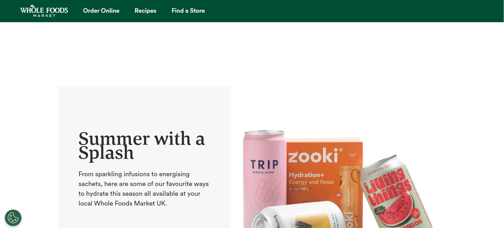
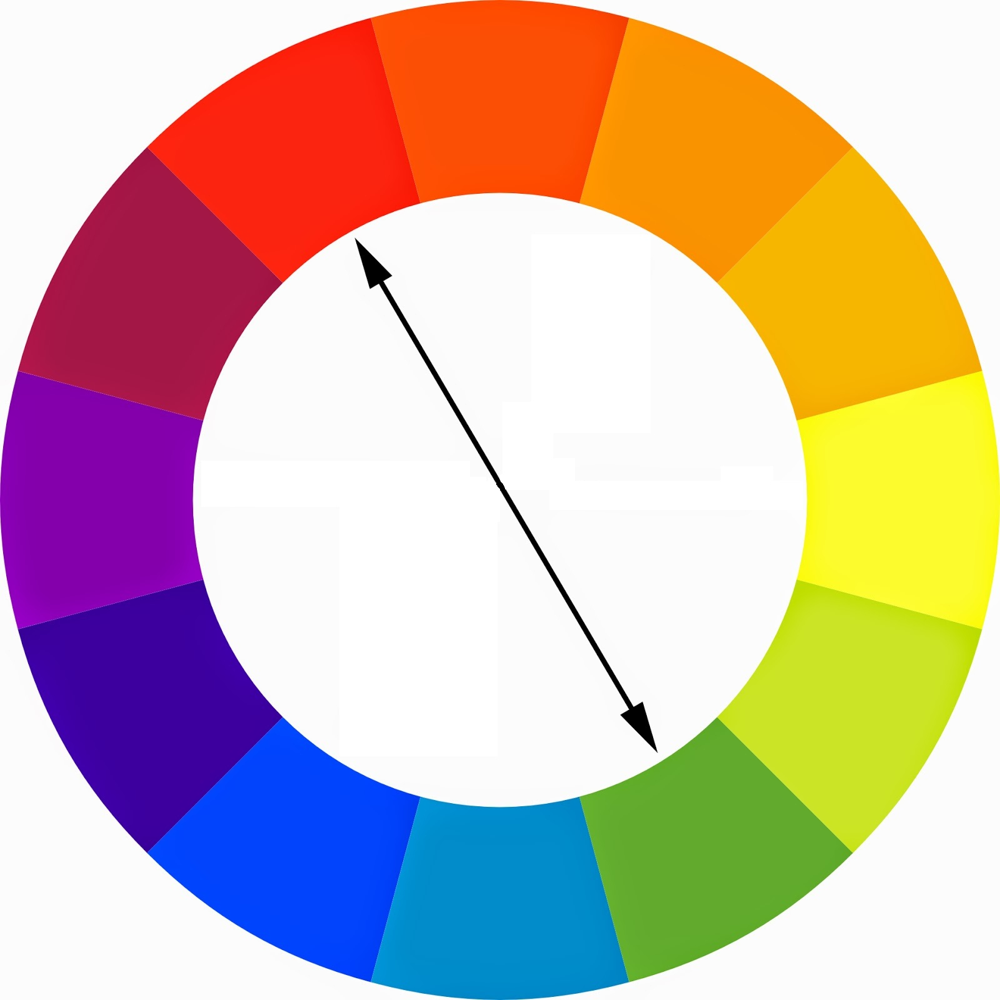
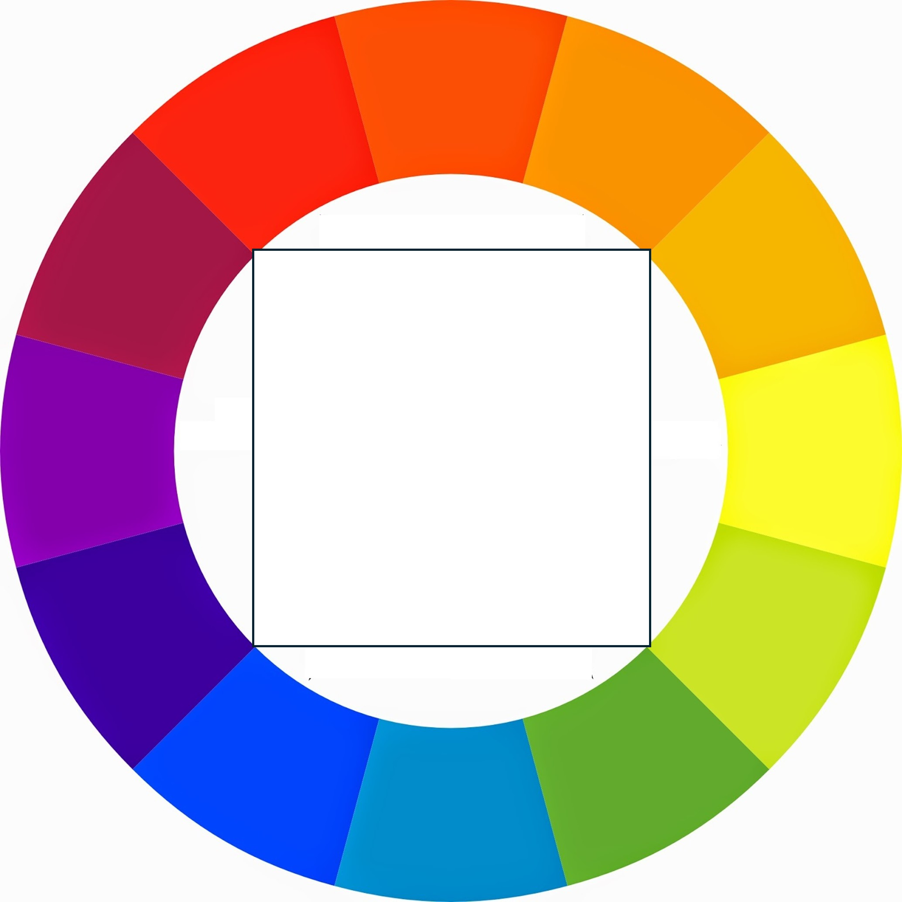

# Dia 4. Fundamentos da Web. 🕸️ HTML, CSS, Bootstrap e Web Design
{: .no_toc }

Bem-vindo ao Dia 4! Hoje, você construirá uma base sólida em desenvolvimento web, aprendendo como a internet funciona, os fundamentos de HTML e CSS, e como usar o Bootstrap para um design web rápido e bonito. Também abordaremos os conceitos básicos da teoria do web design para ajudá-lo a criar sites que as pessoas vão adorar.

---

<details open markdown="block">
  <summary>
    Índice
  </summary>
  {: .text-delta }
1. TOC
{:toc}
</details>

---

## 🌐 Como a Internet Realmente Funciona?<a href="#top" class="back-to-top-link" aria-label="Back to Top">↑</a>

Antes de construir sites, é importante entender como a internet conecta usuários e servidores.

- **Internet**: Uma [rede global de computadores](https://developer.mozilla.org/en-US/docs/Learn_web_development/Howto/Web_mechanics/How_does_the_Internet_work) que se comunicam por meio de protocolos (TCP/IP).
- **Sites**: Hospedados em servidores, acessados por clientes (navegadores) via [URLs](https://developer.mozilla.org/en-US/docs/Learn_web_development/Howto/Web_mechanics/What_is_a_URL) (Localizador Uniforme de Recursos).
- **HTTP/HTTPS**: Protocolos para transferir dados da web.
- **DNS** ([Sistema de Nomes de Domínio](https://developer.mozilla.org/en-US/docs/Learn_web_development/Howto/Web_mechanics/What_is_a_domain_name)): Traduz nomes de domínio amigáveis para humanos (como google.com) em endereços IP.

**Como os Sites Funcionam:**
1. Você digita uma URL em seu navegador.
2. O navegador pede a um servidor DNS o endereço IP.
3. O navegador envia uma requisição HTTP para o servidor.
4. O servidor responde com HTML (para elementos), CSS (formato), JS (ações), imagens, etc.
5. O navegador (Chrome, Firefox, Edge, Safari) renderiza a página.

quando você implanta um site e atribui um domínio a um endereço IP no servidor DNS. Os servidores DNS funcionam 24/7, mas atualizam os pares DNS-IP apenas uma ou duas vezes por dia.

**Inspecionando Sites**

Os arquivos recebidos pelo navegador podem ser revisados com as Ferramentas de Desenvolvedor (F12) no Chrome para inspecionar e modificar HTML e CSS ao vivo. Você também pode clicar com o botão direito sobre um elemento e depois clicar em inspecionar, e isso o levará ao trecho de código que você deseja verificar.

Para fazer um teste, clique com o botão direito no título `Inspecionando Sites` e clique em inspecionar.


O navegador possui um conjunto de ferramentas para inspecionar elementos (o código html), estilos (o código CSS), um terminal para executar código diretamente ou ver em que ordem e quanto tempo leva para baixar e executar o código do servidor. Você também pode gravar ações ou carregar extensões. O navegador tem muito mais possibilidades do que parece à primeira vista.


---


## 📝 HTML: A Estrutura da Web<a href="#top" class="back-to-top-link" aria-label="Back to Top">↑</a>

### O que é HTML?<a href="#top" class="back-to-top-link" aria-label="Back to Top">↑</a>

- **HTML (HyperText Markup Language)** é a linguagem padrão para criar páginas da web que podem ser renderizadas pela maioria dos navegadores. Ele estrutura o conteúdo usando **elementos** (tags) como `<title>Minha Primeira Página Web</title>` de forma estática e não formatada.
Geralmente, as tags têm uma tag de abertura e uma de fechamento, como `<details></details>`, mas algumas tags não precisam de uma tag de fechamento, por exemplo, `` para imagens, `<br>` para nova linha, `<hr>` para uma linha horizontal.

### Estrutura Básica do HTML<a href="#top" class="back-to-top-link" aria-label="Back to Top">↑</a>

Toda página HTML começa com uma estrutura básica:

```html
<!DOCTYPE html>
<html lang="pt-br">
<head>
  <meta charset="UTF-8">
  <title>Minha Primeira Página Web</title>
</head>
<body>
  <!-- O conteúdo vai aqui -->
   Olá, Mundo!
</body>
</html>
```

### Títulos, Parágrafos e Listas<a href="#top" class="back-to-top-link" aria-label="Back to Top">↑</a>
Os [elementos mais básicos](https://developer.mozilla.org/en-US/docs/Learn_web_development/Howto/Solve_HTML_problems) são títulos (existem 7 deles), parágrafos e listas. Você pode encontrar a lista completa de elementos em [W3Schools](https://www.w3schools.com/html/default.asp)

Tente brincar com o código abaixo no [teste da web de HTML da W3Schools](https://www.w3schools.com/html/tryit.asp?filename=tryhtml_basic)

```html
<!DOCTYPE html>
<html lang="pt-br">
<head>
  <meta charset="UTF-8">
  <title>Minha Primeira Página Web</title>
</head>
<body>
  <h1>Título Principal</h1>
  <h2>Subtítulo</h2>
  <p>Este é um parágrafo de texto.</p>

  <ul>
    <li>Item de lista não ordenada</li>
  </ul>
  <ol>
    <li>Item de lista ordenada</li>
  </ol>
</body>
</html>
```

### Elementos de Âncora e Imagem<a href="#top" class="back-to-top-link" aria-label="Back to Top">↑</a>
Elementos de âncora são usados para criar links. Imagens são incluídas com a tag ``. É recomendado incluir uma descrição para acessibilidade.

```html
<a href="https://www.example.com">Visite o Exemplo</a>

```

### Aninhamento e Indentação<a href="#top" class="back-to-top-link" aria-label="Back to Top">↑</a>

Elementos HTML podem ser aninhados. É recomendado escrevê-los com indentação adequada para melhorar a legibilidade.

```html
<ul>
  <li>
    <a href="#">Link Aninhado</a>
  </li>
</ul>
```

### Formulários<a href="#top" class="back-to-top-link" aria-label="Back to Top">↑</a>

Formulários são usados para coletar a entrada do usuário em uma página da web. Cada formulário pode ter rótulos, campos de entrada e placeholders para guiar o usuário, bem como botões para enviar as informações.

Exemplo:
```html
<form>
  <label for="nome">Nome:</label>
  <input type="text" id="nome" name="nome" placeholder="Digite seu nome">
  <button type="submit">Enviar</button>
</form>
```

### Estilos<a href="#top" class="back-to-top-link" aria-label="Back to Top">↑</a>

Você pode estilizar elementos HTML inline usando o atributo `style` diretamente na tag. Isso é chamado de estilização inline. Por exemplo, você pode alterar o tamanho da fonte, alinhamento do texto, cor e muito mais.

Exemplo:
```html
<p style="font-size:18px; text-align:center; color:blue; font-family:Arial;">Este é um parágrafo estilizado.</p>
```

Em vez de atribuir os estilos tag por tag, o que seria confuso e demorado, as tags são atribuídas a classes e/ou IDs e, em seguida, os estilos para as classes ou IDs são especificados em um arquivo CSS, como explicado mais adiante.


### Elementos HTML com IDs e Classes<a href="#top" class="back-to-top-link" aria-label="Back to Top">↑</a>

Tanto IDs quanto classes são atributos que podem ser adicionados a elementos HTML para torná-los selecionáveis para estilização com CSS ou manipulação com JavaScript. As principais diferenças:

- **ID**: Deve ser único na página (apenas um elemento deve ter um ID específico)
- **Classe**: Pode ser reutilizada em múltiplos elementos

```html
<h2 id="titulo-boas-vindas" class="titulo-secao">Bem-vindo ao Meu Site</h2>
<p id="texto-intro" class="paragrafo-conteudo">Este parágrafo tem um ID e uma classe.
O ID "texto-intro" só pode ser usado uma vez nesta página, enquanto a classe "paragrafo-conteudo"
pode ser aplicada a múltiplos elementos de parágrafo.</p>
```

Em CSS, você selecionaria esses elementos usando:
```css
/* Selecionar por ID (usa o símbolo #) */
#titulo-boas-vindas {
  color: navy;
  font-size: 28px;
}

#texto-intro {
  font-style: italic;
}

/* Selecionar por classe (usa o símbolo .) */
.titulo-secao {
  border-bottom: 2px solid #ccc;
  padding-bottom: 10px;
}

.paragrafo-conteudo {
  line-height: 1.6;
  margin-bottom: 20px;
}
```


### Divs<a href="#top" class="back-to-top-link" aria-label="Back to Top">↑</a>
O elemento HTML `<div>` é um contêiner genérico para conteúdo de fluxo. É uma "divisão" ou "seção" de uma página da web. Eles são usados para agrupar outros elementos HTML.

### Template HTML completo<a href="#top" class="back-to-top-link" aria-label="Back to Top">↑</a>

<details markdown="block">
  <summary>
    Para uma visão completa de todos os tipos de elementos HTML, veja o código abaixo.
  </summary>

Isso pode ser visualizado no [teste da web de HTML da W3Schools](https://www.w3schools.com/html/tryit.asp?filename=tryhtml_basic)


```html
<!DOCTYPE html>
<html lang="pt-br">
<head>
    <meta charset="UTF-8">
    <meta name="viewport" content="width=device-width, initial-scale=1.0">
    <title>Mostruário de Elementos HTML</title>
    <!-- Tailwind CSS CDN para estilização -->
    <script src="https://cdn.tailwindcss.com"></script>
    <!-- Google Fonts - Inter -->
    <link href="https://fonts.googleapis.com/css2?family=Inter:wght@400;600;700&display=swap" rel="stylesheet">
    <style>
        body {
            font-family: 'Inter', sans-serif;
            background-color: #f3f4f6; /* Fundo cinza claro */
            color: #374151; /* Texto cinza escuro */
        }
    </style>
</head>
<body class="p-4 sm:p-8 md:p-12 lg:p-16">
    <div class="max-w-4xl mx-auto bg-white shadow-xl rounded-xl p-6 sm:p-8 md:p-10 lg:p-12">

        <!-- Seção de Cabeçalho -->
        <header class="mb-12 text-center">
            <h1 class="text-4xl sm:text-5xl font-extrabold text-blue-600 mb-4 rounded-lg p-2">Mostruário de Elementos HTML</h1>
            <p class="text-lg sm:text-xl text-gray-700">Um template abrangente demonstrando elementos HTML comuns com Tailwind CSS.</p>
        </header>

        <!-- Seção de Navegação -->
        <nav class="mb-12">
            <h2 class="text-3xl font-semibold text-gray-800 mb-4 pb-2 border-b-2 border-blue-300 rounded-lg">Navegação</h2>
            <ul class="flex flex-wrap gap-4 justify-center">
                <li><a href="#typography" class="text-blue-600 hover:text-blue-800 text-lg font-medium p-2 rounded-md hover:bg-blue-50 transition-colors duration-200">Tipografia</a></li>
                <li><a href="#links-images" class="text-blue-600 hover:text-blue-800 text-lg font-medium p-2 rounded-md hover:bg-blue-50 transition-colors duration-200">Links e Imagens</a></li>
                <li><a href="#lists" class="text-blue-600 hover:text-blue-800 text-lg font-medium p-2 rounded-md hover:bg-blue-50 transition-colors duration-200">Listas</a></li>
                <li><a href="#tables" class="text-blue-600 hover:text-blue-800 text-lg font-medium p-2 rounded-md hover:bg-blue-50 transition-colors duration-200">Tabelas</a></li>
                <li><a href="#forms" class="text-blue-600 hover:text-blue-800 text-lg font-medium p-2 rounded-md hover:bg-blue-50 transition-colors duration-200">Formulários</a></li>
                <li><a href="#media" class="text-blue-600 hover:text-blue-800 text-lg font-medium p-2 rounded-md hover:bg-blue-50 transition-colors duration-200">Mídia</a></li>
                <li><a href="#interactive" class="text-blue-600 hover:text-blue-800 text-lg font-medium p-2 rounded-md hover:bg-blue-50 transition-colors duration-200">Interativo</a></li>
            </ul>
        </nav>

        <!-- Área de Conteúdo Principal -->
        <main>
            <!-- Seção de Tipografia -->
            <section id="typography" class="mb-12 p-6 bg-gray-50 rounded-lg shadow-md">
                <h2 class="text-3xl font-semibold text-gray-800 mb-4 pb-2 border-b-2 border-blue-300 rounded-lg">Tipografia</h2>

                <!-- Títulos -->
                <h3 class="text-2xl font-bold text-gray-700 mb-3">Títulos</h3>
                <p class="mb-4">O HTML fornece seis níveis de títulos, de `h1` (mais importante) a `h6` (menos importante).</p>
                <h1 class="text-4xl font-extrabold text-blue-700 mb-2">Título 1 (h1) - Título Principal</h1>
                <h2 class="text-3xl font-bold text-blue-600 mb-2">Título 2 (h2) - Título da Seção</h2>
                <h3 class="text-2xl font-semibold text-blue-500 mb-2">Título 3 (h3) - Título da Subseção</h3>
                <h4 class="text-xl font-medium text-blue-400 mb-2">Título 4 (h4) - Título Menor</h4>
                <h5 class="text-lg font-normal text-blue-300 mb-2">Título 5 (h5) - Título Menor Ainda</h5>
                <h6 class="text-base font-light text-blue-200 mb-6">Título 6 (h6) - Título Menos Importante</h6>

                <!-- Parágrafos -->
                <h3 class="text-2xl font-bold text-gray-700 mb-3">Parágrafos</h3>
                <p class="mb-4 text-gray-600 leading-relaxed">
                    Este é um parágrafo padrão (`&lt;p&gt;`) de texto. É usado para blocos de conteúdo.
                    Podemos adicionar algum <strong class="font-bold text-gray-800">texto em negrito</strong> e
                    <em>texto enfatizado (itálico)</em> usando as tags `&lt;strong&gt;` e `&lt;em&gt;`.
                </p>
                <p class="mb-6 text-gray-600 leading-relaxed">
                    Aqui está outro parágrafo demonstrando várias opções de formatação de texto inline.
                    Você pode <mark class="bg-yellow-200 px-1 rounded">destacar texto</mark> usando `&lt;mark&gt;`.
                    <del class="line-through text-red-500">Texto deletado</del> (`&lt;del&gt;`) e
                    <ins class="underline text-green-600">texto inserido</ins> (`&lt;ins&gt;`) também são possíveis.
                    Para notação científica, você pode usar H<sub class="align-sub">2</sub>O (`&lt;sub&gt;`) ou
                    E=mc<sup class="align-super">2</sup> (`&lt;sup&gt;`).
                </p>
            </section>

            <!-- Seção de Links e Imagens -->
            <section id="links-images" class="mb-12 p-6 bg-gray-50 rounded-lg shadow-md">
                <h2 class="text-3xl font-semibold text-gray-800 mb-4 pb-2 border-b-2 border-blue-300 rounded-lg">Links e Imagens</h2>

                <!-- Links -->
                <h3 class="text-2xl font-bold text-gray-700 mb-3">Links</h3>
                <p class="mb-4">
                    Este é um link externo:
                    <a href="https://www.google.com" target="_blank" rel="noopener noreferrer"
                       class="text-blue-600 hover:text-blue-800 underline font-medium transition-colors duration-200">
                        Visite o Google
                    </a>.
                    Links (`&lt;a&gt;`) são cruciais para a navegação. O atributo `target="_blank"` abre o link em uma nova aba, e `rel="noopener noreferrer"` é uma boa prática de segurança para links externos.
                </p>

                <!-- Imagens -->
                <h3 class="text-2xl font-bold text-gray-700 mb-3">Imagens</h3>
                <p class="mb-4">
                    Uma imagem (`&lt;img&gt;`) exibida abaixo. O atributo `alt` é importante para a acessibilidade.
                    O atributo `onerror` fornece um fallback caso a imagem não carregue.
                </p>
                <div class="flex justify-center mb-6">
                    
                </div>
            </section>

            <!-- Seção de Listas -->
            <section id="lists" class="mb-12 p-6 bg-gray-50 rounded-lg shadow-md">
                <h2 class="text-3xl font-semibold text-gray-800 mb-4 pb-2 border-b-2 border-blue-300 rounded-lg">Listas</h2>

                <!-- Lista Não Ordenada -->
                <h3 class="text-2xl font-bold text-gray-700 mb-3">Lista Não Ordenada (`&lt;ul&gt;`)</h3>
                <p class="mb-2">Itens em uma lista não ordenada são tipicamente marcados com pontos.</p>
                <ul class="list-disc list-inside mb-6 pl-4 text-gray-700">
                    <li class="mb-1">Item Um</li>
                    <li class="mb-1">Item Dois
                        <ul class="list-circle list-inside mt-1 pl-4">
                            <li class="mb-1">Item Aninhado A</li>
                            <li class="mb-1">Item Aninhado B</li>
                        </ul>
                    </li>
                    <li class="mb-1">Item Três</li>
                </ul>

                <!-- Lista Ordenada -->
                <h3 class="text-2xl font-bold text-gray-700 mb-3">Lista Ordenada (`&lt;ol&gt;`)</h3>
                <p class="mb-2">Itens em uma lista ordenada são tipicamente numerados.</p>
                <ol class="list-decimal list-inside mb-6 pl-4 text-gray-700">
                    <li class="mb-1">Primeiro passo</li>
                    <li class="mb-1">Segundo passo</li>
                    <li class="mb-1">Terceiro passo</li>
                </ol>

                <!-- Lista de Descrição -->
                <h3 class="text-2xl font-bold text-gray-700 mb-3">Lista de Descrição (`&lt;dl&gt;`)</h3>
                <p class="mb-2">Uma lista de termos e suas descrições.</p>
                <dl class="mb-6 text-gray-700">
                    <dt class="font-semibold text-gray-800 mt-2">HTML</dt>
                    <dd class="ml-6 mb-1">HyperText Markup Language: A linguagem de marcação padrão para criar páginas da web.</dd>
                    <dt class="font-semibold text-gray-800 mt-2">CSS</dt>
                    <dd class="ml-6 mb-1">Cascading Style Sheets: Uma linguagem de folha de estilo usada para descrever a apresentação de um documento escrito em HTML.</dd>
                    <dt class="font-semibold text-gray-800 mt-2">JavaScript</dt>
                    <dd class="ml-6 mb-1">Uma linguagem de programação que permite páginas da web interativas.</dd>
                </dl>
            </section>

            <!-- Seção de Tabelas -->
            <section id="tables" class="mb-12 p-6 bg-gray-50 rounded-lg shadow-md overflow-x-auto">
                <h2 class="text-3xl font-semibold text-gray-800 mb-4 pb-2 border-b-2 border-blue-300 rounded-lg">Tabelas</h2>
                <p class="mb-4">Tabelas (`&lt;table&gt;`) são usadas para exibir dados tabulares.</p>
                <table class="w-full border-collapse text-left rounded-lg overflow-hidden shadow-md">
                    <thead class="bg-blue-600">
                        <tr>
                            <th class="py-3 px-4 border-b border-blue-700">Nome</th>
                            <th class="py-3 px-4 border-b border-blue-700">Idade</th>
                            <th class="py-3 px-4 border-b border-blue-700">Cidade</th>
                        </tr>
                    </thead>
                    <tbody class="bg-white">
                        <tr>
                            <td class="py-2 px-4 border-b border-gray-200">João da Silva</td>
                            <td class="py-2 px-4 border-b border-gray-200">30</td>
                            <td class="py-2 px-4 border-b border-gray-200">Nova York</td>
                        </tr>
                        <tr>
                            <td class="py-2 px-4 border-b border-gray-200">Maria Souza</td>
                            <td class="py-2 px-4 border-b border-gray-200">24</td>
                            <td class="py-2 px-4 border-b border-gray-200">Los Angeles</td>
                        </tr>
                        <tr>
                            <td class="py-2 px-4 border-b border-gray-200">Pedro Oliveira</td>
                            <td class="py-2 px-4 border-b border-gray-200">45</td>
                            <td class="py-2 px-4 border-b border-gray-200">Chicago</td>
                        </tr>
                    </tbody>
                </table>
            </section>

            <!-- Seção de Formulários -->
            <section id="forms" class="mb-12 p-6 bg-gray-50 rounded-lg shadow-md">
                <h2 class="text-3xl font-semibold text-gray-800 mb-4 pb-2 border-b-2 border-blue-300 rounded-lg">Formulários</h2>
                <p class="mb-4">Formulários (`&lt;form&gt;`) são usados para coletar a entrada do usuário.</p>

                <form class="space-y-6">
                    <!-- Entrada de Texto -->
                    <div>
                        <label for="username" class="block text-sm font-medium text-gray-700 mb-1">Nome de usuário:</label>
                        <input type="text" id="username" name="username" placeholder="Digite seu nome de usuário"
                               class="mt-1 block w-full px-3 py-2 border border-gray-300 rounded-md shadow-sm focus:ring-blue-500 focus:border-blue-500 sm:text-sm"
                               required>
                    </div>

                    <!-- Entrada de Email -->
                    <div>
                        <label for="email" class="block text-sm font-medium text-gray-700 mb-1">Email:</label>
                        <input type="email" id="email" name="email" placeholder="voce@exemplo.com"
                               class="mt-1 block w-full px-3 py-2 border border-gray-300 rounded-md shadow-sm focus:ring-blue-500 focus:border-blue-500 sm:text-sm">
                    </div>

                    <!-- Entrada de Senha -->
                    <div>
                        <label for="password" class="block text-sm font-medium text-gray-700 mb-1">Senha:</label>
                        <input type="password" id="password" name="password" placeholder="••••••••"
                               class="mt-1 block w-full px-3 py-2 border border-gray-300 rounded-md shadow-sm focus:ring-blue-500 focus:border-blue-500 sm:text-sm"
                               minlength="8">
                    </div>

                    <!-- Entrada de Número -->
                    <div>
                        <label for="quantity" class="block text-sm font-medium text-gray-700 mb-1">Quantidade:</label>
                        <input type="number" id="quantity" name="quantity" value="1" min="1" max="10"
                               class="mt-1 block w-full px-3 py-2 border border-gray-300 rounded-md shadow-sm focus:ring-blue-500 focus:border-blue-500 sm:text-sm">
                    </div>

                    <!-- Textarea -->
                    <div>
                        <label for="message" class="block text-sm font-medium text-gray-700 mb-1">Mensagem:</label>
                        <textarea id="message" name="message" rows="4" placeholder="Sua mensagem aqui..."
                                  class="mt-1 block w-full px-3 py-2 border border-gray-300 rounded-md shadow-sm focus:ring-blue-500 focus:border-blue-500 sm:text-sm"></textarea>
                    </div>

                    <!-- Select (Dropdown) -->
                    <div>
                        <label for="country" class="block text-sm font-medium text-gray-700 mb-1">País:</label>
                        <select id="country" name="country"
                                class="mt-1 block w-full px-3 py-2 border border-gray-300 rounded-md shadow-sm focus:ring-blue-500 focus:border-blue-500 sm:text-sm bg-white">
                            <option value="">--Por favor, escolha uma opção--</option>
                            <option value="usa">Estados Unidos</option>
                            <option value="can">Canadá</option>
                            <option value="mex">México</option>
                        </select>
                    </div>

                    <!-- Checkbox -->
                    <div class="flex items-center">
                        <input type="checkbox" id="newsletter" name="newsletter"
                               class="h-4 w-4 text-blue-600 border-gray-300 rounded focus:ring-blue-500">
                        <label for="newsletter" class="ml-2 block text-sm text-gray-900">Inscrever-se na newsletter</label>
                    </div>

                    <!-- Botões de Rádio (Fieldset para agrupar) -->
                    <fieldset class="border border-gray-300 p-4 rounded-md">
                        <legend class="text-base font-medium text-gray-900">Cor Favorita:</legend>
                        <div class="mt-2 space-y-2">
                            <div class="flex items-center">
                                <input type="radio" id="color_red" name="fav_color" value="red"
                                       class="focus:ring-blue-500 h-4 w-4 text-blue-600 border-gray-300">
                                <label for="color_red" class="ml-2 block text-sm text-gray-900">Vermelho</label>
                            </div>
                            <div class="flex items-center">
                                <input type="radio" id="color_blue" name="fav_color" value="blue" checked
                                       class="focus:ring-blue-500 h-4 w-4 text-blue-600 border-gray-300">
                                <label for="color_blue" class="ml-2 block text-sm text-gray-900">Azul</label>
                            </div>
                            <div class="flex items-center">
                                <input type="radio" id="color_green" name="fav_color" value="green"
                                       class="focus:ring-blue-500 h-4 w-4 text-blue-600 border-gray-300">
                                <label for="color_green" class="ml-2 block text-sm text-gray-900">Verde</label>
                            </div>
                        </div>
                    </fieldset>

                    <!-- Entrada de Arquivo -->
                    <div>
                        <label for="profile_pic" class="block text-sm font-medium text-gray-700 mb-1">Carregar Foto de Perfil:</label>
                        <input type="file" id="profile_pic" name="profile_pic" accept="image/*"
                               class="mt-1 block w-full text-sm text-gray-500 file:mr-4 file:py-2 file:px-4 file:rounded-full file:border-0 file:text-sm file:font-semibold file:bg-blue-50 file:text-blue-700 hover:file:bg-blue-100">
                    </div>

                    <!-- Entrada de Faixa -->
                    <div>
                        <label for="volume" class="block text-sm font-medium text-gray-700 mb-1">Volume:</label>
                        <input type="range" id="volume" name="volume" min="0" max="100" value="50"
                               class="mt-1 block w-full h-2 bg-gray-200 rounded-lg appearance-none cursor-pointer range-lg">
                    </div>

                    <!-- Entrada de Data -->
                    <div>
                        <label for="event_date" class="block text-sm font-medium text-gray-700 mb-1">Data do Evento:</label>
                        <input type="date" id="event_date" name="event_date"
                               class="mt-1 block w-full px-3 py-2 border border-gray-300 rounded-md shadow-sm focus:ring-blue-500 focus:border-blue-500 sm:text-sm">
                    </div>

                    <!-- Entrada de Cor -->
                    <div>
                        <label for="fav_color_picker" class="block text-sm font-medium text-gray-700 mb-1">Escolha sua cor favorita:</label>
                        <input type="color" id="fav_color_picker" name="fav_color_picker" value="#4A90E2"
                               class="mt-1 block w-24 h-10 border border-gray-300 rounded-md cursor-pointer">
                    </div>

                    <!-- Botão de Envio -->
                    <div>
                        <button type="submit"
                                class="w-full flex justify-center py-2 px-4 border border-transparent rounded-md shadow-sm text-sm font-medium text-white bg-blue-600 hover:bg-blue-700 focus:outline-none focus:ring-2 focus:ring-offset-2 focus:ring-blue-500 transition-colors duration-200">
                            Enviar Formulário
                        </button>
                    </div>
                </form>
            </section>

            <!-- Seção de Mídia -->
            <section id="media" class="mb-12 p-6 bg-gray-50 rounded-lg shadow-md">
                <h2 class="text-3xl font-semibold text-gray-800 mb-4 pb-2 border-b-2 border-blue-300 rounded-lg">Mídia</h2>

                <!-- Áudio -->
                <h3 class="text-2xl font-bold text-gray-700 mb-3">Áudio (`&lt;audio&gt;`)</h3>
                <p class="mb-4">Incorpore conteúdo de áudio. Nota: Uma URL de arquivo de áudio real seria necessária aqui.</p>
                <div class="flex justify-center mb-6">
                    <audio controls class="w-full max-w-lg rounded-lg shadow-md bg-gray-200 p-2">
                        <!-- Substitua por uma fonte de áudio válida -->
                        <source src="https://www.soundhelix.com/examples/mp3/SoundHelix-Song-1.mp3" type="audio/mpeg">
                        Seu navegador não suporta o elemento de áudio.
                    </audio>
                </div>

                <!-- Vídeo -->
                <h3 class="text-2xl font-bold text-gray-700 mb-3">Vídeo (`&lt;video&gt;`)</h3>
                <p class="mb-4">Incorpore conteúdo de vídeo. Nota: Uma URL de arquivo de vídeo real seria necessária aqui.</p>
                <div class="flex justify-center mb-6">
                    <video controls width="640" height="360" poster="https://placehold.co/640x360/A0A0A0/FFFFFF?text=Placeholder+de+Vídeo"
                           class="max-w-full h-auto rounded-lg shadow-md border-2 border-gray-200">
                        <!-- Substitua por uma fonte de vídeo válida -->
                        <source src="http://commondatastorage.googleapis.com/gtv-videos-bucket/sample/BigBuckBunny.mp4" type="video/mp4">
                        Seu navegador não suporta a tag de vídeo.
                    </video>
                </div>
            </section>

            <!-- Seção de Elementos Interativos -->
            <section id="interactive" class="mb-12 p-6 bg-gray-50 rounded-lg shadow-md">
                <h2 class="text-3xl font-semibold text-gray-800 mb-4 pb-2 border-b-2 border-blue-300 rounded-lg">Elementos Interativos</h2>

                <!-- Detalhes/Resumo -->
                <h3 class="text-2xl font-bold text-gray-700 mb-3">Detalhes e Resumo (`&lt;details&gt;`, `&lt;summary&gt;`)</h3>
                <p class="mb-4">Fornece um widget de divulgação sob demanda que o usuário pode abrir e fechar.</p>
                <details class="bg-white border border-gray-300 rounded-md p-4 shadow-sm cursor-pointer hover:bg-gray-100 transition-colors duration-200">
                    <summary class="font-semibold text-lg text-blue-700">Clique para revelar mais informações</summary>
                    <div class="mt-3 text-gray-700 leading-relaxed">
                        <p>Este conteúdo está oculto por padrão e é revelado quando o resumo é clicado.</p>
                        <p>É útil para FAQs, acordeões ou para ocultar detalhes menos importantes.</p>
                    </div>
                </details>
            </section>
        </main>

        <!-- Seção Aside (para conteúdo tangencial) -->
        <aside class="mb-12 p-6 bg-blue-50 rounded-lg shadow-md border-l-4 border-blue-300">
            <h2 class="text-3xl font-semibold text-gray-800 mb-4 pb-2 border-b-2 border-blue-300 rounded-lg">Sobre Este Template</h2>
            <p class="text-gray-700 leading-relaxed">
                Este template serve como uma referência rápida para elementos HTML comuns. Cada seção demonstra uma categoria diferente de tags e como elas podem ser estilizadas usando classes de utilidade do <a href="https://tailwindcss.com/" target="_blank" rel="noopener noreferrer" class="text-blue-600 hover:text-blue-800 underline font-medium">Tailwind CSS</a>.
            </p>
            <p class="mt-3 text-gray-700 leading-relaxed">
                Lembre-se de aplicar HTML semântico para melhor acessibilidade e SEO.
            </p>
        </aside>

        <!-- Seção de Rodapé -->
        <footer class="text-center text-gray-600 mt-12 pt-6 border-t-2 border-gray-200">
            <p>&copy; 2025 Mostruário de Elementos HTML. Todos os direitos reservados.</p>
            <p class="text-sm mt-2">
                Criado com amor usando HTML e Tailwind CSS.
            </p>
        </footer>

    </div>

    <!-- Exemplo de JavaScript (Opcional) -->
    <script>
        // Um exemplo simples de JavaScript demonstrando um log no console
        // Este script é executado após o carregamento do documento HTML.
        console.log("Mostruário de Elementos HTML Carregado!");

        // Exemplo de adição de um ouvinte de evento a um botão (se você tivesse um)
        document.addEventListener('DOMContentLoaded', () => {
            const submitButton = document.querySelector('button[type="submit"]');
            if (submitButton) {
                submitButton.addEventListener('click', (event) => {
                    // Previne o envio padrão do formulário para demonstração
                    event.preventDefault();
                    console.log('Tentativa de envio do formulário!');
                    // Em uma aplicação real, você manipularia os dados do formulário aqui,
                    // por exemplo, enviando-os para um servidor usando a API fetch.
                    // Por enquanto, apenas mostraremos uma mensagem simples no console.
                });
            }
        });
    </script>
</body>
</html>
```


</details>

<details>
  <summary>
    Template HTML completo renderizado abaixo.
  </summary>
Você pode usar F12 ou clicar com o botão direito e inspecionar para ver o código html de cada elemento.


```
<html lang="pt-br">
<head>
    <meta charset="UTF-8">
    <meta name="viewport" content="width=device-width, initial-scale=1.0">
    <title>Mostruário de Elementos HTML</title>
    <!-- Tailwind CSS CDN para estilização -->
    <script src="https://cdn.tailwindcss.com"></script>
    <!-- Google Fonts - Inter -->
    <link href="https://fonts.googleapis.com/css2?family=Inter:wght@400;600;700&display=swap" rel="stylesheet">
    <style>
        body {
            font-family: 'Inter', sans-serif;
            background-color: #f3f4f6; /* Fundo cinza claro */
            color: #374151; /* Texto cinza escuro */
        }
    </style>
</head>
<body class="p-4 sm:p-8 md:p-12 lg:p-16">
    <div class="max-w-4xl mx-auto bg-white shadow-xl rounded-xl p-6 sm:p-8 md:p-10 lg:p-12">

        <!-- Seção de Cabeçalho -->
        <header class="mb-12 text-center">
            <h1 class="text-4xl sm:text-5xl font-extrabold text-blue-600 mb-4 rounded-lg p-2">Mostruário de Elementos HTML</h1>
            <p class="text-lg sm:text-xl text-gray-700">Um template abrangente demonstrando elementos HTML comuns com Tailwind CSS.</p>
        </header>

        <!-- Seção de Navegação -->
        <nav class="mb-12">
            <h2 class="text-3xl font-semibold text-gray-800 mb-4 pb-2 border-b-2 border-blue-300 rounded-lg">Navegação</h2>
            <ul class="flex flex-wrap gap-4 justify-center">
                <li><a href="#typography" class="text-blue-600 hover:text-blue-800 text-lg font-medium p-2 rounded-md hover:bg-blue-50 transition-colors duration-200">Tipografia</a></li>
                <li><a href="#links-images" class="text-blue-600 hover:text-blue-800 text-lg font-medium p-2 rounded-md hover:bg-blue-50 transition-colors duration-200">Links e Imagens</a></li>
                <li><a href="#lists" class="text-blue-600 hover:text-blue-800 text-lg font-medium p-2 rounded-md hover:bg-blue-50 transition-colors duration-200">Listas</a></li>
                <li><a href="#tables" class="text-blue-600 hover:text-blue-800 text-lg font-medium p-2 rounded-md hover:bg-blue-50 transition-colors duration-200">Tabelas</a></li>
                <li><a href="#forms" class="text-blue-600 hover:text-blue-800 text-lg font-medium p-2 rounded-md hover:bg-blue-50 transition-colors duration-200">Formulários</a></li>
                <li><a href="#media" class="text-blue-600 hover:text-blue-800 text-lg font-medium p-2 rounded-md hover:bg-blue-50 transition-colors duration-200">Mídia</a></li>
                <li><a href="#interactive" class="text-blue-600 hover:text-blue-800 text-lg font-medium p-2 rounded-md hover:bg-blue-50 transition-colors duration-200">Interativo</a></li>
            </ul>
        </nav>

        <!-- Área de Conteúdo Principal -->
        <main>
            <!-- Seção de Tipografia -->
            <section id="typography" class="mb-12 p-6 bg-gray-50 rounded-lg shadow-md">
                <h2 class="text-3xl font-semibold text-gray-800 mb-4 pb-2 border-b-2 border-blue-300 rounded-lg">Tipografia</h2>

                <!-- Títulos -->
                <h3 class="text-2xl font-bold text-gray-700 mb-3">Títulos</h3>
                <p class="mb-4">O HTML fornece seis níveis de títulos, de `h1` (mais importante) a `h6` (menos importante).</p>
                <h1 class="text-4xl font-extrabold text-blue-700 mb-2">Título 1 (h1) - Título Principal</h1>
                <h2 class="text-3xl font-bold text-blue-600 mb-2">Título 2 (h2) - Título da Seção</h2>
                <h3 class="text-2xl font-semibold text-blue-500 mb-2">Título 3 (h3) - Título da Subseção</h3>
                <h4 class="text-xl font-medium text-blue-400 mb-2">Título 4 (h4) - Título Menor</h4>
                <h5 class="text-lg font-normal text-blue-300 mb-2">Título 5 (h5) - Título Menor Ainda</h5>
                <h6 class="text-base font-light text-blue-200 mb-6">Título 6 (h6) - Título Menos Importante</h6>

                <!-- Parágrafos -->
                <h3 class="text-2xl font-bold text-gray-700 mb-3">Parágrafos</h3>
                <p class="mb-4 text-gray-600 leading-relaxed">
                    Este é um parágrafo padrão (`&lt;p&gt;`) de texto. É usado para blocos de conteúdo.
                    Podemos adicionar algum <strong class="font-bold text-gray-800">texto em negrito</strong> e
                    <em>texto enfatizado (itálico)</em> usando as tags `&lt;strong&gt;` e `&lt;em&gt;`.
                </p>
                <p class="mb-6 text-gray-600 leading-relaxed">
                    Aqui está outro parágrafo demonstrando várias opções de formatação de texto inline.
                    Você pode <mark class="bg-yellow-200 px-1 rounded">destacar texto</mark> usando `&lt;mark&gt;`.
                    <del class="line-through text-red-500">Texto deletado</del> (`&lt;del&gt;`) e
                    <ins class="underline text-green-600">texto inserido</ins> (`&lt;ins&gt;`) também são possíveis.
                    Para notação científica, você pode usar H<sub class="align-sub">2</sub>O (`&lt;sub&gt;`) ou
                    E=mc<sup class="align-super">2</sup> (`&lt;sup&gt;`).
                </p>
            </section>

            <!-- Seção de Links e Imagens -->
            <section id="links-images" class="mb-12 p-6 bg-gray-50 rounded-lg shadow-md">
                <h2 class="text-3xl font-semibold text-gray-800 mb-4 pb-2 border-b-2 border-blue-300 rounded-lg">Links e Imagens</h2>

                <!-- Links -->
                <h3 class="text-2xl font-bold text-gray-700 mb-3">Links</h3>
                <p class="mb-4">
                    Este é um link externo:
                    <a href="https://www.google.com" target="_blank" rel="noopener noreferrer"
                       class="text-blue-600 hover:text-blue-800 underline font-medium transition-colors duration-200">
                        Visite o Google
                    </a>.
                    Links (`&lt;a&gt;`) são cruciais para a navegação. O atributo `target="_blank"` abre o link em uma nova aba, e `rel="noopener noreferrer"` é uma boa prática de segurança para links externos.
                </p>

                <!-- Imagens -->
                <h3 class="text-2xl font-bold text-gray-700 mb-3">Imagens</h3>
                <p class="mb-4">
                    Uma imagem (`&lt;img&gt;`) exibida abaixo. O atributo `alt` é importante para a acessibilidade.
                    O atributo `onerror` fornece um fallback caso a imagem não carregue.
                </p>
                <div class="flex justify-center mb-6">
                    
                </div>
            </section>

            <!-- Seção de Listas -->
            <section id="lists" class="mb-12 p-6 bg-gray-50 rounded-lg shadow-md">
                <h2 class="text-3xl font-semibold text-gray-800 mb-4 pb-2 border-b-2 border-blue-300 rounded-lg">Listas</h2>

                <!-- Lista Não Ordenada -->
                <h3 class="text-2xl font-bold text-gray-700 mb-3">Lista Não Ordenada (`&lt;ul&gt;`)</h3>
                <p class="mb-2">Itens em uma lista não ordenada são tipicamente marcados com pontos.</p>
                <ul class="list-disc list-inside mb-6 pl-4 text-gray-700">
                    <li class="mb-1">Item Um</li>
                    <li class="mb-1">Item Dois
                        <ul class="list-circle list-inside mt-1 pl-4">
                            <li class="mb-1">Item Aninhado A</li>
                            <li class="mb-1">Item Aninhado B</li>
                        </ul>
                    </li>
                    <li class="mb-1">Item Três</li>
                </ul>

                <!-- Lista Ordenada -->
                <h3 class="text-2xl font-bold text-gray-700 mb-3">Lista Ordenada (`&lt;ol&gt;`)</h3>
                <p class="mb-2">Itens em uma lista ordenada são tipicamente numerados.</p>
                <ol class="list-decimal list-inside mb-6 pl-4 text-gray-700">
                    <li class="mb-1">Primeiro passo</li>
                    <li class="mb-1">Segundo passo</li>
                    <li class="mb-1">Terceiro passo</li>
                </ol>

                <!-- Lista de Descrição -->
                <h3 class="text-2xl font-bold text-gray-700 mb-3">Lista de Descrição (`&lt;dl&gt;`)</h3>
                <p class="mb-2">Uma lista de termos e suas descrições.</p>
                <dl class="mb-6 text-gray-700">
                    <dt class="font-semibold text-gray-800 mt-2">HTML</dt>
                    <dd class="ml-6 mb-1">HyperText Markup Language: A linguagem de marcação padrão para criar páginas da web.</dd>
                    <dt class="font-semibold text-gray-800 mt-2">CSS</dt>
                    <dd class="ml-6 mb-1">Cascading Style Sheets: Uma linguagem de folha de estilo usada para descrever a apresentação de um documento escrito em HTML.</dd>
                    <dt class="font-semibold text-gray-800 mt-2">JavaScript</dt>
                    <dd class="ml-6 mb-1">Uma linguagem de programação que permite páginas da web interativas.</dd>
                </dl>
            </section>

            <!-- Seção de Tabelas -->
            <section id="tables" class="mb-12 p-6 bg-gray-50 rounded-lg shadow-md overflow-x-auto">
                <h2 class="text-3xl font-semibold text-gray-800 mb-4 pb-2 border-b-2 border-blue-300 rounded-lg">Tabelas</h2>
                <p class="mb-4">Tabelas (`&lt;table&gt;`) são usadas para exibir dados tabulares.</p>
                <table class="w-full border-collapse text-left rounded-lg overflow-hidden shadow-md">
                    <thead class="bg-blue-600">
                        <tr>
                            <th class="py-3 px-4 border-b border-blue-700">Nome</th>
                            <th class="py-3 px-4 border-b border-blue-700">Idade</th>
                            <th class="py-3 px-4 border-b border-blue-700">Cidade</th>
                        </tr>
                    </thead>
                    <tbody class="bg-white">
                        <tr>
                            <td class="py-2 px-4 border-b border-gray-200">João da Silva</td>
                            <td class="py-2 px-4 border-b border-gray-200">30</td>
                            <td class="py-2 px-4 border-b border-gray-200">Nova York</td>
                        </tr>
                        <tr>
                            <td class="py-2 px-4 border-b border-gray-200">Maria Souza</td>
                            <td class="py-2 px-4 border-b border-gray-200">24</td>
                            <td class="py-2 px-4 border-b border-gray-200">Los Angeles</td>
                        </tr>
                        <tr>
                            <td class="py-2 px-4 border-b border-gray-200">Pedro Oliveira</td>
                            <td class="py-2 px-4 border-b border-gray-200">45</td>
                            <td class="py-2 px-4 border-b border-gray-200">Chicago</td>
                        </tr>
                    </tbody>
                </table>
            </section>

            <!-- Seção de Formulários -->
            <section id="forms" class="mb-12 p-6 bg-gray-50 rounded-lg shadow-md">
                <h2 class="text-3xl font-semibold text-gray-800 mb-4 pb-2 border-b-2 border-blue-300 rounded-lg">Formulários</h2>
                <p class="mb-4">Formulários (`&lt;form&gt;`) são usados para coletar a entrada do usuário.</p>

                <form class="space-y-6">
                    <!-- Entrada de Texto -->
                    <div>
                        <label for="username" class="block text-sm font-medium text-gray-700 mb-1">Nome de usuário:</label>
                        <input type="text" id="username" name="username" placeholder="Digite seu nome de usuário"
                               class="mt-1 block w-full px-3 py-2 border border-gray-300 rounded-md shadow-sm focus:ring-blue-500 focus:border-blue-500 sm:text-sm"
                               required>
                    </div>

                    <!-- Entrada de Email -->
                    <div>
                        <label for="email" class="block text-sm font-medium text-gray-700 mb-1">Email:</label>
                        <input type="email" id="email" name="email" placeholder="voce@exemplo.com"
                               class="mt-1 block w-full px-3 py-2 border border-gray-300 rounded-md shadow-sm focus:ring-blue-500 focus:border-blue-500 sm:text-sm">
                    </div>

                    <!-- Entrada de Senha -->
                    <div>
                        <label for="password" class="block text-sm font-medium text-gray-700 mb-1">Senha:</label>
                        <input type="password" id="password" name="password" placeholder="••••••••"
                               class="mt-1 block w-full px-3 py-2 border border-gray-300 rounded-md shadow-sm focus:ring-blue-500 focus:border-blue-500 sm:text-sm"
                               minlength="8">
                    </div>

                    <!-- Entrada de Número -->
                    <div>
                        <label for="quantity" class="block text-sm font-medium text-gray-700 mb-1">Quantidade:</label>
                        <input type="number" id="quantity" name="quantity" value="1" min="1" max="10"
                               class="mt-1 block w-full px-3 py-2 border border-gray-300 rounded-md shadow-sm focus:ring-blue-500 focus:border-blue-500 sm:text-sm">
                    </div>

                    <!-- Textarea -->
                    <div>
                        <label for="message" class="block text-sm font-medium text-gray-700 mb-1">Mensagem:</label>
                        <textarea id="message" name="message" rows="4" placeholder="Sua mensagem aqui..."
                                  class="mt-1 block w-full px-3 py-2 border border-gray-300 rounded-md shadow-sm focus:ring-blue-500 focus:border-blue-500 sm:text-sm"></textarea>
                    </div>

                    <!-- Select (Dropdown) -->
                    <div>
                        <label for="country" class="block text-sm font-medium text-gray-700 mb-1">País:</label>
                        <select id="country" name="country"
                                class="mt-1 block w-full px-3 py-2 border border-gray-300 rounded-md shadow-sm focus:ring-blue-500 focus:border-blue-500 sm:text-sm bg-white">
                            <option value="">--Por favor, escolha uma opção--</option>
                            <option value="usa">Estados Unidos</option>
                            <option value="can">Canadá</option>
                            <option value="mex">México</option>
                        </select>
                    </div>

                    <!-- Checkbox -->
                    <div class="flex items-center">
                        <input type="checkbox" id="newsletter" name="newsletter"
                               class="h-4 w-4 text-blue-600 border-gray-300 rounded focus:ring-blue-500">
                        <label for="newsletter" class="ml-2 block text-sm text-gray-900">Inscrever-se na newsletter</label>
                    </div>

                    <!-- Botões de Rádio (Fieldset para agrupar) -->
                    <fieldset class="border border-gray-300 p-4 rounded-md">
                        <legend class="text-base font-medium text-gray-900">Cor Favorita:</legend>
                        <div class="mt-2 space-y-2">
                            <div class="flex items-center">
                                <input type="radio" id="color_red" name="fav_color" value="red"
                                       class="focus:ring-blue-500 h-4 w-4 text-blue-600 border-gray-300">
                                <label for="color_red" class="ml-2 block text-sm text-gray-900">Vermelho</label>
                            </div>
                            <div class="flex items-center">
                                <input type="radio" id="color_blue" name="fav_color" value="blue" checked
                                       class="focus:ring-blue-500 h-4 w-4 text-blue-600 border-gray-300">
                                <label for="color_blue" class="ml-2 block text-sm text-gray-900">Azul</label>
                            </div>
                            <div class="flex items-center">
                                <input type="radio" id="color_green" name="fav_color" value="green"
                                       class="focus:ring-blue-500 h-4 w-4 text-blue-600 border-gray-300">
                                <label for="color_green" class="ml-2 block text-sm text-gray-900">Verde</label>
                            </div>
                        </div>
                    </fieldset>

                    <!-- Entrada de Arquivo -->
                    <div>
                        <label for="profile_pic" class="block text-sm font-medium text-gray-700 mb-1">Carregar Foto de Perfil:</label>
                        <input type="file" id="profile_pic" name="profile_pic" accept="image/*"
                               class="mt-1 block w-full text-sm text-gray-500 file:mr-4 file:py-2 file:px-4 file:rounded-full file:border-0 file:text-sm file:font-semibold file:bg-blue-50 file:text-blue-700 hover:file:bg-blue-100">
                    </div>

                    <!-- Entrada de Faixa -->
                    <div>
                        <label for="volume" class="block text-sm font-medium text-gray-700 mb-1">Volume:</label>
                        <input type="range" id="volume" name="volume" min="0" max="100" value="50"
                               class="mt-1 block w-full h-2 bg-gray-200 rounded-lg appearance-none cursor-pointer range-lg">
                    </div>

                    <!-- Entrada de Data -->
                    <div>
                        <label for="event_date" class="block text-sm font-medium text-gray-700 mb-1">Data do Evento:</label>
                        <input type="date" id="event_date" name="event_date"
                               class="mt-1 block w-full px-3 py-2 border border-gray-300 rounded-md shadow-sm focus:ring-blue-500 focus:border-blue-500 sm:text-sm">
                    </div>

                    <!-- Entrada de Cor -->
                    <div>
                        <label for="fav_color_picker" class="block text-sm font-medium text-gray-700 mb-1">Escolha sua cor favorita:</label>
                        <input type="color" id="fav_color_picker" name="fav_color_picker" value="#4A90E2"
                               class="mt-1 block w-24 h-10 border border-gray-300 rounded-md cursor-pointer">
                    </div>

                    <!-- Botão de Envio -->
                    <div>
                        <button type="submit"
                                class="w-full flex justify-center py-2 px-4 border border-transparent rounded-md shadow-sm text-sm font-medium text-white bg-blue-600 hover:bg-blue-700 focus:outline-none focus:ring-2 focus:ring-offset-2 focus:ring-blue-500 transition-colors duration-200">
                            Enviar Formulário
                        </button>
                    </div>
                </form>
            </section>

            <!-- Seção de Mídia -->
            <section id="media" class="mb-12 p-6 bg-gray-50 rounded-lg shadow-md">
                <h2 class="text-3xl font-semibold text-gray-800 mb-4 pb-2 border-b-2 border-blue-300 rounded-lg">Mídia</h2>

                <!-- Áudio -->
                <h3 class="text-2xl font-bold text-gray-700 mb-3">Áudio (`&lt;audio&gt;`)</h3>
                <p class="mb-4">Incorpore conteúdo de áudio. Nota: Uma URL de arquivo de áudio real seria necessária aqui.</p>
                <div class="flex justify-center mb-6">
                    <audio controls class="w-full max-w-lg rounded-lg shadow-md bg-gray-200 p-2">
                        <!-- Substitua por uma fonte de áudio válida -->
                        <source src="https://www.soundhelix.com/examples/mp3/SoundHelix-Song-1.mp3" type="audio/mpeg">
                        Seu navegador não suporta o elemento de áudio.
                    </audio>
                </div>

                <!-- Vídeo -->
                <h3 class="text-2xl font-bold text-gray-700 mb-3">Vídeo (`&lt;video&gt;`)</h3>
                <p class="mb-4">Incorpore conteúdo de vídeo. Nota: Uma URL de arquivo de vídeo real seria necessária aqui.</p>
                <div class="flex justify-center mb-6">
                    <video controls width="640" height="360" poster="https://placehold.co/640x360/A0A0A0/FFFFFF?text=Placeholder+de+Vídeo"
                           class="max-w-full h-auto rounded-lg shadow-md border-2 border-gray-200">
                        <!-- Substitua por uma fonte de vídeo válida -->
                        <source src="http://commondatastorage.googleapis.com/gtv-videos-bucket/sample/BigBuckBunny.mp4" type="video/mp4">
                        Seu navegador não suporta a tag de vídeo.
                    </video>
                </div>
            </section>

            <!-- Seção de Elementos Interativos -->
            <section id="interactive" class="mb-12 p-6 bg-gray-50 rounded-lg shadow-md">
                <h2 class="text-3xl font-semibold text-gray-800 mb-4 pb-2 border-b-2 border-blue-300 rounded-lg">Elementos Interativos</h2>

                <!-- Detalhes/Resumo -->
                <h3 class="text-2xl font-bold text-gray-700 mb-3">Detalhes e Resumo (`&lt;details&gt;`, `&lt;summary&gt;`)</h3>
                <p class="mb-4">Fornece um widget de divulgação sob demanda que o usuário pode abrir e fechar.</p>
                <details class="bg-white border border-gray-300 rounded-md p-4 shadow-sm cursor-pointer hover:bg-gray-100 transition-colors duration-200">
                    <summary class="font-semibold text-lg text-blue-700">Clique para revelar mais informações</summary>
                    <div class="mt-3 text-gray-700 leading-relaxed">
                        <p>Este conteúdo está oculto por padrão e é revelado quando o resumo é clicado.</p>
                        <p>É útil para FAQs, acordeões ou para ocultar detalhes menos importantes.</p>
                    </div>
                </details>
            </section>
        </main>

        <!-- Seção Aside (para conteúdo tangencial) -->
        <aside class="mb-12 p-6 bg-blue-50 rounded-lg shadow-md border-l-4 border-blue-300">
            <h2 class="text-3xl font-semibold text-gray-800 mb-4 pb-2 border-b-2 border-blue-300 rounded-lg">Sobre Este Template</h2>
            <p class="text-gray-700 leading-relaxed">
                Este template serve como uma referência rápida para elementos HTML comuns. Cada seção demonstra uma categoria diferente de tags e como elas podem ser estilizadas usando classes de utilidade do <a href="https://tailwindcss.com/" target="_blank" rel="noopener noreferrer" class="text-blue-600 hover:text-blue-800 underline font-medium">Tailwind CSS</a>.
            </p>
            <p class="mt-3 text-gray-700 leading-relaxed">
                Lembre-se de aplicar HTML semântico para melhor acessibilidade e SEO.
            </p>
        </aside>

        <!-- Seção de Rodapé -->
        <footer class="text-center text-gray-600 mt-12 pt-6 border-t-2 border-gray-200">
            <p>&copy; 2025 Mostruário de Elementos HTML. Todos os direitos reservados.</p>
            <p class="text-sm mt-2">
                Criado com amor usando HTML e Tailwind CSS.
            </p>
        </footer>

    </div>

    <!-- Exemplo de JavaScript (Opcional) -->
    <script>
        // Um exemplo simples de JavaScript demonstrando um log no console
        // Este script é executado após o carregamento do documento HTML.
        console.log("Mostruário de Elementos HTML Carregado!");

        // Exemplo de adição de um ouvinte de evento a um botão (se você tivesse um)
        document.addEventListener('DOMContentLoaded', () => {
            const submitButton = document.querySelector('button[type="submit"]');
            if (submitButton) {
                submitButton.addEventListener('click', (event) => {
                    // Previne o envio padrão do formulário para demonstração
                    event.preventDefault();
                    console.log('Tentativa de envio do formulário!');
                    // Em uma aplicação real, você manipularia os dados do formulário aqui,
                    // por exemplo, enviando-os para um servidor usando a API fetch.
                    // Por enquanto, apenas mostraremos uma mensagem simples no console.
                });
            }
        });
    </script>
</body>
</html>
```
</details>

---

## 🎨 CSS: Styling the Web<a href="#top" class="back-to-top-link" aria-label="Back to Top">↑</a>

### Why Do We Need CSS?<a href="#top" class="back-to-top-link" aria-label="Back to Top">↑</a>

- **CSS (Cascading Style Sheets)** controls the appearance of HTML elements. It separates content (HTML) from presentation (CSS).

### Adding CSS<a href="#top" class="back-to-top-link" aria-label="Back to Top">↑</a>

**Inline:**
```html
<p style="color: red;">Red text</p>
```
**Internal:**
When you set a list of styles in the html file to apply to all elements.

```html
<head>
  <style>
    p { color: blue; } // Aplies to all paragraphs
  </style>
</head>
```

**External:**
In a css file that is referred in the html file as shown below. 
```html
<link rel="stylesheet" href="styles.css">
```

### CSS Selectors and Properties<a href="#top" class="back-to-top-link" aria-label="Back to Top">↑</a>

Selectors allow you to target specific elements, groups of elements, or elements based on their attributes, states, or relationships to other elements.

#### Simple Selectors<a href="#top" class="back-to-top-link" aria-label="Back to Top">↑</a>


<details markdown="block">
  <summary>
    Universal Selector (*)
  </summary>
Selects all elements on the page.

```css
* {
  box-sizing: border-box;
}
```

</details>

<details markdown="block">
  <summary>
    Element Selector
  </summary>
Selects all HTML elements of a specified type (tag name).

```css
p {
  font-size: 16px;
}
```

</details>

<details markdown="block">
  <summary>
    Class Selector (.class_name)
  </summary>
Selects all elements with a specific class attribute.

```css
.my-class {
  color: blue;
}
```

</details>

<details markdown="block">
  <summary>
    ID Selector (#id_name)
  </summary>
Selects a single element with a specific id attribute. IDs should be unique within a page.

```css
#header {
  background-color: gray;
}
```
</details>

#### Combinator Selectors<a href="#top" class="back-to-top-link" aria-label="Back to Top">↑</a>
Combinators allow you to select elements based on their relationship to other elements in the document tree.

<details markdown="block">
  <summary>
    Descendant Selector
  </summary>

```css
div p {
  margin-bottom: 10px;
} /* Selects all paragraphs inside any div */
```

</details>

<details markdown="block">
  <summary>
    Child Selector
  </summary>

```css
ul > li {
  list-style-type: none;
} /* Selects all li elements that are direct children of a ul */
```
</details>

#### Attribute Selectors<a href="#top" class="back-to-top-link" aria-label="Back to Top">↑</a>
They select elements based on their attributes.

<details markdown="block">
  <summary>
    Presence Selector ([attribute])
  </summary>

Selects elements that have the specified attribute.

```css
[data-tooltip] {
  position: relative;
}
```
</details>

<details markdown="block">
  <summary>
    Attribute Value Selector ([attribute="value"])
  </summary>

Selects elements where the attribute's value is exactly equal to "value".

```css
input[type="text"] {
  border: 1px solid #ccc;
}
```

</details>

#### Pseudo-classes<a href="#top" class="back-to-top-link" aria-label="Back to Top">↑</a>
Select elements based on a specific state, condition, or position.


<details markdown="block">
  <summary>
    User Action Pseudo-classes
  </summary>

`:hover:` When the mouse pointer is over an element.

`:active:` When an element is being activated by the user (e.g., clicked).

`:focus:` When an element has input focus.

`:visited:` For links that have been visited by the user.

`:link:` For unvisited links.

</details>

<details markdown="block">
  <summary>
    Structural Pseudo-classes
  </summary>

`:first-child:` Selects the first child of its parent.

`:last-child:` Selects the last child of its parent.

`:nth-child(n):` Selects the n-th child of its parent (can use keywords like even, odd, or formulas like 2n+1).

`:first-of-type:` Selects the first sibling of its type.

`:last-of-type:` Selects the last sibling of its type.

`:nth-of-type(n):` Selects the n-th sibling of its type.

`:only-child:` Selects an element that is the only child of its parent.

`:only-of-type:` Selects an element that is the only sibling of its type.

`:empty:` Selects elements that have no children (including text nodes).

`:root:` Selects the root element of the document (usually <html>).

</details>


<details markdown="block">
  <summary>
    Form Pseudo-classes
  </summary>

`:checked:` For radio buttons or checkboxes that are checked.

`:disabled:` For disabled input elements.

`:enabled:` For enabled input elements.

`:required:` For input elements with the required attribute.

`:optional:` For input elements without the required attribute.

`:valid:` For input elements with valid values.

`:invalid:` For input elements with invalid values.

</details>

<details markdown="block">
  <summary>
    Other Pseudo-classes
  </summary>

`:not(selector):` Selects elements that do NOT match the given selector.

`:has(selector):` Selects elements that contain at least one element matching the given selector (still experimental/not fully supported in all browsers).

`:is(selector-list):` Matches any element in a comma-separated list of selectors.

`:where(selector-list):` Similar to :is(), but adds no specificity.

</details>

#### Pseudo-elements <a href="#top" class="back-to-top-link" aria-label="Back to Top">↑</a>
For specific parts of an element. Prefixed with a double colon (::).


<details markdown="block">
  <summary>
    Other Pseudo-classes
  </summary>

`::before:` Inserts content before the content of an element.

`::after:` Inserts content after the content of an element.

`::first-letter:` Selects the first letter of the first line of a block-level element.

`::first-line:` Selects the first line of a block-level element.

`::selection:` Selects the portion of an element that is highlighted by the user.

`::marker:` Selects the marker box of a list item (e.g., bullets or numbers).

`::placeholder:` Selects the placeholder text in an input field.

</details>


### CSS Colors<a href="#top" class="back-to-top-link" aria-label="Back to Top">↑</a>
Colors in CSS can be expressed in different ways:

- Named colors: `red`, `blue`
- Hex: `#ff5733`
- RGB: `rgb(255, 87, 51)`

### Font Properties<a href="#top" class="back-to-top-link" aria-label="Back to Top">↑</a>
In CSS there are two main types of fonts: 
- System Fonts (or Web-Safe Fonts): These are fonts that are generally pre-installed on most operating systems (like Arial, Times New Roman, Verdana, Georgia, etc.). When you specify a system font in your CSS, the user's browser will try to use that font if it's available on their system. If not, it will fall back to a generic font family you specify (e.g., sans-serif).

- Web Fonts (or Custom Fonts): These are font files that you host yourself or link from a web font service (like Google Fonts, Adobe Fonts). When you use a web font, the font file is downloaded by the user's browser along with your website's other assets. This ensures that the user sees the exact font you intended, regardless of what fonts are installed on their system.

The common ways to get web fonts:

- Self-hosting: You download the font files (e.g., .woff2, .woff, .ttf, .otf) and place them on your server.
- Google Fonts: This is a very popular and easy way. You select fonts from their library, and Google provides you with a <link> tag to put in your HTML <head> or an @import rule for your CSS, which handles the font hosting and delivery for you.
- Other font services: There are many other services offering web fonts, often with different licensing models.

Below an example of font asigned to the body.
```css
body {
  font-family: 'Roboto', sans-serif;
  font-size: 16px;
  font-weight: 400;
}
```

### The CSS Box Model<a href="#top" class="back-to-top-link" aria-label="Back to Top">↑</a>

Every element on a web page is treated as a rectangular box by the browser. The CSS box model describes how these boxes are structured and how spacing works around and inside elements:

- **Content**: The actual text, image, or other media inside the element.
- **Padding**: The space between the content and the border. Padding adds space *inside* the element, around the content.
- **Border**: The line that wraps around the padding and content. Borders can have different widths, styles, and colors.
- **Margin**: The space *outside* the border, separating the element from other elements on the page. Margins create space between boxes.

Visually, the structure is:

```
|  Margin  |  ← space outside the border
| [Border  |  ← border wraps the padding and content
| |Padding |  ← space inside the border, around content
| | Content|  ← the actual element content
```
You can explore the result in the chrome inspector.


You can control each part with CSS properties like `margin`, `padding`, and `border`. For example:

```css
div {
  margin: 20px;      /* space outside the border */
  padding: 10px;     /* space inside the border */
  border: 2px solid #333; /* border around the element */
}
```


---

## 🚀 Introduction to JavaScript<a href="#top" class="back-to-top-link" aria-label="Back to Top">↑</a>

JavaScript is the programming language that brings web pages to life. While HTML provides the structure and CSS handles the appearance, JavaScript enables interactivity, dynamic content, and logic on the client side (in the browser). Javascript has an extensive and complex list of commands, modules and frameworks that are not explained here. Javascript may be used both for Frontend and Backend. We will only cover some basics here to be able to identify it when inspecting websites. 

### What Can JavaScript Do?<a href="#top" class="back-to-top-link" aria-label="Back to Top">↑</a>
- Respond to user actions (clicks, typing, mouse movement)
- Change the content or style of a web page without reloading
- Validate forms before they are submitted
- Create interactive elements like sliders, modals, and tabs
- Fetch data from servers and update the page (AJAX, APIs)
- Build games, animations, and much more

### How to Use JavaScript<a href="#top" class="back-to-top-link" aria-label="Back to Top">↑</a>
You can add JavaScript to your web page in several ways:
- **Inline**: Directly in an HTML element’s attribute (not recommended for complex code)
- **Internal**: Inside a `<script>` tag in your HTML file
- **External**: In a separate `.js` file linked to your HTML

Example (inline):
```html
<button onclick="alert('Hello!')">Click me</button>
```

Example (internal):
```html
<script>
  function greet() {
    alert('Hello from JavaScript!');
  }
</script>
<button onclick="greet()">Greet</button>
```

Example (external):
```html
<script src="script.js"></script>
```

### Try It Yourself<a href="#top" class="back-to-top-link" aria-label="Back to Top">↑</a>
Open your browser’s DevTools (F12), go to the Console tab, and type:
```js
console.log('Hello, world!');
```
You’ll see the message appear in the console. This is a great way to experiment and learn JavaScript basics!

---

## 💡 Bootstrap: Rapid Web Design<a href="#top" class="back-to-top-link" aria-label="Back to Top">↑</a>

### What is Bootstrap?<a href="#top" class="back-to-top-link" aria-label="Back to Top">↑</a>

It is a popular CSS framework for building responsive, mobile-first websites quickly. It includes ready-made components (buttons, navbars, cards) and a grid system.

### Bootstrap Layout<a href="#top" class="back-to-top-link" aria-label="Back to Top">↑</a>
Bootstrap styles are included as a reference in your html file. You can directly link the cloud repository or download a copy and store it with the rest of your files. 
```html
<link rel="stylesheet" href="https://cdn.jsdelivr.net/npm/bootstrap/dist/css/bootstrap.min.css">
<div class="container">
  <div class="row">
    <div class="col-md-6">Column 1</div>
    <div class="col-md-6">Column 2</div>
  </div>
</div>
```

### Bootstrap Components<a href="#top" class="back-to-top-link" aria-label="Back to Top">↑</a>
Bootstrap includes:
- Buttons: `<button class="btn btn-primary">Click</button>`
- Alerts: `<div class="alert alert-success">Success!</div>`
- Navbars, cards, forms, and more.

<details>
  <summary>
    Template Bootstrap renderizado
  </summary>


```
placeholder
```


</details>


### Markdown, Jekyll e Ruby<a href="#top" class="back-to-top-link" aria-label="Back to Top">↑</a>

#### O que é Markdown?

Markdown é uma linguagem de marcação leve para formatar texto usando sintaxe de texto simples. Foi projetado para ser fácil de ler e escrever e é amplamente utilizado para documentação, arquivos README e geradores de sites estáticos.

**Sintaxe Básica do Markdown:**
- Títulos: `# Título 1`, `## Título 2`, ..., até `###### Título 6`
- Negrito: `**texto em negrito**` ou `__texto em negrito__`
- Itálico: `*texto em itálico*` ou `_texto em itálico_`
- Listas:
  - Não ordenada: `- item` ou `* item`
  - Ordenada: `1. item`
- Links: `[texto do link](https://example.com)`
- Imagens: ``
- Código:
  - Inline: `` `código` ``
  - Bloco:
    ```
    bloco de código
    ```
- Citação: `> texto citado`

**Diferenças com HTML:**
- Markdown é mais simples e mais legível em sua forma bruta.
- HTML é mais poderoso e flexível, mas mais verboso.
- Markdown pode ser convertido para HTML, mas nem todos os recursos do HTML estão disponíveis em Markdown.

Para uma referência completa, consulte o [Guia do Markdown](https://www.markdownguide.org/basic-syntax/).

#### Jekyll e Ruby

[Jekyll](https://jekyllrb.com/) é um gerador de sites estáticos que converte arquivos Markdown em sites HTML. É o motor por trás do GitHub Pages, permitindo que você publique documentação ou blogs diretamente de um repositório do GitHub gratuitamente. Jekyll é escrito na linguagem de programação Ruby.

#### Este Site

Este site foi construído usando o tema [just-the-docs](https://just-the-docs.github.io/), que é um tema baseado em Jekyll projetado para sites de documentação.


---

## 🎨 Escola de Web Design: Como Criar um Site que as Pessoas Vão Amar<a href="#top" class="back-to-top-link" aria-label="Back to Top">↑</a>

### Introdução ao Web Design<a href="#top" class="back-to-top-link" aria-label="Back to Top">↑</a>

Web design é mais do que apenas escrever código limpo—é sobre criar uma experiência visual e emocional que se conecta com seus usuários. Um design bem-sucedido convida as pessoas a entrar, conta uma história e as guia sem esforço em direção a um objetivo. Neste guia, exploramos os quatro pilares do design web eficaz: **Teoria das Cores, Tipografia, Interface do Usuário (UI) e Experiência do Usuário (UX)**. Depois de dominar esses conceitos, você estará equipado para criar sites bonitos e centrados no ser humano.

---

### 🎨 Entendendo a Teoria das Cores<a href="#top" class="back-to-top-link" aria-label="Back to Top">↑</a>

A cor não é apenas decoração—ela transmite significado, influencia o humor e pode até afetar o comportamento. Aqui estão os princípios-chave:

- **Consistência é fundamental**: Evite cores conflitantes. Em vez disso, escolha paletas que se alinhem com sua marca e mensagem.
- **Conte uma história com cores**:
  - 🔴**Vermelho**: paixão, energia, urgência—ótimo para marcas orientadas para a ação.
> *Exemplo:* <a href="https://www.coca-cola.com/" target="_blank">Coca-Cola</a>

> *Por que funciona:* A marca da Coca-Cola é sobre excitação, diversão e refrescância. A cor vermelha ousada desperta energia e urgência, tornando-a dinâmica e icônica.
  - 🟡**Amarelo**: otimismo, intelecto, atenção—eficaz para chamar a atenção, mas evite usá-lo em grandes fundos.
> *Exemplo:* <a href="https://www.mcdonalds.com/" target="_blank">McDonald’s</a>

> *Por que funciona:* O McDonald's usa o amarelo para chamar a atenção e transmitir uma sensação de felicidade e amizade. É especialmente eficaz em logotipos e detalhes, sem sobrecarregar o fundo.
  - 🟢 **Verde**: frescor, segurança—ideal para empresas de alimentos ou ecológicas.
> *Exemplo:* <a href="https://www.wholefoodsmarket.com/" target="_blank">Whole Foods Market</a>

> *Por que funciona:* O Whole Foods enfatiza a saúde, a natureza e a sustentabilidade. O verde reforça seu compromisso com alimentos frescos e orgânicos e práticas ambientalmente conscientes.
  - 🔵 **Azul**: confiança, calma—popular em empresas de finanças e tecnologia.
> *Exemplo:* <a href="https://www.paypal.com/" target="_blank">PayPal</a>

> *Por que funciona:* O azul é a cor dominante no design do PayPal, evocando confiança, segurança e profissionalismo—crítico para um provedor de serviços financeiros.
  - 🟣 **Roxo**: realeza, feminilidade—frequentemente usado em produtos de luxo e beleza.
> *Exemplo:* <a href="https://www.cadbury.co.uk/" target="_blank">Cadbury</a>

> *Por que funciona:* A Cadbury usa um roxo rico para refletir luxo e indulgência. A cor também ajuda a distinguir seus produtos e adiciona uma sensação de qualidade premium.

- **Use paletas científicas**:
  - **Análogas**: cores harmoniosas, lado a lado na roda de cores.
  
  - **Complementares**: opostas na roda—chamativas, mas melhores para detalhes, não para texto.
  
  - **Paletas triádicas e quadradas**: bem equilibradas e vibrantes.
    <div style="display: flex; justify-content: center; gap: 20px;">
      
      
    </div>


- **Use ferramentas profissionais**:
  - <a href="https://color.adobe.com/" target="_blank">Adobe Color</a>: para criar temas de cores e transferir para o conteúdo
  - <a href="https://coolors.co/" target="_blank">Coolors</a>: paletas de cores predefinidas
  - <a href="https://colorhunt.co" target="_blank">Color Hunt</a>: paletas de cores predefinidas

Escolha combinações de cores que reflitam o propósito do seu site. Uma boa paleta torna seu design intencional, coerente e memorável.

---

### ✍️ Entendendo a Tipografia<a href="#top" class="back-to-top-link" aria-label="Back to Top">↑</a>

A tipografia guia a jornada do leitor. Uma ótima tipografia traz clareza e humor ao seu conteúdo.

- **Escolha fontes legíveis**: Priorize a legibilidade em todos os tamanhos de tela.
- **Limite a 2–3 famílias de fontes**: Muitas podem sobrecarregar e distrair.
  - <strong>Fontes com serifa</strong> (como <span style="font-family: 'Georgia', serif;">Georgia</span> ou <span style="font-family: 'Times New Roman', serif;">Times New Roman</span>) têm pequenos traços decorativos, ou "pés", nas extremidades de suas letras, dando-lhes uma sensação tradicional e elegante, frequentemente usada na impressão.<br>
  - <strong>Fontes sem serifa</strong> (como Arial) não possuem esses traços decorativos, oferecendo um visual limpo, moderno e minimalista que é altamente legível, especialmente em telas digitais.<br>
  - A escolha entre elas muitas vezes depende do meio (impresso vs. digital) e do humor desejado (clássico vs. moderno).
- **Estabeleça hierarquia**:
  - Use tamanho, peso (negrito vs. regular) e espaçamento para indicar importância.
  - Combine fontes com serifa (<span style="font-family: 'Georgia', serif;">clássicas, estabelecidas</span>) com sem serifa (modernas, limpas) para contraste.
- **Considere o tom da sua marca**: Uma fonte <span style="font-family: 'Times New Roman', serif;">serifada</span> transmite tradição, enquanto uma sem serifa em negrito parece mais tecnológica. Use script para um toque mais <span style="font-family: 'Dancing Script', cursive;">pessoal</span> ou <span style="font-family: 'Great Vibes', cursive;">elegante</span>.

Design é comunicação—suas escolhas de fonte devem ajudar os usuários a absorver sua mensagem, não lutar contra ela.

---

### 👁️ Gerenciando a Atenção com o Design de UI<a href="#top" class="back-to-top-link" aria-label="Back to Top">↑</a>

Seus usuários não leem—eles escaneiam. O design de UI é sobre guiar a atenção deles para onde mais importa.

#### ✅ Hierarquia
- Elementos maiores e em negrito são notados primeiro.
- Use **contraste de cor** e **<span style="font-size: larger;">tamanho</span>** para mostrar o que importa—como um botão verde "Compre Agora" em um layout em tons de cinza.

#### 🧱 Layout
- Quebre blocos de texto com imagens e espaços em branco.
- Comprimento ideal da linha: **40–60 caracteres** para facilitar a leitura.
- Evite paredes de texto avassaladoras como as encontradas na Wikipédia.

#### 📐 Alinhamento
- Alinhe os elementos para criar estrutura.
- Reduza o número de pontos de alinhamento—a uniformidade torna seu layout mais profissional.

#### 🌌 Espaço em Branco
- O vazio adiciona elegância. Designs de ponta (pense na Apple) usam o espaço em branco para sugerir valor e clareza.
- Não amontoe seu conteúdo—deixe cada elemento respirar.

#### 🧑‍🎨 Projete para o seu Público
- Um site para crianças deve parecer diferente de um site de fintech.
- Combine cor, layout e fonte com as expectativas e desejos do seu usuário.

Quando a UI é bem feita, os usuários nem a percebem—eles apenas deslizam pelo seu site felizes.

---

### 💡 Design de Experiência do Usuário (UX)<a href="#top" class="back-to-top-link" aria-label="Back to Top">↑</a>

UX é sobre **empatia**—projetar com a jornada do seu usuário em mente. Pergunte-se: Os usuários conseguem encontrar o que precisam facilmente? Eles podem interagir confortavelmente em todos os dispositivos?

- **Torne a navegação intuitiva**: Use padrões familiares como barras de navegação no topo ou menus de hambúrguer.
- **Design responsivo**: Seu site deve ter uma ótima aparência em celulares, tablets e desktops.
- **Teste cedo e com frequência**: Obtenha feedback de usuários reais. Observe como eles interagem e itere com base no comportamento deles—não em suas suposições.

Pense no UX como um andaime invisível—não é glamoroso, mas mantém todo o seu design unido.


---

## 🏁 Resumo<a href="#top" class="back-to-top-link" aria-label="Back to Top">↑</a>

Hoje você aprendeu:
- Como a internet e os sites funcionam
- Estrutura e elementos HTML
- Estilização com CSS e o modelo de caixa
- Como usar o Bootstrap para um design rápido e responsivo
- Princípios-chave de web design para sites bonitos e fáceis de usar

**Próximos Passos:** Tente construir uma página da web simples usando HTML, estilize-a com CSS e experimente os componentes do Bootstrap! Você pode acelerar seu design usando o <a href="https://www.canva.com/" target="_blank">Canva</a>, que permite projetar um site em seu navegador, publicá-lo e depois ver seu código.
