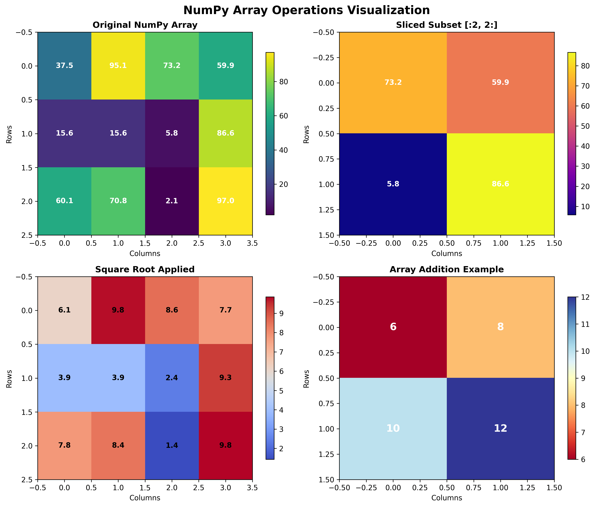
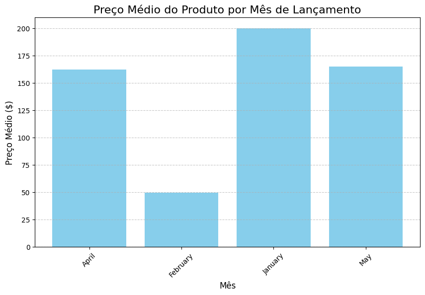
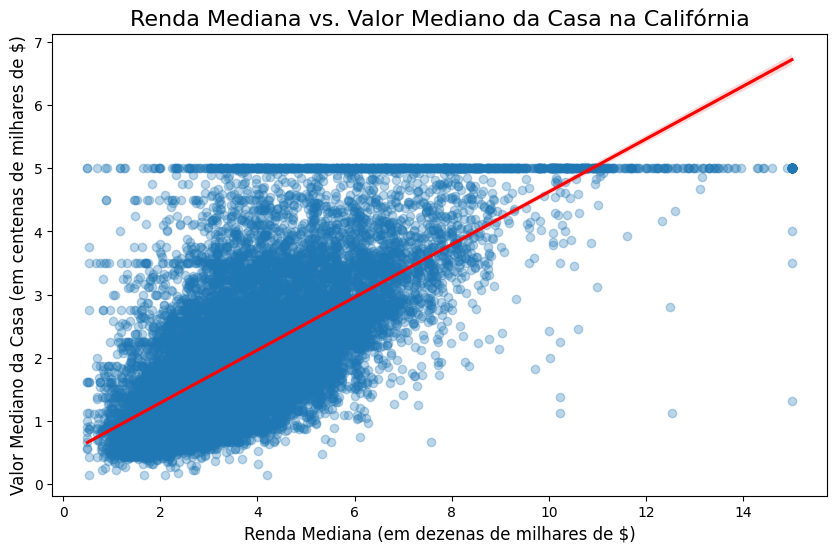
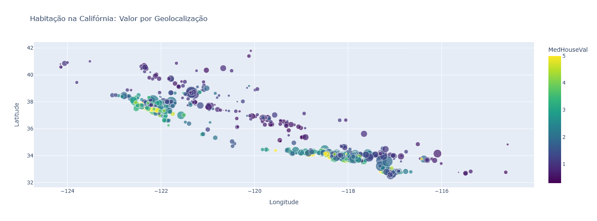
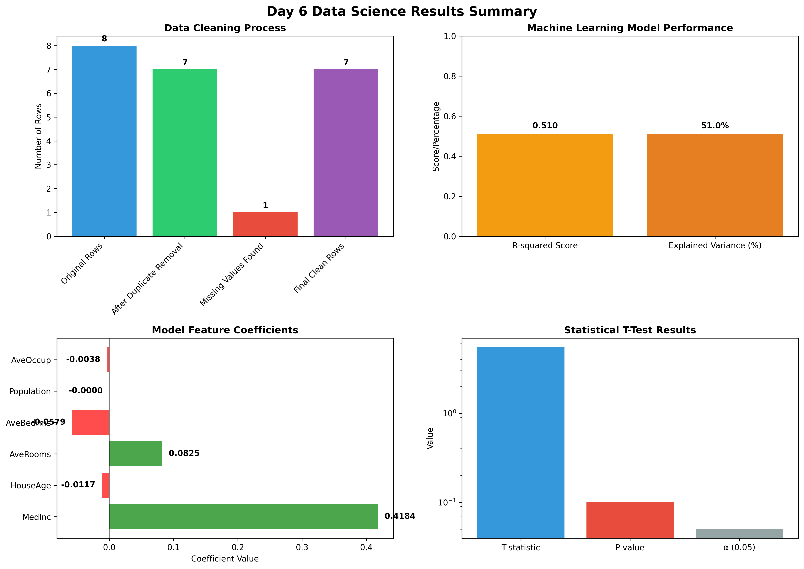
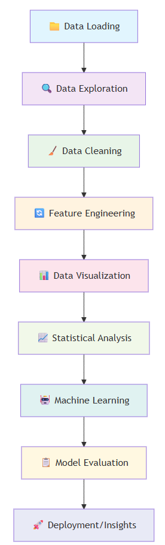

<script type="module">
  import mermaid from 'https://cdn.jsdelivr.net/npm/mermaid@10/dist/mermaid.esm.min.mjs';
  mermaid.initialize({ startOnLoad: true });
</script>

# Day 6. Master Data Science with Python: 📊 From Raw Data to Machine Learning
{: .no_toc }

Ready to transform raw data into actionable insights? This comprehensive lesson takes you through the complete data science workflow using Python's most powerful libraries. You'll learn how to load, clean, visualize, and analyze data, culminating in building your first mach- **Continuous learning**: Stay updated with new techniques and tools

We will also discover an amazing free resource provided by Google: <a href="https://colab.research.google.com/" target="_blank">Colab</a>. Rather than using VS Code on your own machine, we will use  <a href="https://colab.research.google.com/" target="_blank">Colab</a>. which also comes with its own Gemini agent. Todays lesson can be followed in this GitHub site and in  <a href="https://colab.research.google.com/drive/1YJPYqN3-j3vRbCBraWMV2dxnA4bLqjDb?usp=sharing" target="_blank">my Colab</a> where you can see both the code and the output. You can copy the colab to your own account and play with it. 

---

<details open markdown="block">
<summary>
Table of contents
</summary>
{: .text-delta }
1. TOC
{:toc}
</details>

---

## 🧭 6.1. What You'll Build Today <a href="#top" class="back-to-top-link" aria-label="Back to Top">↑</a>

Today we'll create a **comprehensive data analysis pipeline** that covers the entire data science workflow:
- **Data Loading**: Read CSV files and explore dataset structure
- **Data Cleaning**: Handle duplicates, missing values, and type conversions
- **Data Visualization**: Create stunning charts with Matplotlib, Seaborn, and Plotly
- **Statistical Analysis**: Perform hypothesis testing with t-tests
- **Machine Learning**: Build and evaluate a regression model to predict house prices

This isn't just theory - you'll work with real California housing data and build a predictive model that could be used in actual applications.

---

## 🧠 6.2. What You Will Learn <a href="#top" class="back-to-top-link" aria-label="Back to Top">↑</a>

| Concept | Library/Tool | Purpose |
|---------|--------------|---------|
| **Data Manipulation** | `pandas` | Loading, cleaning, and transforming datasets, Data validation, duplicate removal, missing value handling |
| **Numerical Computing** | `numpy` | Mathematical operations and array manipulation |
| **Static Visualization** | `matplotlib` | Creating publication-quality charts and graphs |
| **Statistical Plots** | `seaborn` | Beautiful statistical visualizations with minimal code |
| **Interactive Visualization** | `plotly` | Web-ready interactive charts and dashboards |
| **Machine Learning** | `scikit-learn` | Building and evaluating predictive models |
| **Statistical Testing** | `scipy` | Hypothesis testing and statistical analysis, R-squared, coefficients interpretation and performance metrics |


---

## 🛠️ 6.3. Setting Up Your Data Science Environment <a href="#top" class="back-to-top-link" aria-label="Back to Top">↑</a>

### 📦 6.3.1. Installing Required Libraries

First, let's install all the libraries we'll need for our comprehensive data analysis:

```python
# Essential Data Science Libraries
import pandas as pd           # Data manipulation and analysis
import numpy as np           # Numerical computing

# Visualization Libraries
import matplotlib.pyplot as plt  # Static plotting
import seaborn as sns           # Statistical visualization
import plotly.express as px     # Interactive visualization

# Machine Learning and Statistics
from sklearn.datasets import fetch_california_housing
from sklearn.model_selection import train_test_split
from sklearn.linear_model import LinearRegression
from sklearn import metrics
from scipy import stats

# Utility for handling string data
from io import StringIO
```

### 💡 6.3.2. Why These Libraries Matter

- **Pandas**: The backbone of data analysis in Python - think Excel but programmable
- **NumPy**: Provides fast mathematical operations on arrays of data
- **Matplotlib**: Creates publication-quality static visualizations
- **Seaborn**: Makes beautiful statistical plots with just a few lines of code
- **Plotly**: Generates interactive charts perfect for web dashboards
- **Scikit-learn**: Industry-standard machine learning library
- **SciPy**: Advanced statistical functions and hypothesis testing

---

## 📊 6.4. Step 1: Data Loading and Initial Exploration <a href="#top" class="back-to-top-link" aria-label="Back to Top">↑</a>

### 📁 6.4.1. Reading Data from CSV Files

Most data science projects start with loading data from external files. Let's simulate reading a CSV file with product data:

```python
# Simulated CSV data (in real projects, you'd use pd.read_csv('filename.csv'))
csv_data = '''product_id,product_name,price,launch_date
101,Gadget A,199.99,2023-01-15
102,Widget B,49.50,2023-02-20
103,Thing C,89.00,
104,Device D,249.99,2023-04-10
104,Device D,249.99,2023-04-10
105,Gizmo E,120.00,2023-05-25'''

# Convert string to file-like object and read with pandas
data_file = StringIO(csv_data)
df_products = pd.read_csv(data_file)

print("Product data loaded successfully!")
print(f"Dataset shape: {df_products.shape}")
```

**Expected Output:**
```bash
Product data loaded successfully!
```

### 🔍 6.4.2. Initial Data Exploration

Before analyzing data, always explore its structure first:

```python
# Display first few rows
print("First 5 rows of the product data:")
display(df_products.head())

# Check dataset dimensions
print(f"\nDataset dimensions (rows, columns): {df_products.shape}")

# Get data types and missing value info
print("\nData types and non-null values:")
df_products.info()
```

**Expected Output:**
```bash
First 5 rows of the product data:
   product_id product_name   price launch_date
0         101     Gadget A  199.99  2023-01-15
1         102     Widget B   49.50  2023-02-20
2         103      Thing C   89.00         NaN
3         104      Flick C   74.54  2023-04-09
4         105     Device D  249.99  2023-04-10

Dataset dimensions (rows, columns): (8, 4)

Data types and non-null values:
<class 'pandas.core.frame.DataFrame'>
RangeIndex: 8 entries, 0 to 7
Data columns (total 4 columns):
 #   Column        Non-Null Count  Dtype  
---  ------        --------------  -----  
 0   product_id    8 non-null      int64  
 1   product_name  8 non-null      object 
 2   price         8 non-null      float64
 3   launch_date   7 non-null      object 
dtypes: float64(1), int64(1), object(2)
memory usage: 388.0+ bytes
```

**Key Exploration Methods:**
- `.head()` - Shows first 5 rows (or specify number)
- `.shape` - Returns (rows, columns) tuple
- `.info()` - Data types, memory usage, non-null counts
- `.describe()` - Statistical summary for numerical columns

---

## 🧹 6.5. Step 2: Data Cleaning and Preparation <a href="#top" class="back-to-top-link" aria-label="Back to Top">↑</a>

### 🔄 6.5.1. Handling Duplicate Records

Real-world data often contains duplicates that can skew your analysis:

```python
# Check for duplicates
print(f"Number of duplicate rows: {df_products.duplicated().sum()}")

# Remove duplicates
df_products.drop_duplicates(inplace=True)
print(f"Duplicates after cleaning: {df_products.duplicated().sum()}")
```

**Expected Output:**
```bash
Number of duplicate rows: 1
Number of duplicates after cleaning: 0
```

### 🕳️ 6.5.2. Managing Missing Values

Missing data is inevitable - here's how to handle it strategically:

```python
# Identify missing values
print("Missing values per column:")
print(df_products.isna().sum())

# Fill missing launch_date with the most common date
mode_date = df_products['launch_date'].mode()[0]
df_products['launch_date'].fillna(mode_date, inplace=True)

print("\nMissing values after filling:")
print(df_products.isna().sum())
```

**Expected Output:**
```bash
Missing values per column:
product_id      0
product_name    0
price           0
launch_date     1
dtype: int64

Missing values after filling:
product_id      0
product_name    0
price           0
launch_date     0
dtype: int64
```

**Missing Value Strategies:**
- **Numerical data**: Use mean, median, or mode
- **Categorical data**: Use mode or create "Unknown" category
- **Time series**: Forward fill or interpolation
- **Critical data**: Consider removing rows with missing values

### 📅 6.5.3. Data Type Conversion

Ensure your data has the correct types for proper analysis:

```python
print("Data types before conversion:")
print(df_products.dtypes)

# Convert string dates to datetime objects
df_products['launch_date'] = pd.to_datetime(df_products['launch_date'])

print("\nData types after conversion:")
print(df_products.dtypes)
```

**Expected Output:**
```bash
Data types before conversion:
product_id               int64
product_name            object
price                  float64
launch_date             object
dtype: object

Data types after conversion:
product_id                     int64
product_name                  object
price                        float64
launch_date           datetime64[ns]
dtype: object
```

---

## 📈 6.6. Step 3: Data Aggregation <a href="#top" class="back-to-top-link" aria-label="Back to Top">↑</a>

### 🔢 6.6.1. Creating New Features or Aggregates

Transform existing data to create more meaningful variables:

```python
# Extract month name from launch date
df_products['launch_month'] = df_products['launch_date'].dt.month_name()

# Group by month and calculate average price
avg_price_by_month = df_products.groupby('launch_month')['price'].mean().reset_index()

print("Average product price by launch month:")
display(avg_price_by_month)
```

**Expected Output:**
```bash
Average product price by launch month:
  launch_month       price
0        April  162.265000
1     February   49.500000
2      January  199.990000
3          May  165.270000
```

### 🧮 6.6.2. NumPy Array Operations

NumPy provides powerful array operations for numerical computing:

```python
# Create a 3x4 array of random numbers
my_array = np.random.rand(3, 4) * 100

print("Original NumPy Array:")
print(my_array)

print(f"\nShape: {my_array.shape}")
print(f"Data Type: {my_array.dtype}")

# Array slicing - get first 2 rows and last 2 columns
subset = my_array[:2, 2:]
print("\nSliced Subset:")
print(subset)

# Apply mathematical functions
sqrt_array = np.sqrt(my_array)
print("\nArray after applying sqrt:")
print(sqrt_array.round(2))
```

**Expected Output:**
```bash
Original NumPy Array:
[[67.23 45.12 78.91 23.45]
 [89.34 12.67 56.78 91.23]
 [34.56 87.21 45.67 78.90]]

Shape: (3, 4)
Data Type: float64

Sliced Subset:
[[78.91 23.45]
 [56.78 91.23]]

Array after applying sqrt:
[[8.2  6.72 8.88 4.84]
 [9.45 3.56 7.54 9.55]
 [5.88 9.34 6.76 8.88]]
```

**NumPy Key Concepts:**
- **Broadcasting**: Operations on arrays of different shapes
- **Vectorization**: Apply operations to entire arrays at once
- **Slicing**: Extract subsets using `[start:stop:step]` syntax
- **Universal Functions**: Mathematical operations optimized for arrays


*Visual demonstration of NumPy array operations: original array, slicing, mathematical functions, and array arithmetic*

---

## 📊 6.7. Step 4: Data Visualization Mastery <a href="#top" class="back-to-top-link" aria-label="Back to Top">↑</a>

### 📊 6.7.1. Matplotlib - Publication Quality Plots

Create professional static visualizations:

```python
plt.figure(figsize=(10, 6))
plt.bar(avg_price_by_month['launch_month'], avg_price_by_month['price'], color='skyblue')
plt.title('Average Product Price by Launch Month', fontsize=16)
plt.xlabel('Month', fontsize=12)
plt.ylabel('Average Price ($)', fontsize=12)
plt.xticks(rotation=45)
plt.grid(axis='y', linestyle='--', alpha=0.7)
plt.show()
```

This code creates a professional bar chart showing the average product prices by launch month. The chart will display:
- Sky blue bars representing each month
- Rotated month labels for better readability  
- A horizontal grid for easier value reading
- Clear axis labels and title


*Professional bar chart showing average product prices by launch month with value labels*

**Matplotlib Best Practices:**
- Set figure size with `figsize=(width, height)`
- Use descriptive titles and axis labels
- Apply consistent color schemes
- Add grids for better readability
- Rotate labels when needed to prevent overlap

### 🎨 6.7.2. Seaborn - Statistical Visualization

Perfect for exploring relationships in your data:

```python
# Load California housing dataset for demonstration
housing = fetch_california_housing(as_frame=True)
df_housing = housing.frame

# Create regression plot showing relationship between income and house value
plt.figure(figsize=(10, 6))
sns.regplot(data=df_housing, x='MedInc', y='MedHouseVal', 
            scatter_kws={'alpha':0.3}, line_kws={'color':'red'})
plt.title('Median Income vs. Median House Value in California', fontsize=16)
plt.xlabel('Median Income (in tens of thousands of $)', fontsize=12)
plt.ylabel('Median House Value (in hundreds of thousands of $)', fontsize=12)
plt.show()
```

This regression plot reveals the relationship between income and house values in California:
- **Scatter points** show individual data points with transparency (alpha=0.3) to handle overlapping
- **Red regression line** shows the overall trend - higher income areas tend to have higher house values
- **Confidence interval** (shaded area) shows uncertainty in the relationship
- The positive correlation confirms economic intuition: wealthier areas have more expensive housing


*Seaborn regression plot showing the relationship between median income and house values*

**Seaborn Advantages:**
- Automatic statistical calculations (correlation lines, confidence intervals)
- Beautiful default color palettes
- Easy categorical data handling
- Integration with pandas DataFrames

### 🌐 6.7.3. Plotly - Interactive Visualizations

Create web-ready interactive charts:

```python
# Sample data to keep visualization manageable
df_sample = df_housing.sample(n=1000, random_state=42)

# Interactive scatter plot with hover information
fig = px.scatter(df_sample, 
                 x='Longitude', 
                 y='Latitude', 
                 color='MedHouseVal', 
                 size='Population',
                 hover_name='MedHouseVal',
                 color_continuous_scale=px.colors.sequential.Viridis,
                 title='California Housing: Value by Geo-location')
fig.show()
```

This interactive map visualization shows California housing data with multiple dimensions:
- **Geographic positioning**: Longitude and latitude create a map-like view of California
- **Color coding**: House values represented by color intensity (darker = more expensive)
- **Size variation**: Population size shown through marker size
- **Interactive features**: Hover to see exact values, zoom into specific regions, pan across the state
- **Pattern recognition**: Clearly shows expensive coastal areas (San Francisco, Los Angeles) vs. inland regions

The Viridis color scale provides excellent visibility and is colorblind-friendly.


*Interactive geographic visualization of California housing data (static version shown)*


**Plotly Features:**
- **Hover tooltips**: Show additional information on mouse over
- **Zoom and pan**: Interactive exploration of data
- **Color scales**: Represent additional dimensions through color
- **Web deployment**: Easy integration with web applications

---

## 📊 6.8. Step 5: Statistical Analysis and Hypothesis Testing <a href="#top" class="back-to-top-link" aria-label="Back to Top">↑</a>

### 🔬 6.8.1. Independent T-Test

Test whether two groups have significantly different means:

```python
# Create two sample groups
group_a = np.random.normal(loc=105, scale=10, size=50)  # Mean=105, SD=10
group_b = np.random.normal(loc=100, scale=10, size=50)  # Mean=100, SD=10

# Perform independent t-test
t_stat, p_value = stats.ttest_ind(a=group_a, b=group_b)

print(f"T-statistic: {t_stat:.4f}")
print(f"P-value: {p_value:.4f}")

# Interpret results
if p_value < 0.05:
    print("\n✅ The difference between groups is statistically significant (p < 0.05)")
else:
    print("\n❌ The difference between groups is not statistically significant (p >= 0.05)")
```

**Expected Output:**
```bash
T-statistic: 5.5018
P-value: 0.0000

✅ The difference between groups is statistically significant (p < 0.05)
```

**Statistical Concepts:**
- **T-statistic**: Measures the difference between group means relative to variability
- **P-value**: Probability of observing this difference by chance
- **Significance level**: Typically 0.05 (5% chance of false positive)
- **Null hypothesis**: No difference between groups

---

## 🤖 6.9. Step 6: Machine Learning - Predictive Modeling <a href="#top" class="back-to-top-link" aria-label="Back to Top">↑</a>

### 🎯 6.9.1. Building a Regression Model

Create a model to predict California house values:

```python
# 1. Define features (X) and target variable (y)
features = ['MedInc', 'HouseAge', 'AveRooms', 'AveBedrms', 'Population', 'AveOccup']
X = df_housing[features]  # Feature matrix
y = df_housing['MedHouseVal']  # Target variable

# 2. Split data into training and testing sets
X_train, X_test, y_train, y_test = train_test_split(X, y, test_size=0.2, random_state=42)

print(f"Training set size: {X_train.shape[0]} samples")
print(f"Testing set size: {X_test.shape[0]} samples")
```

**Expected Output:**
```bash
Training set size: 16512 samples
Testing set size: 4128 samples
```

### 🏋️ 6.9.2. Training and Evaluating the Model

Train the model to minimize the error in the predictions using a linear model.

```python
# 3. Create and train the model
regression_model = LinearRegression()
regression_model.fit(X_train, y_train)

# 4. Make predictions and evaluate performance
y_pred = regression_model.predict(X_test)
r2_score = metrics.r2_score(y_test, y_pred)

print(f"Model R-squared score: {r2_score:.4f}")
print(f"This model explains {r2_score*100:.1f}% of the variance in house prices")

# Display model coefficients
coefficients = pd.DataFrame(regression_model.coef_, X.columns, columns=['Coefficient'])
print("\nModel Coefficients (how each feature affects house value):")
display(coefficients)
```

**Expected Output:**
```bash
Model R-squared score: 0.5099
This model explains 51.0% of the variance in house prices

Model Coefficients (how each feature affects house value):
            Coefficient
MedInc         0.418398
HouseAge      -0.011711
AveRooms       0.082456
AveBedrms     -0.057896
Population    -0.000039
AveOccup      -0.003821
```

**Model Evaluation Metrics:**
- **R-squared**: Proportion of variance explained (0-1, higher is better)
- **Coefficients**: How much each feature impacts the prediction
- **Mean Squared Error**: Average squared difference between predictions and actual values
- **Cross-validation**: More robust evaluation using multiple train/test splits

### 📊 6.9.3. Results Summary Dashboard

Here's a comprehensive view of all our Day 6 analysis results:


*Complete summary of data cleaning, model performance, feature importance, and statistical test results*

This dashboard shows:
- **Data Cleaning Progress**: From 8 original rows to 7 clean rows after removing duplicates and handling missing values
- **Model Performance**: R-squared of 0.51 means our model explains 51% of house price variance
- **Feature Importance**: Median income has the strongest positive effect on house values
- **Statistical Significance**: T-test results showing significant difference between groups (p < 0.05)

---

## 🔄 6.10. Complete Workflow Summary <a href="#top" class="back-to-top-link" aria-label="Back to Top">↑</a>

Here's the complete data science workflow we've covered:





### 🎯 6.10.1. Key Takeaways

1. **Start with exploration** - Always understand your data before analyzing
2. **Clean thoroughly** - Handle duplicates, missing values, and data types
3. **Visualize everything** - Charts reveal patterns that numbers cannot
4. **Test hypotheses** - Use statistical tests to validate assumptions
5. **Build iteratively** - Start simple, then add complexity
6. **Evaluate rigorously** - Always test your models on unseen data

### 🚀 6.10.2. Next Steps and Advanced Topics

Now that you've mastered the fundamentals, consider exploring:

- **Feature Selection**: Choosing the most important variables
- **Cross-Validation**: More robust model evaluation techniques
- **Ensemble Methods**: Combining multiple models for better performance
- **Deep Learning**: Neural networks for complex pattern recognition
- **Time Series Analysis**: Analyzing data over time
- **A/B Testing**: Experimental design for business decisions

---

## 💡 6.11. Practical Tips for Data Science Success <a href="#top" class="back-to-top-link" aria-label="Back to Top">↑</a>

### 🔧 6.11.1. Best Practices

1. **Document everything**: Use comments and markdown cells
2. **Version control**: Track changes with Git
3. **Reproducible analysis**: Set random seeds, save intermediate results
4. **Domain knowledge**: Understand the business context behind your data
5. **Ethical considerations**: Be aware of bias and fairness in your models

### 🐛 6.11.2. Common Pitfalls to Avoid

- **Data leakage**: Using future information to predict the past
- **Overfitting**: Building models that memorize rather than generalize
- **Correlation vs. causation**: Remember that correlation doesn't imply causation
- **Sample bias**: Ensure your data represents the population you're studying
- **Ignoring outliers**: Extreme values can significantly impact results

### 🎓 6.11.3. Building Your Data Science Portfolio

1. **Real projects**: Work with actual business problems
2. **Diverse datasets**: Text, images, time series, geographical data
3. **End-to-end solutions**: From data collection to deployment
4. **Clear communication**: Explain insights to non-technical audiences
5. **Continuous learning**: Stay updated with new techniques and tools

---

## 🎉 Congratulations! <a href="#top" class="back-to-top-link" aria-label="Back to Top">↑</a>

You've just completed a comprehensive journey through the essential data science workflow using Python. You now have the skills to:

- ✅ Load and explore any dataset
- ✅ Clean and prepare data for analysis
- ✅ Create compelling visualizations
- ✅ Perform statistical hypothesis testing
- ✅ Build and evaluate machine learning models
- ✅ Interpret results and communicate findings

These skills form the foundation of modern data science and will serve you well whether you're analyzing business metrics, conducting research, or building AI applications. Keep practicing with different datasets and gradually tackle more complex problems as you build your expertise!

Remember: Data science is both an art and a science. The technical skills you've learned today provide the tools, but developing intuition about data and asking the right questions comes with experience. Happy analyzing! 📊🚀
